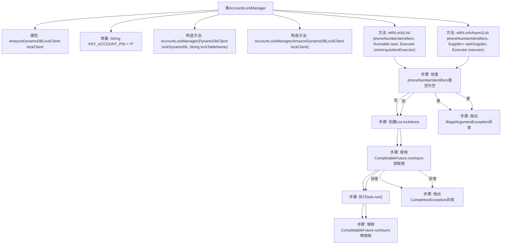

# 基础信息

|      |      |
|------|------|
| 名称 | AccountLockManager |
| 编码语言 | .java |
| 代码路径 | Signal-Server/service/src/main/java/org/whispersystems/textsecuregcm/storage/AccountLockManager.java |
| 包名 | org.whispersystems.textsecuregcm.storage |
| 依赖项 | ['com.amazonaws.services.dynamodbv2.AcquireLockOptions', 'com.amazonaws.services.dynamodbv2.AmazonDynamoDBLockClient', 'com.amazonaws.services.dynamodbv2.AmazonDynamoDBLockClientOptions', 'com.amazonaws.services.dynamodbv2.LockItem', 'com.amazonaws.services.dynamodbv2.ReleaseLockOptions', 'com.google.common.annotations.VisibleForTesting', 'java.util.ArrayList', 'java.util.List', 'java.util.UUID', 'java.util.concurrent.CompletableFuture', 'java.util.concurrent.CompletionException', 'java.util.concurrent.Executor', 'java.util.concurrent.TimeUnit', 'java.util.function.Supplier', 'software.amazon.awssdk.services.dynamodb.DynamoDbClient'] |
| 概述说明 | AccountLockManager利用DynamoDB实现分布式锁，支持同步异步锁定电话号码，任务完成释放锁。 |

# 说明

AccountLockManager利用DynamoDB实现分布式锁机制，能够同步和异步地锁定电话号码标识符。在任务执行完成后，系统会自动释放锁，确保资源的高效利用和并发控制。

# 类列表 Class Summary

| 名称   | 类型  | 说明 |
|-------|------|-------------|
| AccountLockManager | class | AccountLockManager使用DynamoDB实现分布式锁，支持同步和异步锁定电话号码标识符，执行任务后释放锁。 |


## 类 AccountLockManager

|      |      |
|------|------|
| 访问范围 | public |
| 类型 | class |
| 名称 | AccountLockManager |
| 说明 | AccountLockManager使用DynamoDB实现分布式锁，支持同步和异步锁定电话号码标识符，执行任务后释放锁。 |


### UML类图

```mermaid
classDiagram
    class AccountLockManager {
        -AmazonDynamoDBLockClient lockClient
        +AccountLockManager(DynamoDbClient lockDynamoDb, String lockTableName)
        +AccountLockManager(AmazonDynamoDBLockClient lockClient)
        +void withLock(List~UUID~ phoneNumberIdentifiers, Runnable task, Executor lockAcquisitionExecutor)
        +CompletableFuture~T~ withLockAsync(List~UUID~ phoneNumberIdentifiers, Supplier~CompletableFuture~T~~ taskSupplier, Executor executor)
    }

    class AmazonDynamoDBLockClient {
        +AmazonDynamoDBLockClient(AmazonDynamoDBLockClientOptions options)
        +LockItem acquireLock(AcquireLockOptions options)
        +void releaseLock(ReleaseLockOptions options)
    }

    class AmazonDynamoDBLockClientOptions {
        +static AmazonDynamoDBLockClientOptions.Builder builder(DynamoDbClient lockDynamoDb, String lockTableName)
    }

    class AcquireLockOptions {
        +static AcquireLockOptions.Builder builder(String partitionKey)
    }

    class ReleaseLockOptions {
        +static ReleaseLockOptions.Builder builder(LockItem lockItem)
    }

    class LockItem {
        // LockItem properties and methods
    }

    class DynamoDbClient {
        // DynamoDbClient properties and methods
    }

    class Executor {
        <<Interface>>
        +void execute(Runnable command)
    }

    class Runnable {
        <<Interface>>
        +void run()
    }

    class Supplier~T~ {
        <<Interface>>
        +T get()
    }

    class CompletableFuture~T~ {
        +static CompletableFuture~Void~ runAsync(Runnable runnable, Executor executor)
        +CompletableFuture~U~ thenCompose(Function~? super T, ? extends CompletionStage~U~~ fn)
        +CompletableFuture~T~ whenCompleteAsync(BiConsumer~? super T, ? super Throwable~ action, Executor executor)
    }

    class UUID {
        // UUID properties and methods
    }

    AccountLockManager --> AmazonDynamoDBLockClient : 依赖
    AccountLockManager --> Executor : 依赖
    AccountLockManager --> Runnable : 依赖
    AccountLockManager --> Supplier~CompletableFuture~T~~ : 依赖
    AccountLockManager --> CompletableFuture~T~ : 依赖
    AmazonDynamoDBLockClient --> AmazonDynamoDBLockClientOptions : 依赖
    AmazonDynamoDBLockClient --> AcquireLockOptions : 依赖
    AmazonDynamoDBLockClient --> ReleaseLockOptions : 依赖
    AmazonDynamoDBLockClient --> LockItem : 依赖
    AmazonDynamoDBLockClientOptions --> DynamoDbClient : 依赖
    AcquireLockOptions --> UUID : 依赖
    ReleaseLockOptions --> LockItem : 依赖
    CompletableFuture~T~ --> Executor : 依赖
    CompletableFuture~T~ --> Runnable : 依赖
    CompletableFuture~T~ --> BiConsumer~? super T, ? super Throwable~ : 依赖
```

**描述：**
`AccountLockManager` 类用于管理分布式悲观锁，依赖于 `AmazonDynamoDBLockClient` 来获取和释放锁。它提供了同步和异步两种方式来执行任务，确保在任务执行期间锁定指定的资源。`AmazonDynamoDBLockClient` 负责与 DynamoDB 交互，处理锁的获取和释放操作。`Executor` 和 `Runnable` 接口用于控制任务的执行，而 `CompletableFuture` 则用于处理异步任务的结果和异常。


### 内部方法调用关系图



这段代码定义了一个`AccountLockManager`类，用于管理分布式锁的获取和释放。类中包含两个构造方法和两个主要方法：`withLock`和`withLockAsync`。`withLock`方法用于同步获取锁、执行任务并释放锁，而`withLockAsync`方法则用于异步执行相同操作。流程图展示了从检查输入参数到获取锁、执行任务、释放锁的完整流程，并处理了可能的异常情况。

### 字段列表 Field List

| 名称  | 类型  | 说明 |
|-------|-------|------|
| lockClient | AmazonDynamoDBLockClient | 私有且不可变的DynamoDB锁客户端实例。 |
| KEY_ACCOUNT_PNI = "P" | String | 定义静态常量KEY_ACCOUNT_PNI，值为"P"。 |

### 方法列表 Method List

| 名称  | 类型  | 说明 |
|-------|-------|------|
| withLockAsync | CompletableFuture<T> | 异步锁定电话号码标识符并执行任务，完成后释放锁。 |
| withLock | void | 方法withLock通过锁机制确保任务执行，处理PNI列表的加锁与释放。 |


