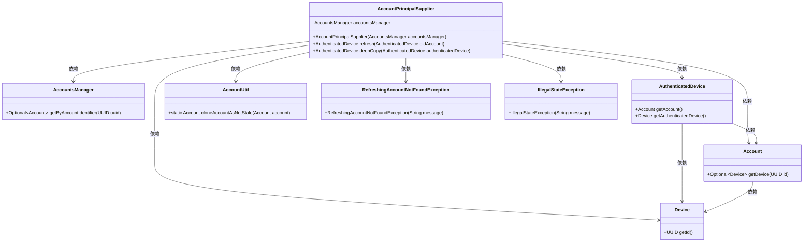
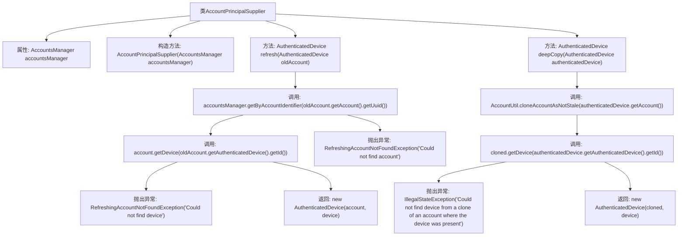

# 基础信息

|      |      |
|------|------|
| 名称 | AccountPrincipalSupplier |
| 编码语言 | .java |
| 代码路径 | Signal-Server/service/src/main/java/org/whispersystems/textsecuregcm/storage/AccountPrincipalSupplier.java |
| 包名 | org.whispersystems.textsecuregcm.storage |
| 依赖项 | ['org.whispersystems.textsecuregcm.auth.AuthenticatedDevice', 'org.whispersystems.websocket.auth.PrincipalSupplier'] |
| 概述说明 | AccountPrincipalSupplier实现PrincipalSupplier接口，负责设备认证与账户刷新管理。 |

# 说明

AccountPrincipalSupplier是一个实现了PrincipalSupplier接口的类，主要负责设备认证和账户刷新的管理。通过实现该接口，它能够提供与账户相关的认证信息，并确保账户状态的及时更新，从而保障系统的安全性和用户账户的有效性。

# 类列表 Class Summary

| 名称   | 类型  | 说明 |
|-------|------|-------------|
| AccountPrincipalSupplier | class | AccountPrincipalSupplier实现PrincipalSupplier接口，管理设备认证与账户刷新。 |

## 类 AccountPrincipalSupplier

|      |      |
|------|------|
| 访问范围 | public |
| 类型 | class |
| 名称 | AccountPrincipalSupplier |
| 说明 | AccountPrincipalSupplier实现PrincipalSupplier接口，管理设备认证与账户刷新。 |

### UML类图

这段代码描述了一个 `AccountPrincipalSupplier` 类，它实现了 `PrincipalSupplier` 接口，用于管理和刷新 `AuthenticatedDevice` 对象。该类依赖于 `AccountsManager` 来获取账户信息，并通过 `AccountUtil` 进行账户的深拷贝。代码中涉及了多个异常处理，如 `RefreshingAccountNotFoundException` 和 `IllegalStateException`，用于处理账户和设备查找失败的情况。整体设计体现了对账户和设备管理的复杂性和健壮性。

### 内部方法调用关系图

这段代码描述了一个`AccountPrincipalSupplier`类，该类实现了`PrincipalSupplier`接口，主要用于管理和刷新`AuthenticatedDevice`对象。`refresh`方法通过`accountsManager`获取并验证账户和设备信息，若找不到则抛出异常。`deepCopy`方法则通过克隆账户并验证设备信息来创建一个新的`AuthenticatedDevice`对象，若设备不存在则抛出异常。这两个方法都确保了在操作过程中数据的完整性和正确性。

### 字段列表 Field List

| 名称  | 类型  | 说明 |
|-------|-------|------|
| accountsManager | AccountsManager | 私有且不可变的AccountsManager实例变量。 |

### 方法列表 Method List

| 名称  | 类型  | 说明 |
|-------|-------|------|
| refresh | AuthenticatedDevice | 通过UUID查找账户和设备，返回新的认证设备实例。 |
| deepCopy | AuthenticatedDevice | 深拷贝AuthenticatedDevice，克隆账户并获取设备，若设备不存在则抛出异常。 |

