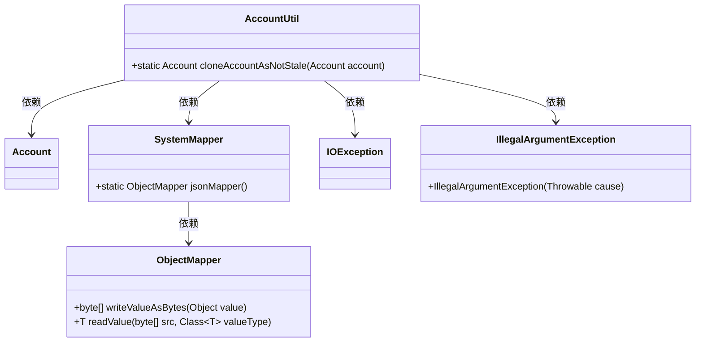
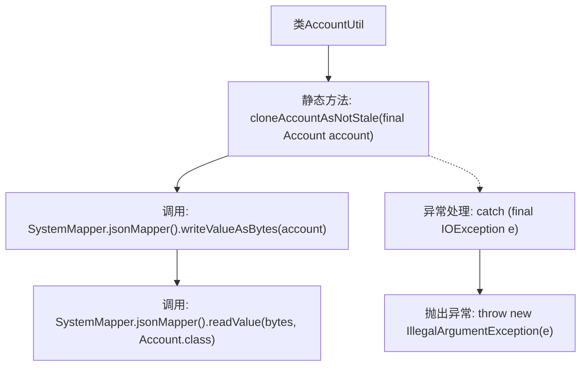

# 基础信息

|      |      |
|------|------|
| 名称 | AccountUtil |
| 编码语言 | .java |
| 代码路径 | Signal-Server/service/src/main/java/org/whispersystems/textsecuregcm/storage/AccountUtil.java |
| 包名 | org.whispersystems.textsecuregcm.storage |
| 依赖项 | ['org.whispersystems.textsecuregcm.util.SystemMapper', 'java.io.IOException'] |
| 概述说明 | AccountUtil类提供克隆非陈旧账户的静态方法。 |

# 说明

AccountUtil类提供了一个静态方法，专门用于克隆非陈旧账户。该方法的主要功能是复制那些未被标记为陈旧的账户信息，确保克隆的账户保持原有状态，而不包含陈旧数据。这一设计有助于在处理账户信息时，避免引入过时或不准确的数据，从而提高数据处理的准确性和可靠性。通过静态方法的形式，AccountUtil类可以方便地在不同场景下调用，简化了账户克隆的操作流程。

# 类列表 Class Summary

| 名称   | 类型  | 说明 |
|-------|------|-------------|
| AccountUtil | class | AccountUtil类包含克隆非陈旧账户的静态方法。 |

## 类 AccountUtil

|      |      |
|------|------|
| 访问范围 | public |
| 类型 | class |
| 名称 | AccountUtil |
| 说明 | AccountUtil类包含克隆非陈旧账户的静态方法。 |

### UML类图

类图描述：`AccountUtil`类提供了一个静态方法`cloneAccountAsNotStale`，用于克隆`Account`对象并确保其不是过时的。该方法依赖于`SystemMapper`和`ObjectMapper`类进行JSON序列化和反序列化操作。如果发生`IOException`，则会抛出`IllegalArgumentException`异常。

### 内部方法调用关系图

这段代码定义了一个名为`AccountUtil`的类，其中包含一个静态方法`cloneAccountAsNotStale`。该方法通过将`Account`对象序列化为字节数组，然后再反序列化为新的`Account`对象，从而实现对象的克隆。如果在序列化或反序列化过程中发生`IOException`，则会抛出`IllegalArgumentException`异常。流程图展示了方法的调用顺序和异常处理流程。

### 字段列表 Field List

| 名称  | 类型  | 说明 |
|-------|-------|------|

### 方法列表 Method List

| 名称  | 类型  | 说明 |
|-------|-------|------|
| cloneAccountAsNotStale | Account | 克隆账户对象并确保其非陈旧状态。 |

