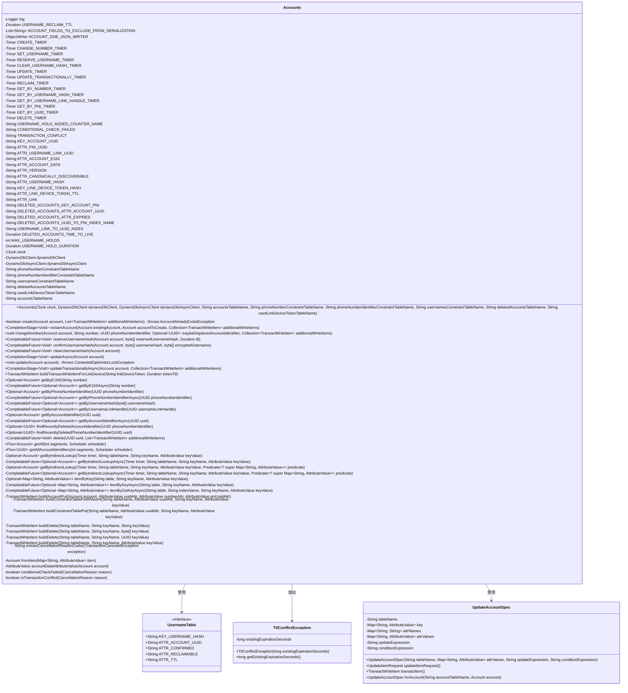

# 基础信息

|      |      |
|------|------|
| 名称 | Accounts |
| 编码语言 | .java |
| 代码路径 | Signal-Server/service/src/main/java/org/whispersystems/textsecuregcm/storage/Accounts.java |
| 包名 | org.whispersystems.textsecuregcm.storage |
| 依赖项 | ['com.codahale.metrics.MetricRegistry.name', 'java.util.Objects.requireNonNull', 'com.fasterxml.jackson.core.JsonProcessingException', 'com.fasterxml.jackson.databind.ObjectWriter', 'com.google.common.annotations.VisibleForTesting', 'com.google.common.base.Throwables', 'io.micrometer.core.instrument.Metrics', 'io.micrometer.core.instrument.Timer', 'java.io.IOException', 'java.nio.charset.StandardCharsets', 'java.security.MessageDigest', 'java.security.NoSuchAlgorithmException', 'java.time.Clock', 'java.time.Duration', 'java.time.Instant', 'java.util.ArrayList', 'java.util.Arrays', 'java.util.Collection', 'java.util.HashMap', 'java.util.List', 'java.util.Map', 'java.util.Objects', 'java.util.Optional', 'java.util.UUID', 'java.util.concurrent.CompletableFuture', 'java.util.concurrent.CompletionException', 'java.util.concurrent.CompletionStage', 'java.util.function.Predicate', 'java.util.stream.Collectors', 'javax.annotation.Nonnull', 'javax.annotation.Nullable', 'org.signal.libsignal.zkgroup.backups.BackupCredentialType', 'org.slf4j.Logger', 'org.slf4j.LoggerFactory', 'org.whispersystems.textsecuregcm.util.AsyncTimerUtil', 'org.whispersystems.textsecuregcm.util.AttributeValues', 'org.whispersystems.textsecuregcm.util.ExceptionUtils', 'org.whispersystems.textsecuregcm.util.SystemMapper', 'org.whispersystems.textsecuregcm.util.UUIDUtil', 'org.whispersystems.textsecuregcm.util.Util', 'reactor.core.publisher.Flux', 'reactor.core.scheduler.Scheduler', 'software.amazon.awssdk.core.SdkBytes', 'software.amazon.awssdk.services.dynamodb.DynamoDbAsyncClient', 'software.amazon.awssdk.services.dynamodb.DynamoDbClient', 'software.amazon.awssdk.services.dynamodb.model.AttributeValue', 'software.amazon.awssdk.services.dynamodb.model.CancellationReason', 'software.amazon.awssdk.services.dynamodb.model.ConditionalCheckFailedException', 'software.amazon.awssdk.services.dynamodb.model.Delete', 'software.amazon.awssdk.services.dynamodb.model.GetItemRequest', 'software.amazon.awssdk.services.dynamodb.model.GetItemResponse', 'software.amazon.awssdk.services.dynamodb.model.Put', 'software.amazon.awssdk.services.dynamodb.model.QueryRequest', 'software.amazon.awssdk.services.dynamodb.model.QueryResponse', 'software.amazon.awssdk.services.dynamodb.model.ReturnValuesOnConditionCheckFailure', 'software.amazon.awssdk.services.dynamodb.model.ScanRequest', 'software.amazon.awssdk.services.dynamodb.model.TransactWriteItem', 'software.amazon.awssdk.services.dynamodb.model.TransactWriteItemsRequest', 'software.amazon.awssdk.services.dynamodb.model.TransactionCanceledException', 'software.amazon.awssdk.services.dynamodb.model.TransactionConflictException', 'software.amazon.awssdk.services.dynamodb.model.Update', 'software.amazon.awssdk.services.dynamodb.model.UpdateItemRequest', 'software.amazon.awssdk.utils.CompletableFutureUtils'] |
| 概述说明 | Accounts类管理账户数据，支持增删改查，使用DynamoDB存储，含用户名、电话、唯一标识等字段。 |

# 说明

Accounts类负责管理账户数据，支持创建、更新、删除和查询等操作。它使用DynamoDB作为数据存储，存储的字段包括用户名、电话号码和唯一标识符等关键信息。该类提供了全面的账户管理功能，确保数据的有效存储和操作。

# 类列表 Class Summary

| 名称   | 类型  | 说明 |
|-------|------|-------------|
| Accounts | class | Accounts类管理账户数据，支持创建、更新、删除、查询等操作，使用DynamoDB存储，包含用户名、电话号码、唯一标识符等字段。 |

## 类 Accounts

|      |      |
|------|------|
| 访问范围 | @SuppressWarnings("OptionalUsedAsFieldOrParameterType");public |
| 类型 | class |
| 名称 | Accounts |
| 说明 | Accounts类管理账户数据，支持创建、更新、删除、查询等操作，使用DynamoDB存储，包含用户名、电话号码、唯一标识符等字段。 |

### UML类图

这段代码定义了一个名为 `Accounts` 的类，用于管理用户账户的创建、更新、删除等操作。它依赖于 AWS DynamoDB 客户端进行数据存储，并通过事务操作确保数据的一致性。类中包含多个计时器和常量，用于监控和记录操作的性能。`Accounts` 类还定义了多个内部类，如 `UsernameTable`、`TtlConflictException` 和 `UpdateAccountSpec`，用于处理用户名表、TTL冲突异常和账户更新规范。整体设计旨在确保账户操作的安全性和高效性。

### 内部方法调用关系图

这段代码定义了一个名为 `Accounts` 的类，主要用于管理账户相关的操作，包括创建、更新、删除账户，以及处理用户名、电话号码等信息的变更。类中包含了多个属性和方法，用于处理与账户相关的各种操作，如创建账户、更改电话号码、设置用户名、清除用户名哈希等。代码还涉及与 DynamoDB 的交互，使用 `DynamoDbClient` 和 `DynamoDbAsyncClient` 进行数据库操作。流程图展示了类中各个属性和方法之间的调用关系，帮助理解代码的结构和功能。

### 字段列表 Field List

| 名称  | 类型  | 说明 |
|-------|-------|------|
| USERNAME_RECLAIM_TTL = Duration.ofDays(3) | Duration | 用户名回收时限为3天。 |
| TRANSACTION_CONFLICT = "TransactionConflict" | String | 定义常量字符串表示事务冲突。 |
| CONDITIONAL_CHECK_FAILED = "ConditionalCheckFailed" | String | 定义常量字符串表示条件检查失败。 |
| ACCOUNT_FIELDS_TO_EXCLUDE_FROM_SERIALIZATION = List.of("uuid", "usernameLinkHandle") | List<String> | 排除序列化的账户字段：uuid、usernameLinkHandle。 |
| deletedAccountsTableName | String | 私有字符串变量存储已删除账户表名。 |
| dynamoDbAsyncClient | DynamoDbAsyncClient | 私有异步DynamoDB客户端实例。 |
| ATTR_VERSION = "V" | String | 定义常量ATTR_VERSION，值为"V"。 |
| MAX_USERNAME_HOLDS = 3 | int | 测试可见的用户名最大保留数为3。 |
| dynamoDbClient | DynamoDbClient | 私有DynamoDbClient实例。 |
| ATTR_ACCOUNT_E164 = "P" | String | 定义常量ATTR_ACCOUNT_E164，值为"P"。 |
| UPDATE_TIMER = Metrics.timer(name(Accounts.class, "update")) | Timer | 定义私有静态计时器，用于记录Accounts类的update方法性能。 |
| ATTR_PNI_UUID = "PNI" | String | 定义静态常量ATTR_PNI_UUID，值为"PNI"。 |
| phoneNumberConstraintTableName | String | 定义私有常量存储电话号码约束表名。 |
| usernamesConstraintTableName | String | 私有常量字符串用于存储用户名约束表名。 |
| DELETED_ACCOUNTS_TIME_TO_LIVE = Duration.ofDays(30) | Duration | 已删除账户的保留时长为30天。 |
| usedLinkDeviceTokenTableName | String | 私有字符串变量存储设备令牌表名。 |
| clock | Clock | 定义了一个私有且不可变的Clock类型变量clock。 |
| KEY_LINK_DEVICE_TOKEN_HASH = "H" | String | 定义静态常量KEY_LINK_DEVICE_TOKEN_HASH，值为"H"。 |
| log = LoggerFactory.getLogger(Accounts.class) | Logger | Accounts类中定义了私有的静态日志记录器。 |
| SET_USERNAME_TIMER = Metrics.timer(name(Accounts.class, "setUsername")) | Timer | 定义了一个私有静态计时器，用于监控Accounts类中setUsername方法的执行时间。 |
| ATTR_CANONICALLY_DISCOVERABLE = "C" | String | 定义常量ATTR_CANONICALLY_DISCOVERABLE，值为"C"。 |
| phoneNumberIdentifierConstraintTableName | String | 私有字符串常量phoneNumberIdentifierConstraintTableName。 |
| UPDATE_TRANSACTIONALLY_TIMER = Metrics.timer(name(Accounts.class, "updateTransactionally")) | Timer | 定义私有静态计时器用于账户类的事务更新监控。 |
| ATTR_ACCOUNT_DATA = "D" | String | 定义静态常量ATTR_ACCOUNT_DATA，值为"D"。 |
| CREATE_TIMER = Metrics.timer(name(Accounts.class, "create")) | Timer | Accounts类中定义了一个名为CREATE_TIMER的静态计时器。 |
| USERNAME_HOLD_DURATION = Duration.ofDays(7) | Duration | 测试用静态常量：用户名保留时长为7天。 |
| GET_BY_UUID_TIMER = Metrics.timer(name(Accounts.class, "getByUuid")) | Timer | 定义了一个私有静态计时器，用于监控获取UUID操作的性能。 |
| GET_BY_PNI_TIMER = Metrics.timer(name(Accounts.class, "getByPni")) | Timer | 定义了一个私有静态计时器，用于监控Accounts类的getByPni方法性能。 |
| ATTR_LINK_DEVICE_TOKEN_TTL = "E" | String | 定义静态常量ATTR_LINK_DEVICE_TOKEN_TTL，值为"E"。 |
| ATTR_USERNAME_HASH = "N" | String | 定义静态常量ATTR_USERNAME_HASH，值为"N"。 |
| KEY_ACCOUNT_UUID = "U" | String | 定义静态常量KEY_ACCOUNT_UUID，值为"U"。 |
| ATTR_USERNAME_LINK_UUID = "UL" | String | 定义常量ATTR_USERNAME_LINK_UUID，值为"UL"。 |
| CLEAR_USERNAME_HASH_TIMER = Metrics.timer(name(Accounts.class, "clearUsernameHash")) | Timer | Accounts类中定义了一个名为clearUsernameHash的定时器。 |
| accountsTableName | String | 私有常量字符串变量，存储账户表名称。 |
| CHANGE_NUMBER_TIMER = Metrics.timer(name(Accounts.class, "changeNumber")) | Timer | 定义名为CHANGE_NUMBER_TIMER的静态计时器，用于测量Accounts类的changeNumber方法性能。 |
| RECLAIM_TIMER = Metrics.timer(name(Accounts.class, "reclaim")) | Timer | 定义了一个用于计时的静态常量RECLAIM_TIMER。 |
| ACCOUNT_DDB_JSON_WRITER = SystemMapper.jsonMapper()      .writer(SystemMapper.excludingField(Account.class, ACCOUNT_FIELDS_TO_EXCLUDE_FROM_SERIALIZATION)) | ObjectWriter | 定义私有静态对象写入器，用于序列化账户类并排除指定字段。 |
| GET_BY_USERNAME_LINK_HANDLE_TIMER = Metrics.timer(name(Accounts.class, "getByUsernameLinkHandle")) | Timer | 定义了一个用于测量账户类中getByUsernameLinkHandle方法性能的计时器。 |
| USERNAME_LINK_TO_UUID_INDEX = "ul_to_u" | String | 定义常量USERNAME_LINK_TO_UUID_INDEX为"ul_to_u"。 |
| DELETED_ACCOUNTS_UUID_TO_PNI_INDEX_NAME = "u_to_p" | String | 静态常量定义删除账户UUID到PNI索引名称为"u_to_p"。 |
| GET_BY_NUMBER_TIMER = Metrics.timer(name(Accounts.class, "getByNumber")) | Timer | 定义私有静态计时器GET_BY_NUMBER_TIMER，用于监控Accounts类的getByNumber方法。 |
| DELETE_TIMER = Metrics.timer(name(Accounts.class, "delete")) | Timer | Accounts类中定义了一个用于删除操作的计时器DELETE_TIMER。 |
| USERNAME_HOLD_ADDED_COUNTER_NAME = name(Accounts.class, "usernameHoldAdded") | String | Accounts类中定义静态常量USERNAME_HOLD_ADDED_COUNTER_NAME，用于记录用户名持有添加计数器的名称。 |
| GET_BY_USERNAME_HASH_TIMER = Metrics.timer(name(Accounts.class, "getByUsernameHash")) | Timer | Accounts类中定义了一个私有静态Timer变量GET_BY_USERNAME_HASH_TIMER。 |
| DELETED_ACCOUNTS_ATTR_EXPIRES = "E" | String | 静态常量DELETED_ACCOUNTS_ATTR_EXPIRES值为"E"。 |
| RESERVE_USERNAME_TIMER = Metrics.timer(name(Accounts.class, "reserveUsername")) | Timer | 定义了一个名为RESERVE_USERNAME_TIMER的静态计时器，用于监控账户类中的用户名预留操作。 |
| DELETED_ACCOUNTS_ATTR_ACCOUNT_UUID = "U" | String | 定义常量DELETED_ACCOUNTS_ATTR_ACCOUNT_UUID，值为"U"。 |
| DELETED_ACCOUNTS_KEY_ACCOUNT_PNI = "P" | String | 定义静态常量DELETED_ACCOUNTS_KEY_ACCOUNT_PNI为"P"。 |
| ATTR_UAK = "UAK" | String | 定义了一个静态常量字符串ATTR_UAK，值为"UAK"。 |

### 方法列表 Method List

| 名称  | 类型  | 说明 |
|-------|-------|------|
| findRecentlyDeletedPhoneNumberIdentifier | Optional<UUID> | 通过UUID查询最近删除的电话号码标识符。 |
| update | void | 更新账户信息，处理并发锁异常。 |
| conditionalCheckFailed | boolean | 检查取消原因是否为条件检查失败。 |
| isTransactionConflict | boolean | 判断取消原因是否为交易冲突。 |
| getByUsernameLinkHandle | CompletableFuture<Optional<Account>> | 通过用户名链接句柄异步获取账户信息并计时。 |
| getByPhoneNumberIdentifier | Optional<Account> | 通过手机号标识符查询账户信息的方法。 |
| getByAccountIdentifierAsync | CompletableFuture<Optional<Account>> | 异步获取账户信息，使用UUID作为标识符。 |
| clearUsernameHash | CompletableFuture<Void> | 清除账户用户名哈希，更新账户信息，处理并发冲突。 |
| reserveUsernameHash | CompletableFuture<Void> | 方法保留用户名哈希，处理冲突并更新账户版本。 |
| getByUsernameHash | CompletableFuture<Optional<Account>> | 异步获取用户名的哈希值对应的账户信息，忽略未确认的条目。 |
| itemByGsiKeyAsync | CompletableFuture<Optional<Map<String, AttributeValue>>> | 异步查询DynamoDB表，返回匹配项或异常。 |
| getByIndirectLookupAsync | CompletableFuture<Optional<Account>> | 异步方法通过间接查找获取账户信息，支持过滤和转换操作。 |
| buildRemoveDeletedAccount | TransactWriteItem | 构建删除已删除账户的事务写入项，使用PNI作为键。 |
| itemByKey | Optional<Map<String, AttributeValue>> | 从DynamoDB表中通过键名和键值获取非空项。 |
| tryReserveUsernameHash | CompletableFuture<Void> | 方法尝试保留用户名哈希，检查条件后更新数据库，处理冲突和异常。 |
| buildConstraintTablePutIfAbsent | TransactWriteItem | 构建事务写入项，检查键不存在或UUID匹配时插入数据。 |
| getByIndirectLookup | Optional<Account> | 通过间接查找获取账户信息，使用计时器记录操作，过滤并映射结果。 |
| buildDelete | TransactWriteItem | 静态方法buildDelete用于根据表名、键名和键值构建删除操作。 |
| accountDataAttributeValue | AttributeValue | 将账户对象转换为DynamoDB属性值，处理JSON异常。 |
| reclaimAccount | CompletionStage<Void> | 回收账户时验证UUID和号码，更新版本和备份凭证，处理用户名和链接，执行事务写入。 |
| getByAccountIdentifier | Optional<Account> | 根据UUID查询账户信息，返回Optional<Account>类型结果。 |
| buildConstraintTablePut | TransactWriteItem | 构建事务写入项，包含表名、键值、UUID及条件表达式。 |
| getByIndirectLookup | Optional<Account> | 通过间接查找获取账户信息，支持自定义过滤条件。 |
| getAllAccountIdentifiers | Flux<UUID> | 该方法获取所有账户标识符，支持分段并行扫描，确保分段数为正数。 |
| buildDelete | TransactWriteItem | 静态方法构建删除事务项，包含表名、键名和键值。 |
| getAll | Flux<Account> | 获取所有账户信息，分段并行扫描数据库，确保一致性读取。 |
| getByPhoneNumberIdentifierAsync | CompletableFuture<Optional<Account>> | 异步方法通过电话号码标识符查找账户，返回可选账户的CompletableFuture。 |
| buildDelete | TransactWriteItem | 构建删除操作的静态方法，传入表名、键名和键值。 |
| confirmUsernameHash | CompletableFuture<Void> | 确认用户名哈希，更新账户信息，处理事务冲突，确保数据一致性。 |
| updateTransactionallyAsync | CompletionStage<Void> | 异步更新账户事务，处理写操作并管理版本和异常。 |
| buildTransactWriteItemForLinkDevice | TransactWriteItem | 生成链接设备令牌的TransactWriteItem，使用SHA-256哈希并设置过期时间。 |
| buildPutDeletedAccount | TransactWriteItem | 构建删除账户写入项，包含PNI、ACI和过期时间。 |
| pickLinkHandle | CompletableFuture<UUID> | 若无旧链接句柄则生成新UUID，否则保留现有句柄或生成新UUID。 |
| changeNumber | void | 方法更新账户号码及相关标识，处理并发更新和异常回滚。 |
| holdUsernameTransactItem | TransactWriteItem | 生成事务写入项，保存用户名哈希、账户UUID、确认状态和TTL。 |
| extractCancellationReasonCodes | String | 提取事务取消原因代码并拼接成字符串。 |
| releaseHoldIfAllowedTransactItem | TransactWriteItem | 该方法生成删除条件，释放用户名哈希持有，需满足持有者匹配或未确认或TTL过期。 |
| joinAndUnwrapUpdateFuture | void | 该方法同步等待并处理异步操作结果，捕获并解包异常，抛出非检查异常，记录检查异常。 |
| getByIndirectLookupAsync | CompletableFuture<Optional<Account>> | 异步方法通过间接查找获取账户信息，支持定时器和条件过滤。 |
| getByE164 | Optional<Account> | 非空方法通过E164号码查询账户，返回Optional对象。 |
| findRecentlyDeletedAccountIdentifier | Optional<UUID> | 通过DynamoDB查询最近删除的账户标识符并返回UUID。 |
| buildAccountPut | TransactWriteItem | 构建账户写入项，包含UUID、号码、PNI等属性，并添加条件和表名。 |
| delete | CompletableFuture<Void> | 异步删除指定UUID账户及相关数据，包含额外写入项，记录操作时间。 |
| create | boolean | 方法创建账户，处理事务写入，捕获异常并返回布尔值。 |
| buildDelete | TransactWriteItem | 静态方法构建删除项，传入表名、键名和键值字节数组。 |
| itemByKeyAsync | CompletableFuture<Optional<Map<String, AttributeValue>>> | 异步查询DynamoDB表中指定键值的条目，返回非空结果。 |
| getByE164Async | CompletableFuture<Optional<Account>> | 异步方法通过E164号码查询账户，返回CompletableFuture<Optional<Account>>。 |
| fromItem | Account | 从Map创建Account对象，验证并设置属性，处理异常。 |
| addToHolds | Optional<byte[]> | 方法更新账户的持有列表，移除过期或重复的持有项，并添加新持有项。若超出最大持有数，移除最旧的持有项。 |
| updateAsync | CompletionStage<Void> | 异步更新账户信息，处理冲突异常并重试。 |

