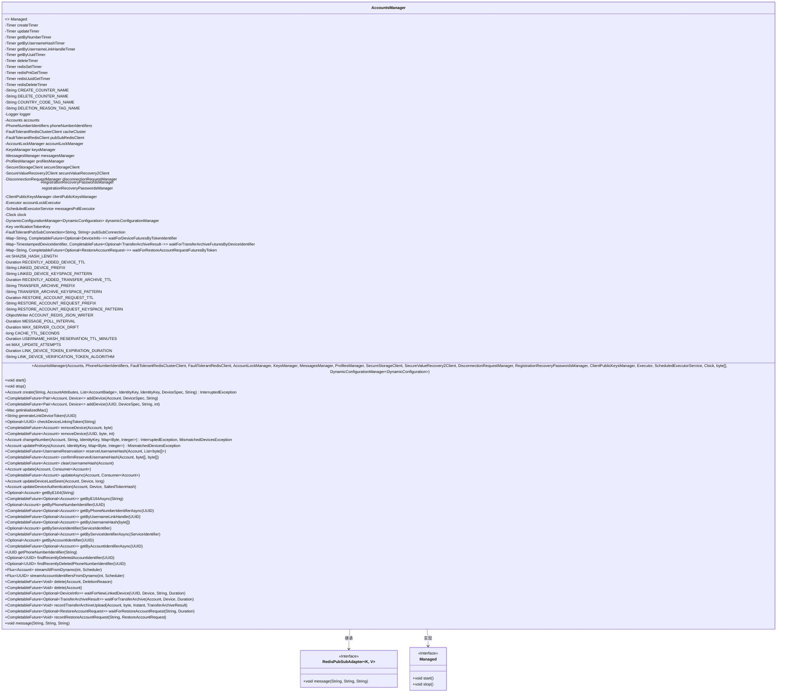

# 基础信息

|      |      |
|------|------|
| 名称 | AccountsManager |
| 编码语言 | .java |
| 代码路径 | Signal-Server/service/src/main/java/org/whispersystems/textsecuregcm/storage/AccountsManager.java |
| 包名 | org.whispersystems.textsecuregcm.storage |
| 依赖项 | ['com.codahale.metrics.MetricRegistry.name', 'java.util.Objects.requireNonNull', 'com.fasterxml.jackson.core.JsonProcessingException', 'com.fasterxml.jackson.databind.ObjectWriter', 'com.google.common.annotations.VisibleForTesting', 'com.google.common.base.Preconditions', 'io.dropwizard.lifecycle.Managed', 'io.lettuce.core.RedisException', 'io.lettuce.core.SetArgs', 'io.lettuce.core.cluster.api.sync.RedisAdvancedClusterCommands', 'io.lettuce.core.pubsub.RedisPubSubAdapter', 'io.micrometer.core.instrument.Metrics', 'io.micrometer.core.instrument.Tag', 'io.micrometer.core.instrument.Tags', 'io.micrometer.core.instrument.Timer', 'java.io.IOException', 'java.io.UncheckedIOException', 'java.nio.charset.StandardCharsets', 'java.security.InvalidKeyException', 'java.security.Key', 'java.security.MessageDigest', 'java.security.NoSuchAlgorithmException', 'java.time.Clock', 'java.time.Duration', 'java.time.Instant', 'java.util.ArrayDeque', 'java.util.ArrayList', 'java.util.Arrays', 'java.util.Base64', 'java.util.Collection', 'java.util.Collections', 'java.util.List', 'java.util.Map', 'java.util.Optional', 'java.util.Queue', 'java.util.UUID', 'java.util.concurrent.CompletableFuture', 'java.util.concurrent.CompletionException', 'java.util.concurrent.CompletionStage', 'java.util.concurrent.ConcurrentHashMap', 'java.util.concurrent.Executor', 'java.util.concurrent.ScheduledExecutorService', 'java.util.concurrent.TimeUnit', 'java.util.concurrent.atomic.AtomicReference', 'java.util.function.BiConsumer', 'java.util.function.BiFunction', 'java.util.function.Consumer', 'java.util.function.Function', 'java.util.function.Supplier', 'java.util.stream.Stream', 'javax.annotation.Nullable', 'javax.crypto.Mac', 'javax.crypto.spec.SecretKeySpec', 'org.apache.commons.lang3.ObjectUtils', 'org.apache.commons.lang3.StringUtils', 'org.signal.libsignal.protocol.IdentityKey', 'org.slf4j.Logger', 'org.slf4j.LoggerFactory', 'org.whispersystems.textsecuregcm.auth.DisconnectionRequestManager', 'org.whispersystems.textsecuregcm.auth.SaltedTokenHash', 'org.whispersystems.textsecuregcm.configuration.dynamic.DynamicConfiguration', 'org.whispersystems.textsecuregcm.controllers.MismatchedDevicesException', 'org.whispersystems.textsecuregcm.entities.AccountAttributes', 'org.whispersystems.textsecuregcm.entities.DeviceInfo', 'org.whispersystems.textsecuregcm.entities.ECSignedPreKey', 'org.whispersystems.textsecuregcm.entities.KEMSignedPreKey', 'org.whispersystems.textsecuregcm.entities.RestoreAccountRequest', 'org.whispersystems.textsecuregcm.entities.TransferArchiveResult', 'org.whispersystems.textsecuregcm.identity.IdentityType', 'org.whispersystems.textsecuregcm.identity.ServiceIdentifier', 'org.whispersystems.textsecuregcm.metrics.UserAgentTagUtil', 'org.whispersystems.textsecuregcm.redis.FaultTolerantPubSubConnection', 'org.whispersystems.textsecuregcm.redis.FaultTolerantRedisClient', 'org.whispersystems.textsecuregcm.redis.FaultTolerantRedisClusterClient', 'org.whispersystems.textsecuregcm.securestorage.SecureStorageClient', 'org.whispersystems.textsecuregcm.securevaluerecovery.SecureValueRecovery2Client', 'org.whispersystems.textsecuregcm.securevaluerecovery.SecureValueRecoveryException', 'org.whispersystems.textsecuregcm.util.DestinationDeviceValidator', 'org.whispersystems.textsecuregcm.util.ExceptionUtils', 'org.whispersystems.textsecuregcm.util.Pair', 'org.whispersystems.textsecuregcm.util.SystemMapper', 'org.whispersystems.textsecuregcm.util.Util', 'reactor.core.publisher.Flux', 'reactor.core.scheduler.Scheduler', 'software.amazon.awssdk.services.dynamodb.model.TransactWriteItem', 'software.amazon.awssdk.services.dynamodb.model.TransactionCanceledException'] |
| 概述说明 | AccountsManager类负责账户操作、设备管理及Redis交互，支持多线程和事务处理。 |

# 说明

AccountsManager类负责管理账户的各项操作，涵盖账户的创建、更新和删除，同时处理设备管理和与Redis缓存的交互。该类支持多线程操作，确保在高并发环境下的性能，并具备事务处理能力，保证操作的原子性和一致性。

# 类列表 Class Summary

| 名称   | 类型  | 说明 |
|-------|------|-------------|
| AccountsManager | class | AccountsManager类管理账户操作，包括创建、更新、删除、设备管理和Redis缓存交互，支持多线程和事务处理。 |

## 类 AccountsManager

|      |      |
|------|------|
| 访问范围 | public |
| 类型 | class |
| 名称 | AccountsManager |
| 说明 | AccountsManager类管理账户操作，包括创建、更新、删除、设备管理和Redis缓存交互，支持多线程和事务处理。 |

### UML类图

### 描述
`AccountsManager` 是一个复杂的类，负责管理用户账户的创建、更新、删除等操作。它依赖于多个外部服务，如 Redis、DynamoDB、消息队列等，并通过定时器和监控工具来跟踪操作的性能。`AccountsManager` 实现了 `Managed` 接口，确保其生命周期可以被管理，同时继承了 `RedisPubSubAdapter`，以便处理 Redis 的发布/订阅消息。该类还包含多个内部类和方法，用于处理设备链接、账户恢复、消息同步等复杂逻辑。

### 内部方法调用关系图

**描述：**  
`AccountsManager` 类是一个复杂的账户管理类，继承了 `RedisPubSubAdapter` 并实现了 `Managed` 接口。它负责处理账户的创建、更新、删除、设备管理、Redis 缓存操作等。类中包含多个计时器、日志记录器、账户锁管理器、Redis 客户端等属性，并通过多种方法实现账户和设备的管理。代码中使用了大量的异步操作和 Redis 缓存机制，确保账户数据的高效访问和一致性。

### 字段列表 Field List

| 名称  | 类型  | 说明 |
|-------|-------|------|
| updateTimer = Metrics.timer(name(AccountsManager.class, "update")) | Timer | AccountsManager类中定义了一个名为update的私有静态计时器。 |
| verificationTokenKey | Key | 私有常量验证令牌密钥。 |
| secureStorageClient | SecureStorageClient | 私有不可变的SecureStorageClient实例。 |
| phoneNumberIdentifiers | PhoneNumberIdentifiers | 私有且不可变的电话号码标识符对象。 |
| accounts | Accounts | 私有不可变账户对象。 |
| secureValueRecovery2Client | SecureValueRecovery2Client | 私有SecureValueRecovery2Client实例。 |
| messagesManager | MessagesManager | 私有消息管理器实例。 |
| messagesPollExecutor | ScheduledExecutorService | 私有且不可变的定时任务执行器。 |
| RECENTLY_ADDED_DEVICE_TTL = Duration.ofHours(1) | Duration | 定义设备最近添加的生存时间为1小时。 |
| TRANSFER_ARCHIVE_PREFIX = "transfer_archive::" | String | 定义常量字符串前缀"transfer_archive::"。 |
| clock | Clock | 私有且不可变的时钟对象。 |
| RESTORE_ACCOUNT_REQUEST_TTL = Duration.ofHours(1) | Duration | 恢复账户请求有效期为1小时。 |
| accountLockExecutor | Executor | 私有且不可变的账户锁定执行器。 |
| SHA256_HASH_LENGTH = getSha256MessageDigest().getDigestLength() | int | 定义SHA256哈希长度的静态常量。 |
| USERNAME_HASH_RESERVATION_TTL_MINUTES = Duration.ofMinutes(5) | Duration | 用户名哈希保留有效期为5分钟。 |
| deleteTimer = Metrics.timer(name(AccountsManager.class, "delete")) | Timer | AccountsManager类中定义了一个名为delete的定时器。 |
| clientPublicKeysManager | ClientPublicKeysManager | 私有且不可变的客户端公钥管理器实例。 |
| CACHE_TTL_SECONDS = Duration.ofDays(2).toSeconds() | long | 定义缓存有效期为2天的秒数常量。 |
| profilesManager | ProfilesManager | 私有且不可变的ProfilesManager实例。 |
| ACCOUNT_REDIS_JSON_WRITER = SystemMapper.jsonMapper()      .writer(SystemMapper.excludingField(Account.class, List.of("uuid"))) | ObjectWriter | 创建排除"uuid"字段的Account类JSON写入器。 |
| MESSAGE_POLL_INTERVAL = Duration.ofSeconds(1) | Duration | 定义消息轮询间隔为1秒的私有静态常量。 |
| pubSubRedisClient | FaultTolerantRedisClient | 私有不可变的容错Redis客户端用于发布订阅功能。 |
| waitForRestoreAccountRequestFuturesByToken =      new ConcurrentHashMap<>() | Map<String, CompletableFuture<Optional<RestoreAccountRequest>>> | 私有并发映射存储令牌与恢复账户请求的异步结果。 |
| accountLockManager | AccountLockManager | 私有且不可变的账户锁定管理器实例。 |
| RESTORE_ACCOUNT_REQUEST_KEYSPACE_PATTERN = "__keyspace@0__:" + RESTORE_ACCOUNT_REQUEST_PREFIX + "*" | String | 定义了一个用于匹配恢复账户请求的键空间模式字符串。 |
| RECENTLY_ADDED_TRANSFER_ARCHIVE_TTL = Duration.ofHours(1) | Duration | 定义最近添加的传输存档生存时间为1小时。 |
| createTimer = Metrics.timer(name(AccountsManager.class, "create")) | Timer | AccountsManager类中创建了一个名为"create"的计时器。 |
| pubSubConnection | FaultTolerantPubSubConnection<String, String> | 私有且容错的PubSub连接，类型为字符串键值对。 |
| dynamicConfigurationManager | DynamicConfigurationManager<DynamicConfiguration> | 动态配置管理器用于管理动态配置。 |
| redisSetTimer = Metrics.timer(name(AccountsManager.class, "redisSet")) | Timer | 定义了一个私有静态计时器redisSetTimer，用于监控AccountsManager类中redisSet操作的性能。 |
| MAX_SERVER_CLOCK_DRIFT = Duration.ofSeconds(5) | Duration | 定义最大服务器时钟偏差为5秒。 |
| MAX_UPDATE_ATTEMPTS = 10 | int | 最大更新尝试次数设为10。 |
| logger = LoggerFactory.getLogger(AccountsManager.class) | Logger | AccountsManager类中定义了一个私有的静态Logger实例。 |
| DELETE_COUNTER_NAME       = name(AccountsManager.class, "deleteCounter") | String | 定义静态常量DELETE_COUNTER_NAME，值为AccountsManager类的deleteCounter名称。 |
| cacheCluster | FaultTolerantRedisClusterClient | 私有且不可变的Redis集群客户端，具备容错能力。 |
| getByUsernameLinkHandleTimer = Metrics.timer(name(AccountsManager.class, "getByUsernameLinkHandle")) | Timer | AccountsManager类中定义了一个用于测量getByUsernameLinkHandle方法性能的计时器。 |
| getByUsernameHashTimer = Metrics.timer(name(AccountsManager.class, "getByUsernameHash")) | Timer | 定义了一个静态计时器，用于测量AccountsManager类的getByUsernameHash方法执行时间。 |
| disconnectionRequestManager | DisconnectionRequestManager | 私有且不可变的断开连接请求管理器实例。 |
| waitForDeviceFuturesByTokenIdentifier =      new ConcurrentHashMap<>() | Map<String, CompletableFuture<Optional<DeviceInfo>>> | 私有并发映射存储设备信息异步结果，键为令牌标识符。 |
| LINK_DEVICE_TOKEN_EXPIRATION_DURATION = Duration.ofMinutes(10) | Duration | 测试可见的链接设备令牌过期时长为10分钟。 |
| waitForTransferArchiveFuturesByDeviceIdentifier =      new ConcurrentHashMap<>() | Map<TimestampedDeviceIdentifier, CompletableFuture<Optional<TransferArchiveResult>>> | 定义并发映射，存储设备标识符与传输结果的异步任务。 |
| DELETION_REASON_TAG_NAME  = "reason" | String | 定义常量DELETION_REASON_TAG_NAME，值为"reason"。 |
| registrationRecoveryPasswordsManager | RegistrationRecoveryPasswordsManager | 私有且不可变的注册恢复密码管理器实例。 |
| redisUuidGetTimer = Metrics.timer(name(AccountsManager.class, "redisUuidGet")) | Timer | 定义了一个私有静态定时器，用于监控AccountsManager类中的redisUuidGet操作。 |
| redisDeleteTimer = Metrics.timer(name(AccountsManager.class, "redisDelete")) | Timer | AccountsManager类中定义了一个用于Redis删除操作的计时器。 |
| LINKED_DEVICE_PREFIX = "linked_device::" | String | 定义静态常量字符串前缀为linked_device::。 |
| getByUuidTimer = Metrics.timer(name(AccountsManager.class, "getByUuid")) | Timer | 定义了一个私有静态计时器，用于测量getByUuid方法的性能。 |
| keysManager | KeysManager | 私有不可变的KeysManager实例。 |
| TRANSFER_ARCHIVE_KEYSPACE_PATTERN = "__keyspace@0__:" + TRANSFER_ARCHIVE_PREFIX + "*" | String | 定义Redis键空间模式，用于匹配转移归档相关键。 |
| LINK_DEVICE_VERIFICATION_TOKEN_ALGORITHM = "HmacSHA256" | String | 测试可见的静态常量字符串，用于设备验证令牌算法。 |
| CREATE_COUNTER_NAME       = name(AccountsManager.class, "createCounter") | String | 定义常量CREATE_COUNTER_NAME，用于存储AccountsManager类的计数器名称。 |
| LINKED_DEVICE_KEYSPACE_PATTERN = "__keyspace@0__:" + LINKED_DEVICE_PREFIX + "*" | String | 定义私有静态常量字符串，用于匹配指定前缀的键空间模式。 |
| COUNTRY_CODE_TAG_NAME     = "country" | String | 定义常量COUNTRY_CODE_TAG_NAME，值为"country"。 |
| RESTORE_ACCOUNT_REQUEST_PREFIX = "restore_account::" | String | 私有静态常量定义账户恢复请求前缀为"restore_account::"。 |
| getByNumberTimer = Metrics.timer(name(AccountsManager.class, "getByNumber")) | Timer | 定义名为getByNumberTimer的私有静态定时器，用于监控AccountsManager类的getByNumber方法。 |
| redisPniGetTimer = Metrics.timer(name(AccountsManager.class, "redisPniGet")) | Timer | 在AccountsManager类中，定义了一个名为redisPniGet的私有静态定时器。 |

### 方法列表 Method List

| 名称  | 类型  | 说明 |
|-------|-------|------|
| updateDeviceLastSeen | Account | 更新设备最后可见时间，若时间较新则更新，否则保持不变。 |
| checkDeviceLinkingToken | Optional<UUID> | 验证设备链接令牌有效性，返回UUID或空。 |
| start | void | 重写start方法，使用pubSubConnection订阅指定模式。 |
| getByUsernameHash | CompletableFuture<Optional<Account>> | 异步获取账户信息，记录执行时间。 |
| getLinkDeviceTokenIdentifier | String | 该方法将链接设备令牌编码为Base64格式的SHA-256哈希值。 |
| stop | void | 重写stop方法，取消订阅并移除监听器。 |
| getByPhoneNumberIdentifierAsync | CompletableFuture<Optional<Account>> | 异步获取账户信息，先查Redis，再查数据库。 |
| updateTransactionallyWithRetriesAsync | CompletionStage<Account> | 异步更新账户事务，支持重试和乐观锁验证。 |
| getByAccountIdentifierAsync | CompletableFuture<Optional<Account>> | 异步获取账户信息，先查Redis再查数据库。 |
| getByUsernameLinkHandle | CompletableFuture<Optional<Account>> | 通过UUID获取账户信息，记录执行时间。 |
| updateWithRetriesAsync | CompletionStage<Account> | 异步更新账户，支持重试和验证。 |
| updateDeviceAuthentication | Account | 更新设备认证信息，验证凭证版本后设置设备认证令牌哈希。 |
| validateDevices | void | 验证设备签名密钥和注册ID，确保完整性和一致性。 |
| updateDeviceAsync | CompletableFuture<Account> | 异步更新账户设备信息，调用设备更新器并返回结果。 |
| updateAsync | CompletableFuture<Account> | 异步更新账户信息，确保所有修改操作均执行。 |
| removeDevice | CompletableFuture<Account> | 移除设备方法，禁止移除主设备，使用锁管理器异步执行。 |
| getByServiceIdentifierAsync | CompletableFuture<Optional<Account>> | 异步获取账户信息，根据服务标识类型调用不同方法。 |
| generateLinkDeviceToken | String | 生成设备链接令牌，包含ACI和时间戳，并使用HMAC签名。 |
| getByPhoneNumberIdentifier | Optional<Account> | 通过手机号标识符查询账户，优先检查Redis，再查数据库。 |
| getByAccountIdentifier | Optional<Account> | 通过UUID查询账户信息，优先检查Redis，未找到则查询账户数据库。 |
| buildPniKeyWriteItems | Collection<TransactWriteItem> | 构建PNI密钥写入项，处理签名预密钥和PQ最后救援密钥。 |
| getByServiceIdentifier | Optional<Account> | 根据服务标识类型获取账户信息，支持ACI和PNI两种类型。 |
| getInitializedMac | Mac | 私有方法getInitializedMac尝试初始化Mac，若失败则抛出断言错误。 |
| findRecentlyDeletedPhoneNumberIdentifier | Optional<UUID> | 查找最近删除的电话号码标识符，基于账户标识符。 |
| addDevice | CompletableFuture<Pair<Account, Device>> | 异步添加设备，使用账户锁管理器和指定执行器。 |
| updateAsync | CompletableFuture<Account> | 异步更新账户信息，包括Redis删除、重试更新、Redis设置及计时。 |
| getInitializedMac | Mac | 初始化Mac实例并返回，使用指定算法和密钥。 |
| updateDevice | Account | 更新账户中指定设备的公共方法，调用设备更新器进行修改。 |
| update | Account | 公共方法更新账户，调用更新器并返回修改后的账户。 |
| updatePniKeys | Account | 更新账户PNI密钥，验证设备，构建写操作，异步删除旧密钥并更新。 |
| getByE164Async | CompletableFuture<Optional<Account>> | 异步获取E164号码对应的账户信息，并记录执行时间。 |
| confirmReservedUsernameHash | CompletableFuture<Account> | 确认用户名哈希，检查并更新账户，处理异常和缓存清理。 |
| removeDevice | CompletableFuture<Account> | 异步移除设备，包括删除密钥、清除消息、更新账户和重试机制。 |
| findRecentlyDeletedAccountIdentifier | Optional<UUID> | 根据手机号标识符查找最近删除的账户标识符。 |
| changeNumber | Account | 方法用于更改账户号码，验证设备，处理目标号码状态，更新账户信息并返回结果。 |
| updateWithRetries | Account | 账户更新方法，重试10次，验证变更，处理并发冲突。 |
| addDevice | CompletableFuture<Pair<Account, Device>> | 异步添加设备，处理账户和设备信息，管理密钥和消息，支持重试和异常处理。 |
| update | Account | 私有方法更新账户，先删除Redis缓存，再重试更新并设置新缓存。 |
| getPhoneNumberIdentifier | UUID | 该方法通过e164获取电话号码标识符并返回。 |
| getByE164 | Optional<Account> | 方法getByE164通过计时器获取指定号码的账户信息。 |
| generateLinkDeviceToken | String | 生成设备链接令牌，包含ACI、时间戳和签名，返回组合字符串。 |
| checkAndReserveNextUsernameHash | CompletableFuture<byte[]> | 异步检查并保留下一个用户名哈希，失败时重试，直到成功或队列为空。 |
| delete | CompletableFuture<Void> | 异步删除账户，记录性能指标，处理异常并记录日志。 |
| reserveUsernameHash | CompletableFuture<UsernameReservation> | 方法reserveUsernameHash为账户保留用户名哈希，若已确认则直接返回成功，否则通过异步操作更新并保留新哈希。 |
| setPniKeys | void | 设置账户PNI密钥和注册ID，需同时为空或非空，否则抛出异常。 |
| clearUsernameHash | CompletableFuture<Account> | 异步清除账户用户名哈希，更新并删除Redis缓存。 |
| redisGetBySecondaryKey | Optional<Account> | 通过Redis获取账户信息，处理反序列化和Redis异常。 |
| checkRedisThenAccounts | Optional<Account> | 方法先查Redis，无结果再查账户，最后存Redis。 |
| create | Account | 创建账户方法，处理新账户、重新注册及设备信息，确保数据一致性和清理旧数据。 |
| redisGetByAccountIdentifier | Optional<Account> | 从Redis通过UUID获取账户信息，处理异常并返回可选结果。 |
| getAccountEntityKey | String | 生成账户实体键的方法，格式为"Account3::UUID"。 |
| getAccountMapKey | String | 生成账户映射键的方法，前缀为"AccountMap::"。 |
| redisDeleteAsync | CompletableFuture<Void> | 异步删除Redis中与账户相关的键，并记录操作时间。 |
| redisGetByAccountIdentifierAsync | CompletableFuture<Optional<Account>> | 异步从Redis获取账户信息，处理异常并返回Optional结果。 |
| redisDelete | void | 该方法使用Redis集群删除与账户相关的缓存数据。 |
| streamAccountIdentifiersFromDynamo | Flux<UUID> | 从DynamoDB流式获取账户标识符，支持分段和调度器。 |
| redisGetBySecondaryKeyAsync | CompletableFuture<Optional<Account>> | 通过二级键从Redis异步获取账户信息，处理异常并记录耗时。 |
| waitForRestoreAccountRequest | CompletableFuture<Optional<RestoreAccountRequest>> | 方法等待恢复账户请求，通过token和超时时间获取结果。 |
| writeRedisAccountJson | String | 用于测试的静态方法，将账户对象转为Redis JSON字符串。 |
| waitForTransferArchive | CompletableFuture<Optional<TransferArchiveResult>> | 等待账户和设备传输归档结果，超时返回。 |
| getRestoreAccountRequestKey | String | 静态方法生成恢复账户请求键，前缀加令牌。 |
| waitForNewLinkedDevice | CompletableFuture<Optional<DeviceInfo>> | 等待新链接设备，验证主设备和令牌，超时处理消息同步。 |
| streamAllFromDynamo | Flux<Account> | 从DynamoDB流式获取所有账户数据，支持分段和调度器。 |
| redisSetAsync | CompletableFuture<Void> | 异步将账户信息写入Redis，包括UUID和JSON格式数据，设置缓存过期时间。 |
| getLinkedDeviceKey | String | 静态方法生成链接设备键，前缀加设备标识符。 |
| parseAccountJson | Optional<Account> | 解析JSON字符串为Account对象，若成功则设置UUID并检查PNI，失败返回空。 |
| handleRestoreAccountRequest | void | 处理恢复账户请求，解析JSON，捕获异常并记录错误。 |
| checkRedisThenAccountsAsync | CompletableFuture<Optional<Account>> | 异步检查Redis和账户，优先从Redis获取，未找到则从账户获取并缓存到Redis。 |
| handleTransferArchiveAdded | void | 处理传输归档添加，解析JSON并完成Future，异常时记录错误。 |
| message | void | 处理Redis消息，根据模式匹配执行设备、传输存档和账户恢复请求操作。 |
| getSha256MessageDigest | MessageDigest | 获取SHA-256算法的MessageDigest实例，若失败则抛出异常。 |
| waitForPreLinkMessagesToBeFetched | CompletableFuture<Optional<DeviceInfo>> | 等待设备预链接消息获取，检查时间戳，重试或返回设备信息。 |
| redisSet | void | 将账户信息存入Redis缓存，设置过期时间并处理异常。 |
| handleDeviceAdded | void | 处理设备添加，解析JSON，完成Future，异常记录。 |
| delete | CompletableFuture<Void> | 删除账户及其相关数据，包括设备信息、备份、存储数据、预置密钥、消息、个人资料、注册恢复密码等。 |
| waitForPubSubKey | CompletableFuture<Optional<T>> | 等待Redis键值，超时处理并返回CompletableFuture结果。 |
| recordRestoreAccountRequest | CompletableFuture<Void> | 异步记录账户恢复请求，序列化后存储至Redis，设置TTL。 |
| recordTransferArchiveUpload | CompletableFuture<Void> | 记录传输存档上传，生成唯一键，序列化结果并存入Redis，设置TTL。 |
| getTransferArchiveKey | String | 生成基于账户ID、目标设备ID和创建时间的传输归档键。 |

