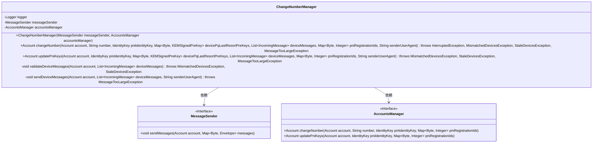
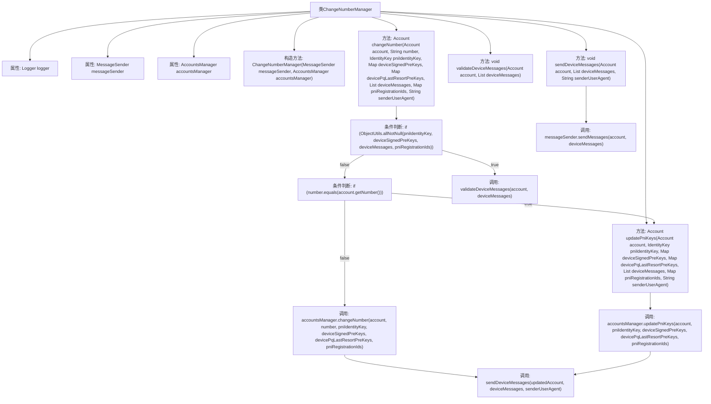

# 基础信息

|      |      |
|------|------|
| 名称 | ChangeNumberManager |
| 编码语言 | .java |
| 代码路径 | Signal-Server/service/src/main/java/org/whispersystems/textsecuregcm/storage/ChangeNumberManager.java |
| 包名 | org.whispersystems.textsecuregcm.storage |
| 依赖项 | ['com.google.protobuf.ByteString', 'java.util.List', 'java.util.Map', 'java.util.Set', 'java.util.stream.Collectors', 'javax.annotation.Nullable', 'org.apache.commons.lang3.ObjectUtils', 'org.signal.libsignal.protocol.IdentityKey', 'org.slf4j.Logger', 'org.slf4j.LoggerFactory', 'org.whispersystems.textsecuregcm.controllers.MismatchedDevicesException', 'org.whispersystems.textsecuregcm.controllers.StaleDevicesException', 'org.whispersystems.textsecuregcm.entities.ECSignedPreKey', 'org.whispersystems.textsecuregcm.entities.IncomingMessage', 'org.whispersystems.textsecuregcm.entities.KEMSignedPreKey', 'org.whispersystems.textsecuregcm.entities.MessageProtos.Envelope', 'org.whispersystems.textsecuregcm.identity.AciServiceIdentifier', 'org.whispersystems.textsecuregcm.push.MessageSender', 'org.whispersystems.textsecuregcm.push.MessageTooLargeException', 'org.whispersystems.textsecuregcm.util.DestinationDeviceValidator'] |
| 概述说明 | ChangeNumberManager类负责账户号码变更、设备消息验证及更新发送。 |

# 说明

ChangeNumberManager类主要负责处理账户号码的变更操作。它通过验证设备消息来确保变更请求的合法性和准确性，并在验证通过后发送相应的更新信息。该类在整个变更流程中起到关键作用，确保账户号码的变更过程安全可靠。

# 类列表 Class Summary

| 名称   | 类型  | 说明 |
|-------|------|-------------|
| ChangeNumberManager | class | ChangeNumberManager类处理账户号码变更，验证设备消息并发送更新。 |

## 类 ChangeNumberManager

|      |      |
|------|------|
| 访问范围 | public |
| 类型 | class |
| 名称 | ChangeNumberManager |
| 说明 | ChangeNumberManager类处理账户号码变更，验证设备消息并发送更新。 |

### UML类图

**描述：**
`ChangeNumberManager` 类负责管理账户号码的更改和PNI（Phone Number Identity）密钥的更新。它依赖于 `MessageSender` 和 `AccountsManager` 两个接口来实现消息发送和账户管理功能。`changeNumber` 方法用于更改账户号码并处理相关的密钥更新，而 `updatePniKeys` 方法则专门用于更新PNI密钥。该类还包含私有方法 `validateDeviceMessages` 和 `sendDeviceMessages`，分别用于验证设备消息和发送设备消息。

### 内部方法调用关系图

**描述：**
这段代码定义了一个名为 `ChangeNumberManager` 的类，用于管理账户号码的更改和PNI（Phone Number Identity）密钥的更新。类中包含多个方法，用于验证设备消息、发送设备消息以及调用 `AccountsManager` 和 `MessageSender` 的相关方法。代码通过条件判断来处理不同的逻辑分支，确保在更改号码或更新密钥时进行必要的验证和操作。流程图展示了类中各个方法的调用关系和条件判断的逻辑流程。

### 字段列表 Field List

| 名称  | 类型  | 说明 |
|-------|-------|------|
| logger = LoggerFactory.getLogger(ChangeNumberManager.class) | Logger | 在ChangeNumberManager类中定义了一个静态的Logger实例。 |
| messageSender | MessageSender | 私有且不可变的MessageSender实例。 |
| accountsManager | AccountsManager | 私有且不可变的AccountsManager实例。 |

### 方法列表 Method List

| 名称  | 类型  | 说明 |
|-------|-------|------|
| validateDeviceMessages | void | 验证设备消息，确保设备列表完整且注册ID匹配。 |
| updatePniKeys | Account | 更新账户PNI密钥，验证设备消息，发送更新后消息。 |
| sendDeviceMessages | void | 发送设备消息，验证内容长度，构建并发送消息，处理异常。 |
| changeNumber | Account | 方法`changeNumber`用于更新账户号码，验证设备消息，处理PNI密钥分发，并返回更新后的账户。 |

