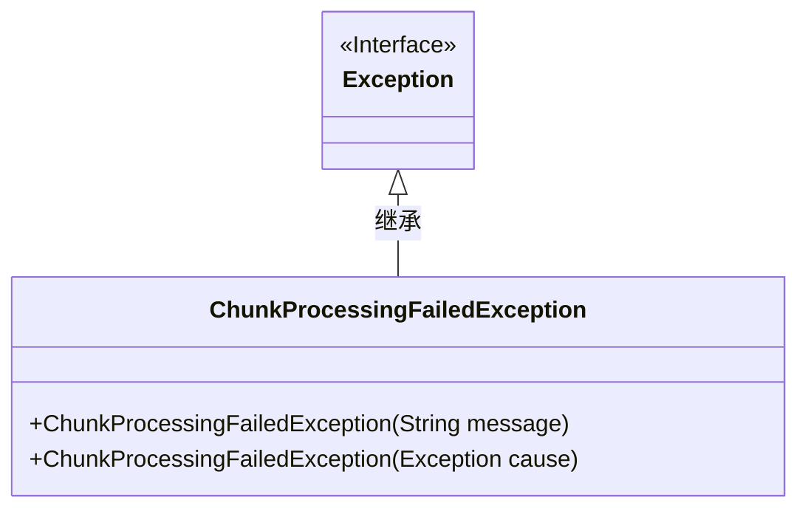
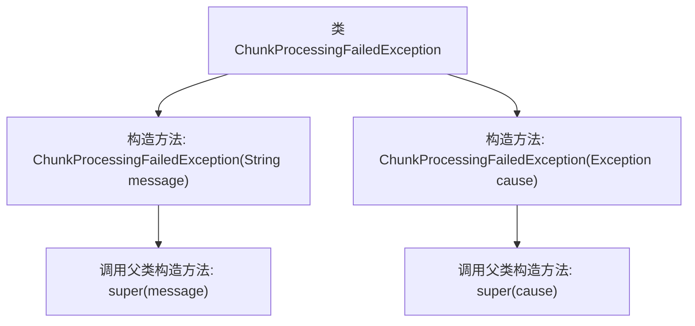

# 基础信息

|      |      |
|------|------|
| 名称 | ChunkProcessingFailedException |
| 编码语言 | .java |
| 代码路径 | Signal-Server/service/src/main/java/org/whispersystems/textsecuregcm/storage/ChunkProcessingFailedException.java |
| 包名 | org.whispersystems.textsecuregcm.storage |
| 依赖项 | [] |
| 概述说明 | ChunkProcessingFailedException继承Exception，支持消息和异常原因构造。 |

# 说明

ChunkProcessingFailedException是一个继承自Exception的异常类，支持通过消息和异常原因进行构造。该类用于处理在处理数据块时发生的错误，提供了灵活的异常信息传递机制，便于开发者捕获和处理特定类型的异常情况。

# 类列表 Class Summary

| 名称   | 类型  | 说明 |
|-------|------|-------------|
| ChunkProcessingFailedException | class | ChunkProcessingFailedException继承Exception，支持消息和异常原因构造。 |

## 类 ChunkProcessingFailedException

|      |      |
|------|------|
| 访问范围 | public |
| 类型 | class |
| 名称 | ChunkProcessingFailedException |
| 说明 | ChunkProcessingFailedException继承Exception，支持消息和异常原因构造。 |

### UML类图

这段代码定义了一个名为 `ChunkProcessingFailedException` 的自定义异常类，它继承自 Java 的 `Exception` 类。该类提供了两个构造函数：一个接受字符串参数用于设置异常消息，另一个接受 `Exception` 类型的参数用于设置异常原因。这个自定义异常类通常用于处理在处理数据块（chunk）时发生的错误，提供更具体的错误信息和上下文。

### 内部方法调用关系图

这段代码定义了一个名为 `ChunkProcessingFailedException` 的自定义异常类，继承自 `Exception`。该类提供了两个构造方法：一个接受字符串参数 `message`，用于传递异常信息；另一个接受 `Exception` 类型的参数 `cause`，用于传递导致该异常的原始异常。两个构造方法分别调用了父类 `Exception` 的相应构造方法，以初始化异常对象。

### 字段列表 Field List

| 名称  | 类型  | 说明 |
|-------|-------|------|

### 方法列表 Method List

| 名称  | 类型  | 说明 |
|-------|-------|------|

