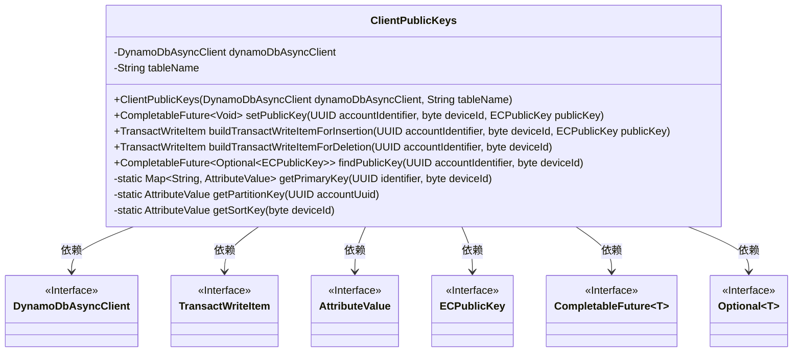

# 基础信息

|      |      |
|------|------|
| 名称 | ClientPublicKeys |
| 编码语言 | .java |
| 代码路径 | Signal-Server/service/src/main/java/org/whispersystems/textsecuregcm/storage/ClientPublicKeys.java |
| 包名 | org.whispersystems.textsecuregcm.storage |
| 依赖项 | ['java.util.Map', 'java.util.Optional', 'java.util.UUID', 'java.util.concurrent.CompletableFuture', 'org.signal.libsignal.protocol.InvalidKeyException', 'org.signal.libsignal.protocol.ecc.ECPublicKey', 'org.slf4j.Logger', 'org.slf4j.LoggerFactory', 'org.whispersystems.textsecuregcm.util.AttributeValues', 'org.whispersystems.textsecuregcm.util.Util', 'software.amazon.awssdk.services.dynamodb.DynamoDbAsyncClient', 'software.amazon.awssdk.services.dynamodb.model.AttributeValue', 'software.amazon.awssdk.services.dynamodb.model.Delete', 'software.amazon.awssdk.services.dynamodb.model.GetItemRequest', 'software.amazon.awssdk.services.dynamodb.model.Put', 'software.amazon.awssdk.services.dynamodb.model.PutItemRequest', 'software.amazon.awssdk.services.dynamodb.model.TransactWriteItem'] |
| 概述说明 | ClientPublicKeys类管理账户/设备公钥，支持存储、查找、删除，使用DynamoDB异步存储。 |

# 说明

ClientPublicKeys类是一个用于管理账户或设备公钥的工具，支持公钥的存储、查找和删除操作。该类通过DynamoDB异步客户端实现数据存储，确保高效处理公钥相关的数据管理任务。该设计适用于需要管理多个公钥的场景，提供了灵活且可靠的数据操作能力。

# 类列表 Class Summary

| 名称   | 类型  | 说明 |
|-------|------|-------------|
| ClientPublicKeys | class | ClientPublicKeys类用于管理账户/设备的公钥，支持存储、查找、删除公钥操作，使用DynamoDB异步客户端实现数据存储。 |

## 类 ClientPublicKeys

|      |      |
|------|------|
| 访问范围 | public |
| 类型 | class |
| 名称 | ClientPublicKeys |
| 说明 | ClientPublicKeys类用于管理账户/设备的公钥，支持存储、查找、删除公钥操作，使用DynamoDB异步客户端实现数据存储。 |

### UML类图

### 描述
`ClientPublicKeys` 类用于管理存储在 DynamoDB 中的客户端公钥。它提供了设置、查找、插入和删除公钥的方法。类依赖于 `DynamoDbAsyncClient` 进行异步数据库操作，并使用 `TransactWriteItem` 和 `AttributeValue` 来处理事务和属性值。`ECPublicKey` 表示公钥，`CompletableFuture` 和 `Optional` 用于处理异步操作和可能为空的结果。

### 内部方法调用关系图

```mermaid
graph TD
    A["类ClientPublicKeys"]
    B["属性: DynamoDbAsyncClient dynamoDbAsyncClient"]
    C["属性: String tableName"]
    D["常量: String KEY_ACCOUNT_UUID = 'U'"]
    E["常量: String KEY_DEVICE_ID = 'D'"]
    F["常量: String ATTR_PUBLIC_KEY = 'K'"]
    G["构造方法: ClientPublicKeys(DynamoDbAsyncClient dynamoDbAsyncClient, String tableName)"]
    H["方法: CompletableFuture<Void> setPublicKey(UUID accountIdentifier, byte deviceId, ECPublicKey publicKey)"]
    I["方法: TransactWriteItem buildTransactWriteItemForInsertion(UUID accountIdentifier, byte deviceId, ECPublicKey publicKey)"]
    J["方法: TransactWriteItem buildTransactWriteItemForDeletion(UUID accountIdentifier, byte deviceId)"]
    K["方法: CompletableFuture<Optional<ECPublicKey>> findPublicKey(UUID accountIdentifier, byte deviceId)"]
    L["私有方法: Map<String, AttributeValue> getPrimaryKey(UUID identifier, byte deviceId)"]
    M["私有方法: AttributeValue getPartitionKey(UUID accountUuid)"]
    N["私有方法: AttributeValue getSortKey(byte deviceId)"]

    A --> B
    A --> C
    A --> D
    A --> E
    A --> F
    A --> G
    A --> H
    A --> I
    A --> J
    A --> K
    A --> L
    A --> M
    A --> N
```

这段代码定义了一个名为 `ClientPublicKeys` 的类，用于管理与 DynamoDB 中的公钥相关的操作。类中包含多个方法，用于设置、插入、删除和查找公钥。`setPublicKey` 方法用于存储公钥，`buildTransactWriteItemForInsertion` 和 `buildTransactWriteItemForDeletion` 分别用于构建插入和删除公钥的事务项，`findPublicKey` 方法用于查找公钥。类中还包含一些私有方法，用于生成主键和分区键。整个类通过 `DynamoDbAsyncClient` 与 DynamoDB 进行异步交互。

### 字段列表 Field List

| 名称  | 类型  | 说明 |
|-------|-------|------|
| tableName | String | 类中定义了私有不可变的字符串变量tableName。 |
| KEY_DEVICE_ID = "D" | String | 静态常量KEY_DEVICE_ID定义为"D"。 |
| log = LoggerFactory.getLogger(ClientPublicKeys.class) | Logger | ClientPublicKeys类中定义了静态的日志记录器实例。 |
| dynamoDbAsyncClient | DynamoDbAsyncClient | 私有且不可变的异步DynamoDB客户端实例。 |
| KEY_ACCOUNT_UUID = "U" | String | 定义常量KEY_ACCOUNT_UUID，值为"U"。 |
| ATTR_PUBLIC_KEY = "K" | String | 定义静态常量ATTR_PUBLIC_KEY，值为"K"。 |

### 方法列表 Method List

| 名称  | 类型  | 说明 |
|-------|-------|------|
| buildTransactWriteItemForInsertion | TransactWriteItem | 构建插入事务写项，包含账户ID、设备ID和公钥。 |
| findPublicKey | CompletableFuture<Optional<ECPublicKey>> | 异步查找公钥，处理DynamoDB响应并返回ECPublicKey。 |
| getPartitionKey | AttributeValue | 静态方法getPartitionKey通过UUID生成分区键值。 |
| setPublicKey | CompletableFuture<Void> | 异步设置公钥并存储到DynamoDB表。 |
| getSortKey | AttributeValue | 静态方法getSortKey根据设备ID生成属性值。 |
| getPrimaryKey | Map<String, AttributeValue> | 方法生成主键映射，包含账户UUID和设备ID。 |
| buildTransactWriteItemForDeletion | TransactWriteItem | 该方法构建删除事务项，使用账户标识和设备ID删除指定表记录。 |

