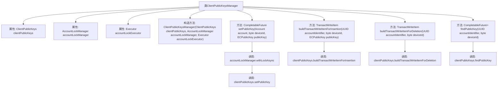

# 基础信息

|      |      |
|------|------|
| 名称 | ClientPublicKeysManager |
| 编码语言 | .java |
| 代码路径 | Signal-Server/service/src/main/java/org/whispersystems/textsecuregcm/storage/ClientPublicKeysManager.java |
| 包名 | org.whispersystems.textsecuregcm.storage |
| 依赖项 | ['java.util.List', 'java.util.Optional', 'java.util.UUID', 'java.util.concurrent.CompletableFuture', 'java.util.concurrent.Executor', 'org.signal.libsignal.protocol.ecc.ECPublicKey', 'org.whispersystems.textsecuregcm.identity.IdentityType', 'software.amazon.awssdk.services.dynamodb.model.TransactWriteItem'] |
| 概述说明 | ClientPublicKeysManager管理客户端公钥，支持设置、插入、删除和查找操作。 |

# 说明

ClientPublicKeysManager是一个用于管理客户端公钥的工具，提供了一系列操作功能。它支持设置公钥，允许用户插入新的公钥到系统中，同时也能删除不再需要的公钥。此外，该工具还具备查找公钥的能力，方便用户快速定位和检索特定的公钥信息。通过这些功能，ClientPublicKeysManager有效地简化了公钥管理流程，确保了系统安全性和操作的便捷性。

# 类列表 Class Summary

| 名称   | 类型  | 说明 |
|-------|------|-------------|
| ClientPublicKeysManager | class | ClientPublicKeysManager管理客户端公钥，支持设置、插入、删除和查找公钥操作。 |

## 类 ClientPublicKeysManager

|      |      |
|------|------|
| 访问范围 | public |
| 类型 | class |
| 名称 | ClientPublicKeysManager |
| 说明 | ClientPublicKeysManager管理客户端公钥，支持设置、插入、删除和查找公钥操作。 |

### UML类图

```mermaid
classDiagram
    class ClientPublicKeysManager {
        -ClientPublicKeys clientPublicKeys
        -AccountLockManager accountLockManager
        -Executor accountLockExecutor
        +ClientPublicKeysManager(ClientPublicKeys clientPublicKeys, AccountLockManager accountLockManager, Executor accountLockExecutor)
        +CompletableFuture~Void~ setPublicKey(Account account, byte deviceId, ECPublicKey publicKey)
        +TransactWriteItem buildTransactWriteItemForInsertion(UUID accountIdentifier, byte deviceId, ECPublicKey publicKey)
        +TransactWriteItem buildTransactWriteItemForDeletion(UUID accountIdentifier, byte deviceId)
        +CompletableFuture~Optional~ECPublicKey~~ findPublicKey(UUID accountIdentifier, byte deviceId)
    }

    class ClientPublicKeys {
        <<Interface>>
        +CompletableFuture~Void~ setPublicKey(UUID accountIdentifier, byte deviceId, ECPublicKey publicKey)
        +TransactWriteItem buildTransactWriteItemForInsertion(UUID accountIdentifier, byte deviceId, ECPublicKey publicKey)
        +TransactWriteItem buildTransactWriteItemForDeletion(UUID accountIdentifier, byte deviceId)
        +CompletableFuture~Optional~ECPublicKey~~ findPublicKey(UUID accountIdentifier, byte deviceId)
    }

    class AccountLockManager {
        <<Interface>>
        +CompletableFuture~Void~ withLockAsync(List~String~ identifiers, Supplier~CompletableFuture~Void~~ task, Executor executor)
    }

    class Executor {
        <<Interface>>
        +void execute(Runnable command)
    }

    class Account {
        +UUID getIdentifier(IdentityType identityType)
        +String getPhoneNumberIdentifier()
    }

    class TransactWriteItem {
        // Represents a write operation in a transaction
    }

    class ECPublicKey {
        // Represents an elliptic curve public key
    }

    ClientPublicKeysManager --> ClientPublicKeys : 依赖
    ClientPublicKeysManager --> AccountLockManager : 依赖
    ClientPublicKeysManager --> Executor : 依赖
    ClientPublicKeysManager --> Account : 依赖
    ClientPublicKeysManager --> TransactWriteItem : 依赖
    ClientPublicKeysManager --> ECPublicKey : 依赖
```

### 描述
`ClientPublicKeysManager` 类负责管理客户端公钥的存储、插入、删除和查找操作。它依赖于 `ClientPublicKeys` 接口来执行具体的公钥操作，并使用 `AccountLockManager` 和 `Executor` 来确保线程安全的操作。`Account` 类提供了账户标识符和电话号码标识符的获取方法，而 `TransactWriteItem` 和 `ECPublicKey` 分别表示事务写操作和椭圆曲线公钥。

### 内部方法调用关系图

这段代码定义了一个名为`ClientPublicKeysManager`的类，用于管理客户端公钥。它包含多个方法，用于设置、插入、删除和查找公钥。类中的方法通过调用`ClientPublicKeys`和`AccountLockManager`的实例来执行具体操作。流程图展示了类的属性、构造方法以及各个方法之间的调用关系，清晰地描述了类内部的功能和交互流程。

### 字段列表 Field List

| 名称  | 类型  | 说明 |
|-------|-------|------|
| accountLockManager | AccountLockManager | 私有不可变的账户锁定管理器实例。 |
| clientPublicKeys | ClientPublicKeys | 私有不可变的客户端公钥对象。 |
| accountLockExecutor | Executor | 私有且不可变的账户锁定执行器。 |

### 方法列表 Method List

| 名称  | 类型  | 说明 |
|-------|-------|------|
| findPublicKey | CompletableFuture<Optional<ECPublicKey>> | 根据账户标识和设备ID查找公钥。 |
| buildTransactWriteItemForDeletion | TransactWriteItem | 构建删除交易的写项方法，基于账户标识和设备ID。 |
| setPublicKey | CompletableFuture<Void> | 异步设置账户公钥，使用锁管理器确保线程安全。 |
| buildTransactWriteItemForInsertion | TransactWriteItem | 方法为插入操作生成事务写入项，参数包括账户标识符、设备ID和公钥。 |

