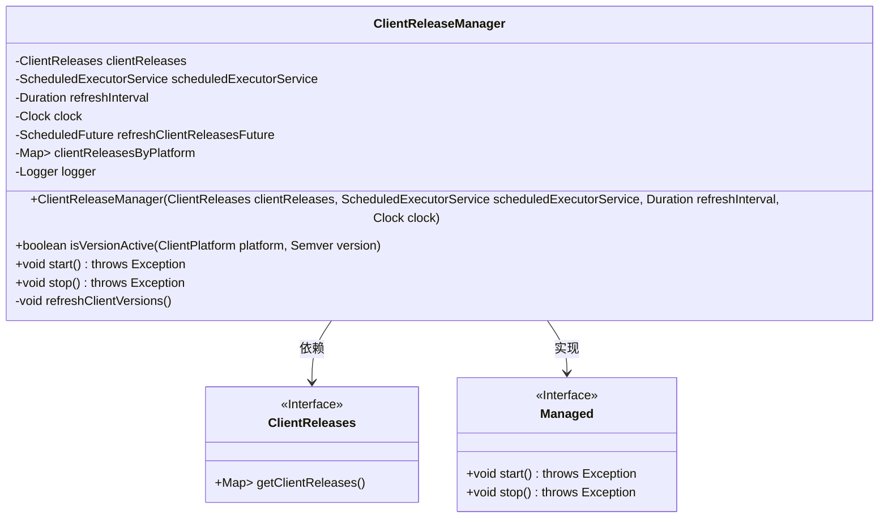
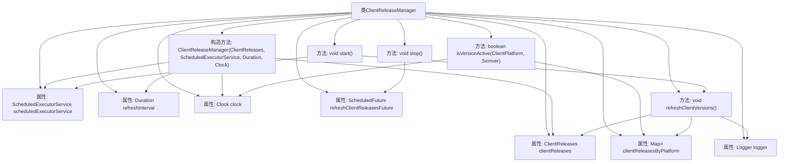

# 基础信息

|      |      |
|------|------|
| 名称 | ClientReleaseManager |
| 编码语言 | .java |
| 代码路径 | Signal-Server/service/src/main/java/org/whispersystems/textsecuregcm/storage/ClientReleaseManager.java |
| 包名 | org.whispersystems.textsecuregcm.storage |
| 依赖项 | ['com.vdurmont.semver4j.Semver', 'java.time.Clock', 'java.time.Duration', 'java.util.Collections', 'java.util.Map', 'java.util.concurrent.ScheduledExecutorService', 'java.util.concurrent.ScheduledFuture', 'java.util.concurrent.TimeUnit', 'io.dropwizard.lifecycle.Managed', 'org.slf4j.Logger', 'org.slf4j.LoggerFactory', 'org.whispersystems.textsecuregcm.util.ua.ClientPlatform', 'javax.annotation.Nullable'] |
| 概述说明 | ClientReleaseManager负责管理客户端版本，定时刷新并验证版本有效性。 |

# 说明

ClientReleaseManager负责管理客户端的版本，其主要功能包括定时刷新和检查版本的有效性。通过定期刷新，确保客户端始终使用最新的版本，同时通过有效性检查，验证版本是否符合要求，从而保障客户端的稳定性和安全性。

# 类列表 Class Summary

| 名称   | 类型  | 说明 |
|-------|------|-------------|
| ClientReleaseManager | class | ClientReleaseManager管理客户端版本，定时刷新并检查版本有效性。 |

## 类 ClientReleaseManager

|      |      |
|------|------|
| 访问范围 | public |
| 类型 | class |
| 名称 | ClientReleaseManager |
| 说明 | ClientReleaseManager管理客户端版本，定时刷新并检查版本有效性。 |

### UML类图

**描述：**  
`ClientReleaseManager` 类负责管理客户端版本的发布信息，通过定期刷新客户端版本数据来确保数据的实时性。它实现了 `Managed` 接口，提供了 `start` 和 `stop` 方法来控制刷新任务的启动和停止。`ClientReleaseManager` 依赖于 `ClientReleases` 接口来获取客户端版本数据，并通过 `ScheduledExecutorService` 定期执行刷新任务。`isVersionActive` 方法用于检查指定平台和版本的客户端是否处于激活状态。

### 内部方法调用关系图

这段代码定义了一个名为 `ClientReleaseManager` 的类，用于管理客户端版本的发布。它包含多个属性和方法，用于初始化、启动、停止和刷新客户端版本信息。`start` 方法会定期调用 `refreshClientVersions` 方法来更新客户端版本信息，而 `stop` 方法则用于取消定时任务。`isVersionActive` 方法用于检查某个平台上的特定版本是否仍然有效。整个过程通过日志记录器进行调试和错误记录。

### 字段列表 Field List

| 名称  | 类型  | 说明 |
|-------|-------|------|
| clientReleases | ClientReleases | 私有且不可变的ClientReleases对象。 |
| refreshInterval | Duration | 私有常量刷新间隔时长。 |
| clock | Clock | 定义了一个私有的不可变时钟对象。 |
| logger = LoggerFactory.getLogger(ClientReleaseManager.class) | Logger | ClientReleaseManager类中定义了一个静态的日志记录器。 |
| scheduledExecutorService | ScheduledExecutorService | 私有且不可变的定时任务执行服务实例。 |
| refreshClientReleasesFuture | ScheduledFuture<?> | 可为空的私有ScheduledFuture类型变量refreshClientReleasesFuture。 |
| clientReleasesByPlatform = Collections.emptyMap() | Map<ClientPlatform, Map<Semver, ClientRelease>> | 私有可变映射存储各平台客户端版本信息。 |

### 方法列表 Method List

| 名称  | 类型  | 说明 |
|-------|-------|------|
| stop | void | 停止方法取消刷新客户端版本任务。 |
| isVersionActive | boolean | 检查指定平台和版本是否有效且未过期。 |
| refreshClientVersions | void | 刷新客户端版本，记录各平台发布数量，捕获异常并记录日志。 |
| start | void | 重写start方法，定时刷新客户端版本信息。 |

