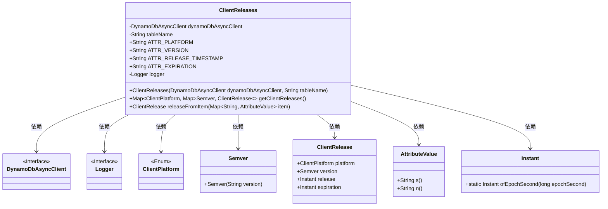
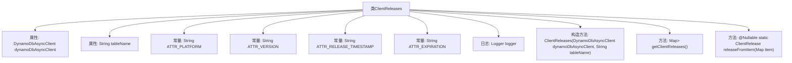
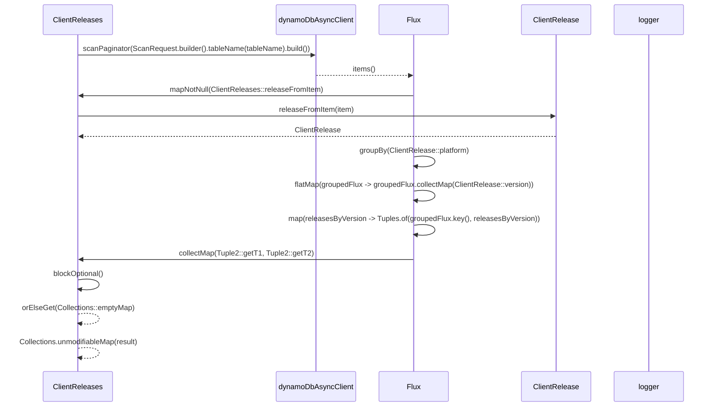

# 基础信息

|      |      |
|------|------|
| 名称 | ClientReleases |
| 编码语言 | .java |
| 代码路径 | Signal-Server/service/src/main/java/org/whispersystems/textsecuregcm/storage/ClientReleases.java |
| 包名 | org.whispersystems.textsecuregcm.storage |
| 依赖项 | ['com.vdurmont.semver4j.Semver', 'org.slf4j.Logger', 'org.slf4j.LoggerFactory', 'org.whispersystems.textsecuregcm.util.ua.ClientPlatform', 'reactor.core.publisher.Flux', 'reactor.util.function.Tuple2', 'reactor.util.function.Tuples', 'software.amazon.awssdk.services.dynamodb.DynamoDbAsyncClient', 'software.amazon.awssdk.services.dynamodb.model.AttributeValue', 'software.amazon.awssdk.services.dynamodb.model.ScanRequest', 'javax.annotation.Nullable', 'java.time.Instant', 'java.util.Collections', 'java.util.Map'] |
| 概述说明 | ClientReleases类通过DynamoDB异步获取客户端发布信息，涵盖平台、版本、发布时间及过期时间。 |

# 说明

ClientReleases类通过DynamoDB异步客户端获取客户端发布信息，支持查询平台、版本、发布时间和过期时间等关键数据。该设计确保了高效的数据检索和处理，适用于需要实时或近实时获取发布信息的应用场景。

# 类列表 Class Summary

| 名称   | 类型  | 说明 |
|-------|------|-------------|
| ClientReleases | class | ClientReleases类使用DynamoDB异步客户端获取客户端发布信息，支持平台、版本、发布时间和过期时间。 |

## 类 ClientReleases

|      |      |
|------|------|
| 访问范围 | public |
| 类型 | class |
| 名称 | ClientReleases |
| 说明 | ClientReleases类使用DynamoDB异步客户端获取客户端发布信息，支持平台、版本、发布时间和过期时间。 |

### UML类图

**描述：**  
`ClientReleases` 类用于从 DynamoDB 异步客户端获取客户端发布信息。它通过 `getClientReleases` 方法扫描指定表，并将结果解析为 `ClientRelease` 对象。`releaseFromItem` 方法负责将 DynamoDB 的 `AttributeValue` 转换为 `ClientRelease` 对象。该类依赖于 `DynamoDbAsyncClient`、`Logger`、`ClientPlatform`、`Semver`、`ClientRelease`、`AttributeValue` 和 `Instant` 等类或接口。

### 内部方法调用关系图

**描述：**
这段代码定义了一个名为`ClientReleases`的类，用于从DynamoDB表中获取客户端发布信息。类中包含构造方法、获取客户端发布信息的方法`getClientReleases`以及解析DynamoDB项的静态方法`releaseFromItem`。`getClientReleases`方法通过异步扫描DynamoDB表，将结果映射为`ClientRelease`对象，并按平台和版本进行分组，最终返回不可修改的映射。`releaseFromItem`方法负责解析DynamoDB项并生成`ClientRelease`对象，若解析失败则记录警告日志并返回`null`。

### 字段列表 Field List

| 名称  | 类型  | 说明 |
|-------|-------|------|
| dynamoDbAsyncClient | DynamoDbAsyncClient | 私有且不可变的DynamoDb异步客户端实例。 |
| ATTR_VERSION = "V" | String | 定义常量ATTR_VERSION，值为"V"。 |
| ATTR_PLATFORM = "P" | String | 定义常量ATTR_PLATFORM，值为"P"。 |
| tableName | String | 定义了一个私有的不可变字符串变量tableName。 |
| ATTR_EXPIRATION = "E" | String | 定义了一个名为ATTR_EXPIRATION的静态常量字符串，值为"E"。 |
| ATTR_RELEASE_TIMESTAMP = "T" | String | ATTR_RELEASE_TIMESTAMP定义为常量字符串"T"。 |
| logger = LoggerFactory.getLogger(ClientReleases.class) | Logger | 定义日志记录器，用于ClientReleases类的日志输出。 |

### 方法列表 Method List

| 名称  | 类型  | 说明 |
|-------|-------|------|
| getClientReleases | Map<ClientPlatform, Map<Semver, ClientRelease>> | 获取客户端发布的不可修改映射，按平台和版本分组。 |
| releaseFromItem | ClientRelease | 解析Map生成ClientRelease对象，失败返回null。 |

