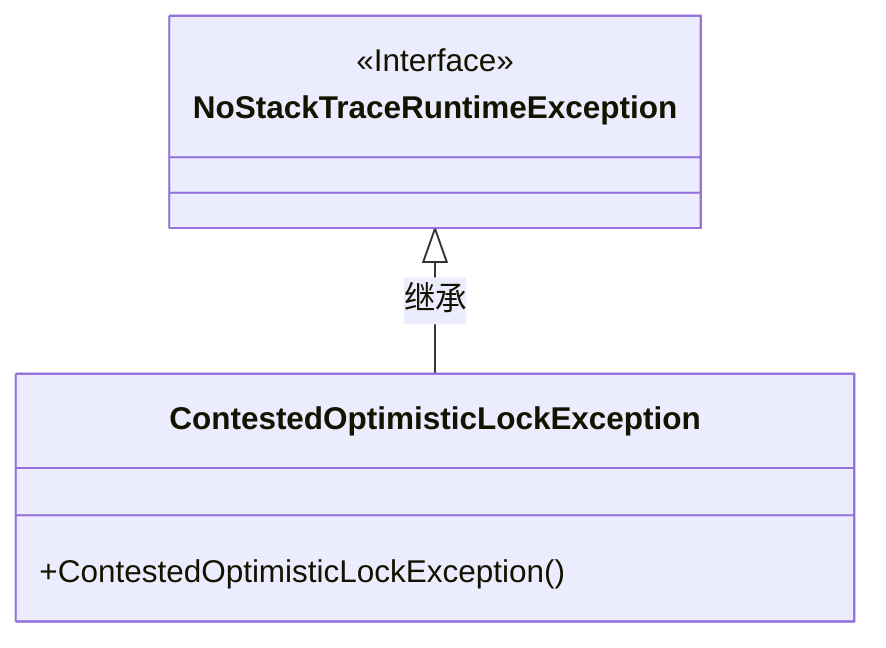
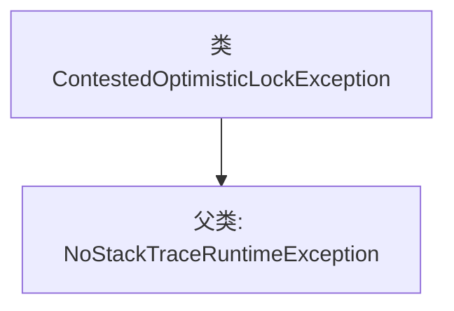

# 基础信息

|      |      |
|------|------|
| 名称 | ContestedOptimisticLockException |
| 编码语言 | .java |
| 代码路径 | Signal-Server/service/src/main/java/org/whispersystems/textsecuregcm/storage/ContestedOptimisticLockException.java |
| 包名 | org.whispersystems.textsecuregcm.storage |
| 依赖项 | ['org.whispersystems.textsecuregcm.util.NoStackTraceRuntimeException'] |
| 概述说明 | ContestedOptimisticLockException继承NoStackTraceRuntimeException。 |

# 说明

ContestedOptimisticLockException是一个继承自NoStackTraceRuntimeException的异常类。它用于表示在乐观锁机制下，当多个事务尝试同时更新同一数据时发生的冲突。由于继承自NoStackTraceRuntimeException，该异常不会包含堆栈跟踪信息，从而减少了异常处理的开销。这种设计适用于需要高效处理并发冲突的场景。

# 类列表 Class Summary

| 名称   | 类型  | 说明 |
|-------|------|-------------|
| ContestedOptimisticLockException | class | ContestedOptimisticLockException继承自NoStackTraceRuntimeException。 |

## 类 ContestedOptimisticLockException

|      |      |
|------|------|
| 访问范围 | public |
| 类型 | class |
| 名称 | ContestedOptimisticLockException |
| 说明 | ContestedOptimisticLockException继承自NoStackTraceRuntimeException。 |

### UML类图

这段代码定义了一个名为 `ContestedOptimisticLockException` 的异常类，它继承自 `NoStackTraceRuntimeException`。`NoStackTraceRuntimeException` 是一个接口（标记为 `<<Interface>>`），而 `ContestedOptimisticLockException` 是一个具体的异常类，包含一个默认的构造函数。这种设计通常用于处理乐观锁冲突的场景，表示在并发操作中发生了资源竞争。

### 内部方法调用关系图

这段代码定义了一个名为 `ContestedOptimisticLockException` 的类，该类继承自 `NoStackTraceRuntimeException`。这个类可能用于表示在乐观锁机制中发生的并发冲突异常。由于它继承了 `NoStackTraceRuntimeException`，因此可能不会包含堆栈跟踪信息，以减少异常处理的开销。这种设计通常用于高性能或低延迟的系统，其中异常的详细信息可能不是必需的。

### 字段列表 Field List

| 名称  | 类型  | 说明 |
|-------|-------|------|

### 方法列表 Method List

| 名称  | 类型  | 说明 |
|-------|-------|------|

