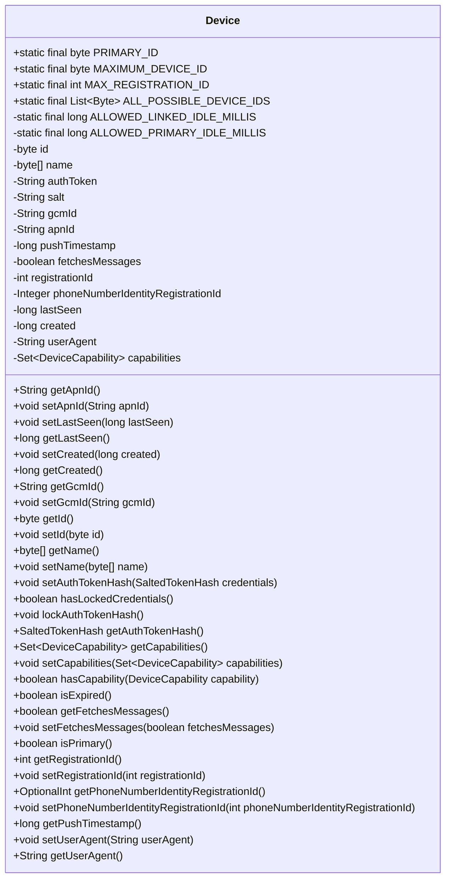

# 基础信息

|      |      |
|------|------|
| 名称 | Device |
| 编码语言 | .java |
| 代码路径 | Signal-Server/service/src/main/java/org/whispersystems/textsecuregcm/storage/Device.java |
| 包名 | org.whispersystems.textsecuregcm.storage |
| 依赖项 | ['com.fasterxml.jackson.annotation.JsonProperty', 'com.fasterxml.jackson.annotation.JsonSetter', 'com.fasterxml.jackson.databind.annotation.JsonDeserialize', 'com.fasterxml.jackson.databind.annotation.JsonSerialize', 'java.time.Duration', 'java.util.Collections', 'java.util.EnumSet', 'java.util.List', 'java.util.OptionalInt', 'java.util.Set', 'java.util.stream.Collectors', 'java.util.stream.IntStream', 'javax.annotation.Nullable', 'com.google.common.annotations.VisibleForTesting', 'org.whispersystems.textsecuregcm.auth.SaltedTokenHash', 'org.whispersystems.textsecuregcm.util.DeviceCapabilityAdapter', 'org.whispersystems.textsecuregcm.util.DeviceNameByteArrayAdapter'] |
| 概述说明 | Device类定义设备属性，支持锁定和过期检测。 |

# 说明

Device类用于定义设备的基本属性，包括设备的唯一标识ID、设备名称、认证信息、推送ID、注册ID以及设备的能力集等。该类还提供了设备锁定功能，允许对设备进行锁定操作，并支持检测设备是否已过期。通过这些属性和功能，Device类能够全面管理和控制设备的状态和行为。

# 类列表 Class Summary

| 名称   | 类型  | 说明 |
|-------|------|-------------|
| Device | class | Device类定义设备属性，包括ID、名称、认证信息、推送ID、注册ID、能力集等，支持设备锁定和过期检测。 |

## 类 Device

|      |      |
|------|------|
| 访问范围 | public |
| 类型 | class |
| 名称 | Device |
| 说明 | Device类定义设备属性，包括ID、名称、认证信息、推送ID、注册ID、能力集等，支持设备锁定和过期检测。 |

### UML类图

这段代码定义了一个`Device`类，用于表示设备的相关信息。类中包含多个静态常量、私有字段和公有方法。静态常量用于定义设备ID的范围和最大注册ID等。私有字段包括设备ID、名称、认证令牌、盐值、GCM ID、APN ID、推送时间戳、消息获取标志、注册ID、电话号码身份注册ID、最后可见时间、创建时间、用户代理和设备能力集合等。公有方法提供了对这些字段的获取和设置功能，还包括判断设备是否过期、是否为主设备、是否锁定凭证等功能。

### 内部方法调用关系图

这段代码定义了一个名为 `Device` 的类，包含多个属性和方法，用于管理设备的相关信息。属性包括设备ID、名称、认证令牌、GCM ID、APN ID、推送时间戳等。方法用于获取和设置这些属性，以及执行一些特定的操作，如锁定认证令牌、检查设备是否过期、判断设备是否为主设备等。代码还包含了一些静态常量，用于定义设备ID的范围和允许的闲置时间。

### 字段列表 Field List

| 名称  | 类型  | 说明 |
|-------|-------|------|
| PRIMARY_ID = 1 | byte | 定义了一个静态常量PRIMARY_ID，其值为1。 |
| userAgent | String | JSON属性映射为userAgent字段。 |
| ALL_POSSIBLE_DEVICE_IDS = IntStream.range(Device.PRIMARY_ID, MAXIMUM_DEVICE_ID).boxed()      .map(Integer::byteValue).collect(Collectors.toList()) | List<Byte> | 生成所有可能的设备ID列表。 |
| ALLOWED_LINKED_IDLE_MILLIS = Duration.ofDays(45).toMillis() | long | 允许空闲连接时长为45天的毫秒数。 |
| fetchesMessages | boolean | 属性fetchesMessages用于标识是否获取消息。 |
| ALLOWED_PRIMARY_IDLE_MILLIS = Duration.ofDays(180).toMillis() | long | 允许主空闲时间为180天的毫秒数。 |
| gcmId | String | JSON属性映射为Java字符串gcmId。 |
| lastSeen | long | JSON属性映射为私有长整型变量lastSeen。 |
| registrationId | int | 使用JsonProperty注解标记registrationId字段。 |
| pushTimestamp | long | JSON属性pushTimestamp为长整型私有变量。 |
| created | long | 属性created为长整型，使用JsonProperty注解。 |
| phoneNumberIdentityRegistrationId | Integer | 可为空的电话身份注册ID字段。 |
| name | byte[] | 使用Jackson库处理字节数组设备名的序列化与反序列化。 |
| apnId | String | 定义私有字符串变量apnId，使用JsonProperty注解。 |
| authToken | String | 属性authToken用于JSON序列化。 |
| MAX_REGISTRATION_ID = 0x3FFF | int | MAX_REGISTRATION_ID为静态常量，最大值为16383。 |
| id | byte | 类属性使用注解指定反序列化方式和JSON属性映射。 |
| MAXIMUM_DEVICE_ID = Byte.MAX_VALUE | byte | 最大设备ID值为字节最大值。 |
| capabilities = Collections.emptySet() | Set<DeviceCapability> | 使用注解配置设备能力集合的JSON序列化与反序列化。 |
| salt | String | 该代码片段定义了一个私有字符串变量salt，并使用JsonProperty注解进行序列化标记。 |

### 方法列表 Method List

| 名称  | 类型  | 说明 |
|-------|-------|------|
| getLastSeen | long | 获取最后访问时间的方法。 |
| getRegistrationId | int | 获取注册ID的公共方法，返回registrationId。 |
| isExpired | boolean | 判断对象是否过期，主对象和关联对象分别依据不同时间阈值。 |
| getCreated | long | 获取创建时间的公共方法。 |
| getApnId | String | 获取APN ID的方法。 |
| getAuthTokenHash | SaltedTokenHash | 生成带盐值的认证令牌哈希。 |
| setUserAgent | void | 设置用户代理字符串的方法。 |
| getGcmId | String | 获取GCM ID的方法。 |
| setApnId | void | 设置APN ID并更新推送时间戳。 |
| setPhoneNumberIdentityRegistrationId | void | 设置电话号码身份注册ID的方法。 |
| setGcmId | void | 设置GCM ID并更新推送时间戳。 |
| getUserAgent | String | 获取用户代理字符串的方法。 |
| setLastSeen | void | 设置最后可见时间的方法。 |
| getFetchesMessages | boolean | 该方法返回布尔值，表示是否获取消息。 |
| hasCapability | boolean | 检查设备是否具备指定功能。 |
| setAuthTokenHash | void | 设置认证令牌哈希，存储哈希值和盐值。 |
| isPrimary | boolean | 该方法检查当前ID是否为主ID，返回布尔值。 |
| setName | void | 该方法用于设置字节数组类型的name属性。 |
| getCapabilities | Set<DeviceCapability> | 公开方法getCapabilities返回设备能力集合。 |
| setCreated | void | 设置创建时间的方法，接受长整型参数。 |
| getId | byte | 方法getId返回字节类型变量id的值。 |
| setId | void | 该方法用于设置对象的ID属性，接收一个字节类型的参数。 |
| getPushTimestamp | long | 获取推送时间戳的方法。 |
| setCapabilities | void | 方法设置设备能力集，若为空或空集则设为空集，否则复制为枚举集。 |
| getPhoneNumberIdentityRegistrationId | OptionalInt | 方法返回手机号身份注册ID的OptionalInt对象，若为空则返回空OptionalInt。 |
| setRegistrationId | void | 设置注册ID的方法，将传入的registrationId赋值给当前对象的registrationId。 |
| hasLockedCredentials | boolean | 检查凭据是否被锁定，通过验证哈希值是否以"!"开头。 |
| lockAuthTokenHash | void | 锁定认证令牌哈希值，更新为带前缀的新哈希值。 |
| setFetchesMessages | void | 设置是否获取消息的布尔值方法。 |
| getName | byte[] | 方法返回字节数组类型的name变量。 |

