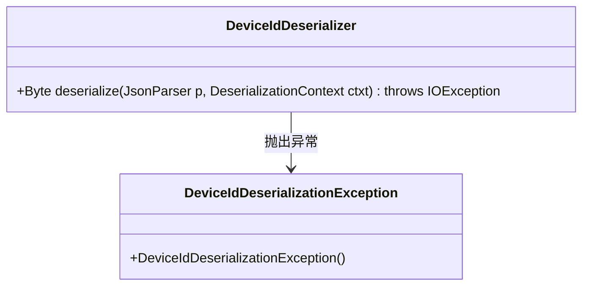
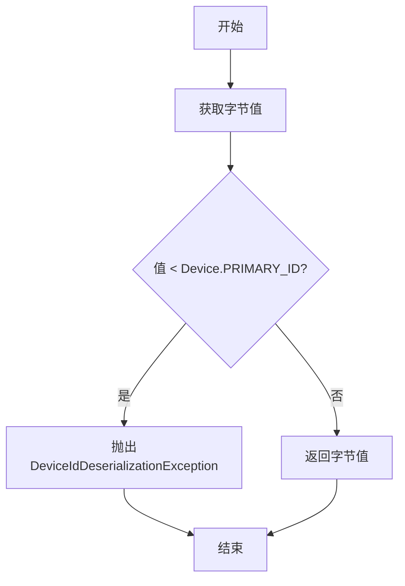
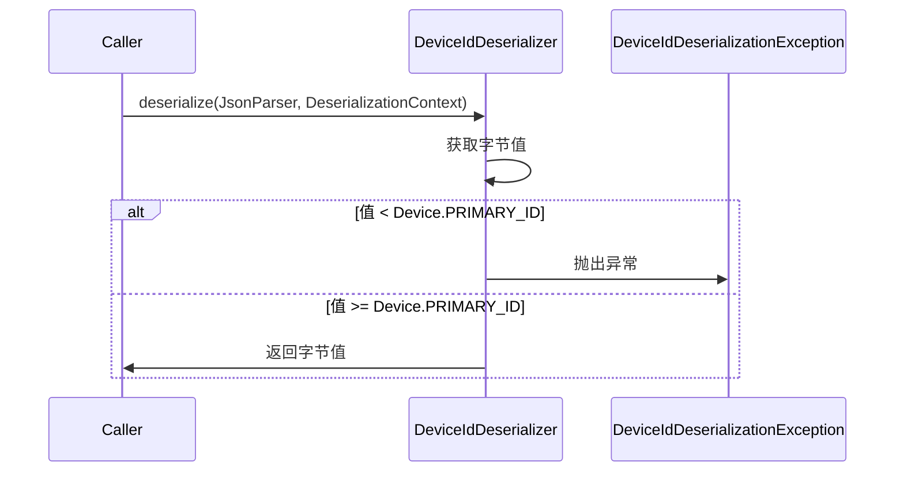
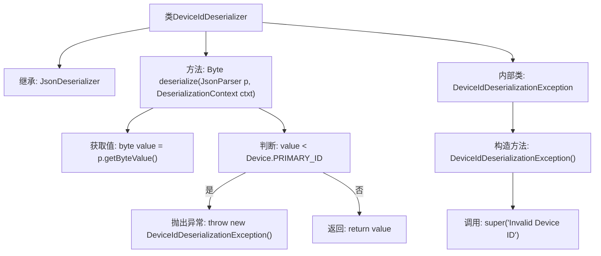

# 基础信息

|      |      |
|------|------|
| 名称 | DeviceIdDeserializer |
| 编码语言 | .java |
| 代码路径 | Signal-Server/service/src/main/java/org/whispersystems/textsecuregcm/storage/DeviceIdDeserializer.java |
| 包名 | org.whispersystems.textsecuregcm.storage |
| 依赖项 | ['com.fasterxml.jackson.core.JsonParser', 'com.fasterxml.jackson.databind.DeserializationContext', 'com.fasterxml.jackson.databind.JsonDeserializer', 'java.io.IOException'] |
| 概述说明 | DeviceIdDeserializer类反序列化字节型设备ID，ID小于PRIMARY_ID时抛出异常。 |

# 说明

DeviceIdDeserializer类的主要功能是反序列化字节型设备ID。在处理过程中，如果设备ID小于预定义的PRIMARY_ID值，该类会抛出异常。这一机制确保了设备ID的有效性和安全性，防止了无效或不合规的ID被使用。

# 类列表 Class Summary

| 名称   | 类型  | 说明 |
|-------|------|-------------|
| DeviceIdDeserializer | class | DeviceIdDeserializer类用于反序列化字节型设备ID，若ID小于PRIMARY_ID则抛出异常。 |

## 类 DeviceIdDeserializer

|      |      |
|------|------|
| 访问范围 | public |
| 类型 | class |
| 名称 | DeviceIdDeserializer |
| 说明 | DeviceIdDeserializer类用于反序列化字节型设备ID，若ID小于PRIMARY_ID则抛出异常。 |

### UML类图

**描述：**
`DeviceIdDeserializer` 是一个用于反序列化设备ID的类，继承自 `JsonDeserializer<Byte>`。它通过 `deserialize` 方法从 `JsonParser` 中获取字节值，并检查该值是否小于 `Device.PRIMARY_ID`。如果小于，则抛出 `DeviceIdDeserializationException` 异常，否则返回该字节值。`DeviceIdDeserializationException` 是一个自定义异常类，用于表示无效的设备ID。

### 内部方法调用关系图

这段代码定义了一个`DeviceIdDeserializer`类，用于反序列化设备ID。它继承了`JsonDeserializer<Byte>`，并重写了`deserialize`方法。在该方法中，首先获取字节值，然后检查该值是否小于`Device.PRIMARY_ID`，如果小于则抛出`DeviceIdDeserializationException`异常，否则返回该值。`DeviceIdDeserializationException`是一个内部类，继承自`IOException`，并在构造方法中调用父类构造方法传递错误信息。

### 字段列表 Field List

| 名称  | 类型  | 说明 |
|-------|-------|------|

### 方法列表 Method List

| 名称  | 类型  | 说明 |
|-------|-------|------|
| deserialize | Byte | 重写方法：从JSON解析字节值，若小于设备主ID则抛出异常，否则返回该值。 |

