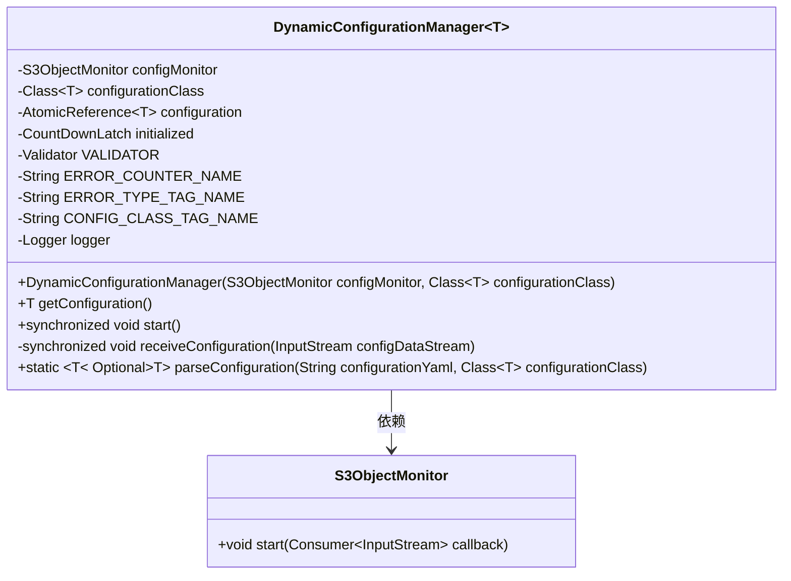

# 基础信息

|      |      |
|------|------|
| 名称 | DynamicConfigurationManager |
| 编码语言 | .java |
| 代码路径 | Signal-Server/service/src/main/java/org/whispersystems/textsecuregcm/storage/DynamicConfigurationManager.java |
| 包名 | org.whispersystems.textsecuregcm.storage |
| 依赖项 | ['org.whispersystems.textsecuregcm.metrics.MetricsUtil.name', 'com.google.common.annotations.VisibleForTesting', 'io.micrometer.core.instrument.Metrics', 'jakarta.validation.ConstraintViolation', 'jakarta.validation.Validation', 'jakarta.validation.Validator', 'java.io.IOException', 'java.io.InputStream', 'java.util.Optional', 'java.util.Set', 'java.util.concurrent.CountDownLatch', 'java.util.concurrent.atomic.AtomicReference', 'org.slf4j.Logger', 'org.slf4j.LoggerFactory', 'org.whispersystems.textsecuregcm.s3.S3ObjectMonitor', 'org.whispersystems.textsecuregcm.util.SystemMapper'] |
| 概述说明 | 动态配置管理器监控S3配置更新，解析验证后确保初始化完成。 |

# 说明

动态配置管理器主要用于监控S3配置的更新，通过实时解析和验证配置内容，确保系统在初始化阶段能够正确加载和生效。该管理器持续跟踪配置变化，及时发现并处理配置更新，保证系统配置的准确性和一致性，从而确保系统初始化的顺利完成。

# 类列表 Class Summary

| 名称   | 类型  | 说明 |
|-------|------|-------------|
| DynamicConfigurationManager | class | 动态配置管理器，监控S3配置更新，解析并验证配置，确保初始化完成。 |

## 类 DynamicConfigurationManager

|      |      |
|------|------|
| 访问范围 | public |
| 类型 | class |
| 名称 | DynamicConfigurationManager |
| 说明 | 动态配置管理器，监控S3配置更新，解析并验证配置，确保初始化完成。 |

### UML类图

### 描述
`DynamicConfigurationManager` 是一个泛型类，用于动态管理配置。它依赖于 `S3ObjectMonitor` 来监控配置文件的更新，并通过 `receiveConfiguration` 方法接收新的配置数据。`parseConfiguration` 方法用于解析和验证配置数据。`start` 方法启动配置监控，并确保在配置可用之前阻塞调用。`getConfiguration` 方法返回当前的配置实例。整个流程通过 `CountDownLatch` 和 `AtomicReference` 确保线程安全。

### 内部方法调用关系图

```mermaid
graph TD
    A["类DynamicConfigurationManager<T>"]
    B["属性: S3ObjectMonitor configMonitor"]
    C["属性: Class<T> configurationClass"]
    D["属性: AtomicReference<T> configuration"]
    E["属性: CountDownLatch initialized"]
    F["属性: Validator VALIDATOR"]
    G["属性: String ERROR_COUNTER_NAME"]
    H["属性: String ERROR_TYPE_TAG_NAME"]
    I["属性: String CONFIG_CLASS_TAG_NAME"]
    J["属性: Logger logger"]
    K["构造方法: DynamicConfigurationManager(S3ObjectMonitor configMonitor, Class<T> configurationClass)"]
    L["方法: T getConfiguration()"]
    M["方法: synchronized void start()"]
    N["方法: synchronized void receiveConfiguration(InputStream configDataStream)"]
    O["方法: static <T> Optional<T> parseConfiguration(String configurationYaml, Class<T> configurationClass)"]
    P["步骤: initialized.await()"]
    Q["步骤: configMonitor.start(this::receiveConfiguration)"]
    R["步骤: this.wait()"]
    S["步骤: initialized.countDown()"]
    T["步骤: configData = new String(configDataStream.readAllBytes())"]
    U["步骤: parseConfiguration(configData, configurationClass)"]
    V["步骤: configuration::set"]
    W["步骤: this.notify()"]
    X["步骤: configuration = SystemMapper.yamlMapper().readValue(configurationYaml, configurationClass)"]
    Y["步骤: Set<ConstraintViolation<T>> violations = VALIDATOR.validate(configuration)"]
    Z["步骤: return Optional.of(configuration)"]

    A --> B
    A --> C
    A --> D
    A --> E
    A --> F
    A --> G
    A --> H
    A --> I
    A --> J
    A --> K
    A --> L
    A --> M
    A --> N
    A --> O
    L --> P
    M --> Q
    M --> R
    M --> S
    N --> T
    N --> U
    U --> V
    U --> W
    O --> X
    O --> Y
    O --> Z
```

**流程图描述：**
这段代码定义了一个`DynamicConfigurationManager`类，用于动态管理配置。类中包含多个属性和方法，如`getConfiguration`用于获取配置，`start`用于启动配置监控，`receiveConfiguration`用于接收配置数据，`parseConfiguration`用于解析和验证配置。流程图展示了类内部方法的调用关系和执行步骤，包括配置的获取、解析、验证以及通知机制。

### 字段列表 Field List

| 名称  | 类型  | 说明 |
|-------|-------|------|
| configMonitor | S3ObjectMonitor | 私有S3对象监控器配置监控实例。 |
| VALIDATOR = Validation.buildDefaultValidatorFactory().getValidator() | Validator | 静态常量VALIDATOR通过默认验证工厂初始化。 |
| configuration = new AtomicReference<>() | AtomicReference<T> | 使用AtomicReference确保线程安全的配置对象引用。 |
| initialized = new CountDownLatch(1) | CountDownLatch | 初始化计数器，用于同步线程操作。 |
| configurationClass | Class<T> | 私有final类T的配置类变量。 |
| ERROR_TYPE_TAG_NAME = "type" | String | 定义常量ERROR_TYPE_TAG_NAME，值为"type"。 |
| logger = LoggerFactory.getLogger(DynamicConfigurationManager.class) | Logger | DynamicConfigurationManager类中定义了一个静态的Logger实例。 |
| CONFIG_CLASS_TAG_NAME = "configClass" | String | 定义常量字符串变量CONFIG_CLASS_TAG_NAME，值为"configClass"。 |
| ERROR_COUNTER_NAME = name(DynamicConfigurationManager.class, "error") | String | 定义静态常量ERROR_COUNTER_NAME，用于记录DynamicConfigurationManager类的错误计数。 |

### 方法列表 Method List

| 名称  | 类型  | 说明 |
|-------|-------|------|
| getConfiguration | T | 方法等待初始化完成，若中断则记录日志并抛出异常，最后返回配置。 |
| parseConfiguration | Optional<T> | 解析并验证YAML配置，失败时记录日志和指标。 |
| start | void | 启动时检查初始化状态，监控配置更新，等待有效配置后标记就绪。 |
| receiveConfiguration | void | 私有同步方法接收配置，读取输入流，处理异常，记录日志，解析配置并通知。 |

