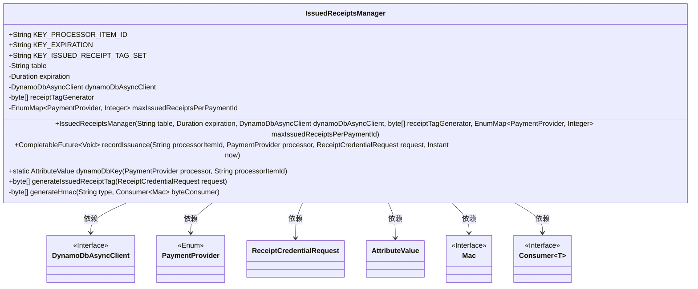

# 基础信息

|      |      |
|------|------|
| 名称 | IssuedReceiptsManager |
| 编码语言 | .java |
| 代码路径 | Signal-Server/service/src/main/java/org/whispersystems/textsecuregcm/storage/IssuedReceiptsManager.java |
| 包名 | org.whispersystems.textsecuregcm.storage |
| 依赖项 | ['org.whispersystems.textsecuregcm.util.AttributeValues.b', 'org.whispersystems.textsecuregcm.util.AttributeValues.n', 'org.whispersystems.textsecuregcm.util.AttributeValues.s', 'com.google.common.annotations.VisibleForTesting', 'com.google.common.base.Throwables', 'jakarta.ws.rs.ClientErrorException', 'jakarta.ws.rs.core.Response.Status', 'java.nio.charset.StandardCharsets', 'java.security.InvalidKeyException', 'java.security.NoSuchAlgorithmException', 'java.time.Duration', 'java.time.Instant', 'java.util.EnumMap', 'java.util.List', 'java.util.Map', 'java.util.Objects', 'java.util.concurrent.CompletableFuture', 'java.util.concurrent.CompletionException', 'java.util.function.Consumer', 'javax.annotation.Nonnull', 'javax.crypto.Mac', 'javax.crypto.spec.SecretKeySpec', 'org.signal.libsignal.zkgroup.receipts.ReceiptCredentialRequest', 'org.whispersystems.textsecuregcm.subscriptions.PaymentProvider', 'software.amazon.awssdk.core.SdkBytes', 'software.amazon.awssdk.services.dynamodb.DynamoDbAsyncClient', 'software.amazon.awssdk.services.dynamodb.model.AttributeValue', 'software.amazon.awssdk.services.dynamodb.model.ConditionalCheckFailedException', 'software.amazon.awssdk.services.dynamodb.model.ReturnValue', 'software.amazon.awssdk.services.dynamodb.model.UpdateItemRequest'] |
| 概述说明 | IssuedReceiptsManager类管理并发收据发放，防重复并生成唯一标签。 |

# 说明

IssuedReceiptsManager类负责管理收据的发放过程，支持并发操作，确保在高并发环境下能够正确处理收据发放请求。该类通过机制防止重复发放，保证每张收据的唯一性。同时，它还能生成唯一的标签，用于标识和追踪每张发放的收据，确保整个发放过程的准确性和可追溯性。

# 类列表 Class Summary

| 名称   | 类型  | 说明 |
|-------|------|-------------|
| IssuedReceiptsManager | class | IssuedReceiptsManager类管理收据发放，支持并发处理，防止重复发放，并生成唯一标签。 |

## 类 IssuedReceiptsManager

|      |      |
|------|------|
| 访问范围 | public |
| 类型 | class |
| 名称 | IssuedReceiptsManager |
| 说明 | IssuedReceiptsManager类管理收据发放，支持并发处理，防止重复发放，并生成唯一标签。 |

### UML类图

这段代码定义了一个`IssuedReceiptsManager`类，用于管理已发出的收据凭证。它通过`DynamoDbAsyncClient`与DynamoDB进行异步交互，记录收据凭证的发放情况，并确保不会重复发放。类中包含多个常量、私有成员变量和公有方法，其中`recordIssuance`方法用于记录收据凭证的发放，`generateIssuedReceiptTag`方法用于生成收据标签，`generateHmac`方法用于生成HMAC签名。类图展示了`IssuedReceiptsManager`与其他类和接口之间的依赖关系。

### 内部方法调用关系图

```mermaid
graph TD
    A["类IssuedReceiptsManager"]
    B["常量: KEY_PROCESSOR_ITEM_ID = 'A'"]
    C["常量: KEY_EXPIRATION = 'E'"]
    D["常量: KEY_ISSUED_RECEIPT_TAG_SET = 'T'"]
    E["属性: String table"]
    F["属性: Duration expiration"]
    G["属性: DynamoDbAsyncClient dynamoDbAsyncClient"]
    H["属性: byte[] receiptTagGenerator"]
    I["属性: EnumMap<PaymentProvider, Integer> maxIssuedReceiptsPerPaymentId"]
    J["构造方法: IssuedReceiptsManager(String table, Duration expiration, DynamoDbAsyncClient dynamoDbAsyncClient, byte[] receiptTagGenerator, EnumMap<PaymentProvider, Integer> maxIssuedReceiptsPerPaymentId)"]
    K["方法: CompletableFuture<Void> recordIssuance(String processorItemId, PaymentProvider processor, ReceiptCredentialRequest request, Instant now)"]
    L["方法: static AttributeValue dynamoDbKey(PaymentProvider processor, String processorItemId)"]
    M["方法: byte[] generateIssuedReceiptTag(ReceiptCredentialRequest request)"]
    N["方法: private byte[] generateHmac(String type, Consumer<Mac> byteConsumer)"]
    O["调用: dynamoDbKey(processor, processorItemId)"]
    P["调用: generateIssuedReceiptTag(request)"]
    Q["调用: UpdateItemRequest.builder()"]
    R["调用: dynamoDbAsyncClient.updateItem(updateItemRequest)"]
    S["处理异常: ConditionalCheckFailedException"]
    T["处理异常: 其他异常"]

    A --> B
    A --> C
    A --> D
    A --> E
    A --> F
    A --> G
    A --> H
    A --> I
    A --> J
    A --> K
    A --> L
    A --> M
    A --> N
    K --> O
    K --> P
    K --> Q
    K --> R
    R --> S
    R --> T
```

这段代码定义了一个名为 `IssuedReceiptsManager` 的类，用于管理已发出的收据。它包含多个常量和属性，用于存储和操作收据数据。类中的 `recordIssuance` 方法负责记录收据的发出情况，并通过 `dynamoDbAsyncClient` 与 DynamoDB 进行交互。代码还包含几个辅助方法，如 `dynamoDbKey` 和 `generateIssuedReceiptTag`，用于生成 DynamoDB 的键和收据标签。`generateHmac` 方法用于生成 HMAC 签名。整个流程涉及多个步骤，包括数据生成、请求构建、异常处理等。

### 字段列表 Field List

| 名称  | 类型  | 说明 |
|-------|-------|------|
| dynamoDbAsyncClient | DynamoDbAsyncClient | 私有异步DynamoDB客户端实例。 |
| expiration | Duration | 私有常量存储过期时间。 |
| KEY_PROCESSOR_ITEM_ID = "A" | String | 定义常量KEY_PROCESSOR_ITEM_ID，值为"A"。 |
| table | String | 定义了一个私有且不可变的字符串变量`table`。 |
| KEY_EXPIRATION = "E" | String | 定义常量KEY_EXPIRATION，值为"E"。 |
| receiptTagGenerator | byte[] | 私有字节数组用于生成收据标签。 |
| KEY_ISSUED_RECEIPT_TAG_SET = "T" | String | 静态常量KEY_ISSUED_RECEIPT_TAG_SET值为"T"。 |
| maxIssuedReceiptsPerPaymentId | EnumMap<PaymentProvider, Integer> | 私有枚举映射，存储各支付提供商的每支付ID最大收据数。 |

### 方法列表 Method List

| 名称  | 类型  | 说明 |
|-------|-------|------|
| generateIssuedReceiptTag | byte[] | 生成收据标签的测试可见方法，使用HMAC和请求序列化。 |
| dynamoDbKey | AttributeValue | 根据支付处理器动态生成DynamoDB键值。 |
| generateHmac | byte[] | 生成HmacSHA256签名，处理异常并返回结果。 |
| recordIssuance | CompletableFuture<Void> | 方法记录收据签发，生成标签并更新DynamoDB表，处理冲突和异常。 |

