# 基础信息

|      |      |
|------|------|
| 名称 | KeysManager |
| 编码语言 | .java |
| 代码路径 | Signal-Server/service/src/main/java/org/whispersystems/textsecuregcm/storage/KeysManager.java |
| 包名 | org.whispersystems.textsecuregcm.storage |
| 依赖项 | ['com.google.common.annotations.VisibleForTesting', 'java.util.List', 'java.util.Optional', 'java.util.UUID', 'java.util.concurrent.CompletableFuture', 'org.whispersystems.textsecuregcm.entities.ECPreKey', 'org.whispersystems.textsecuregcm.entities.ECSignedPreKey', 'org.whispersystems.textsecuregcm.entities.KEMSignedPreKey', 'software.amazon.awssdk.services.dynamodb.DynamoDbAsyncClient', 'software.amazon.awssdk.services.dynamodb.model.TransactWriteItem'] |
| 概述说明 | KeysManager类管理密钥存储，支持插入、删除和查询操作。 |

# 说明

KeysManager类负责管理多种密钥的存储，提供了插入、删除和查询等基本操作功能。通过该类，用户可以方便地对密钥进行增删改查，确保密钥管理的高效性和安全性。

# 类列表 Class Summary

| 名称   | 类型  | 说明 |
|-------|------|-------------|
| KeysManager | class | KeysManager类管理多种密钥存储，支持插入、删除和查询操作。 |

## 类 KeysManager

|      |      |
|------|------|
| 访问范围 | public |
| 类型 | class |
| 名称 | KeysManager |
| 说明 | KeysManager类管理多种密钥存储，支持插入、删除和查询操作。 |

### UML类图

```mermaid
classDiagram
    class KeysManager {
        -SingleUseECPreKeyStore ecPreKeys
        -SingleUseKEMPreKeyStore pqPreKeys
        -RepeatedUseECSignedPreKeyStore ecSignedPreKeys
        -RepeatedUseKEMSignedPreKeyStore pqLastResortKeys
        +KeysManager(DynamoDbAsyncClient dynamoDbAsyncClient, String ecTableName, String pqTableName, String ecSignedPreKeysTableName, String pqLastResortTableName)
        +TransactWriteItem buildWriteItemForEcSignedPreKey(UUID identifier, byte deviceId, ECSignedPreKey ecSignedPreKey)
        +TransactWriteItem buildWriteItemForLastResortKey(UUID identifier, byte deviceId, KEMSignedPreKey lastResortSignedPreKey)
        +List~TransactWriteItem~ buildWriteItemsForNewDevice(UUID accountIdentifier, UUID phoneNumberIdentifier, byte deviceId, ECSignedPreKey aciSignedPreKey, ECSignedPreKey pniSignedPreKey, KEMSignedPreKey aciPqLastResortPreKey, KEMSignedPreKey pniLastResortPreKey)
        +List~TransactWriteItem~ buildWriteItemsForRemovedDevice(UUID accountIdentifier, UUID phoneNumberIdentifier, byte deviceId)
        +CompletableFuture~Void~ storeEcSignedPreKeys(UUID identifier, byte deviceId, ECSignedPreKey ecSignedPreKey)
        +CompletableFuture~Void~ storePqLastResort(UUID identifier, byte deviceId, KEMSignedPreKey lastResortKey)
        +CompletableFuture~Void~ storeEcOneTimePreKeys(UUID identifier, byte deviceId, List~ECPreKey~ preKeys)
        +CompletableFuture~Void~ storeKemOneTimePreKeys(UUID identifier, byte deviceId, List~KEMSignedPreKey~ preKeys)
        +CompletableFuture~Optional~ECPreKey~~ takeEC(UUID identifier, byte deviceId)
        +CompletableFuture~Optional~KEMSignedPreKey~~ takePQ(UUID identifier, byte deviceId)
        +CompletableFuture~Optional~KEMSignedPreKey~~ getLastResort(UUID identifier, byte deviceId)
        +CompletableFuture~Optional~ECSignedPreKey~~ getEcSignedPreKey(UUID identifier, byte deviceId)
        +CompletableFuture~List~Byte~~ getPqEnabledDevices(UUID identifier)
        +CompletableFuture~Integer~ getEcCount(UUID identifier, byte deviceId)
        +CompletableFuture~Integer~ getPqCount(UUID identifier, byte deviceId)
        +CompletableFuture~Void~ deleteSingleUsePreKeys(UUID identifier)
        +CompletableFuture~Void~ deleteSingleUsePreKeys(UUID accountUuid, byte deviceId)
    }

    class SingleUseECPreKeyStore {
        +SingleUseECPreKeyStore(DynamoDbAsyncClient dynamoDbAsyncClient, String ecTableName)
        +CompletableFuture~Void~ store(UUID identifier, byte deviceId, List~ECPreKey~ preKeys)
        +CompletableFuture~Optional~ECPreKey~~ take(UUID identifier, byte deviceId)
        +CompletableFuture~Integer~ getCount(UUID identifier, byte deviceId)
        +CompletableFuture~Void~ delete(UUID identifier)
        +CompletableFuture~Void~ delete(UUID accountUuid, byte deviceId)
    }

    class SingleUseKEMPreKeyStore {
        +SingleUseKEMPreKeyStore(DynamoDbAsyncClient dynamoDbAsyncClient, String pqTableName)
        +CompletableFuture~Void~ store(UUID identifier, byte deviceId, List~KEMSignedPreKey~ preKeys)
        +CompletableFuture~Optional~KEMSignedPreKey~~ take(UUID identifier, byte deviceId)
        +CompletableFuture~Integer~ getCount(UUID identifier, byte deviceId)
        +CompletableFuture~Void~ delete(UUID identifier)
        +CompletableFuture~Void~ delete(UUID accountUuid, byte deviceId)
    }

    class RepeatedUseECSignedPreKeyStore {
        +RepeatedUseECSignedPreKeyStore(DynamoDbAsyncClient dynamoDbAsyncClient, String ecSignedPreKeysTableName)
        +TransactWriteItem buildTransactWriteItemForInsertion(UUID identifier, byte deviceId, ECSignedPreKey ecSignedPreKey)
        +TransactWriteItem buildTransactWriteItemForDeletion(UUID identifier, byte deviceId)
        +CompletableFuture~Void~ store(UUID identifier, byte deviceId, ECSignedPreKey ecSignedPreKey)
        +CompletableFuture~Optional~ECSignedPreKey~~ find(UUID identifier, byte deviceId)
    }

    class RepeatedUseKEMSignedPreKeyStore {
        +RepeatedUseKEMSignedPreKeyStore(DynamoDbAsyncClient dynamoDbAsyncClient, String pqLastResortTableName)
        +TransactWriteItem buildTransactWriteItemForInsertion(UUID identifier, byte deviceId, KEMSignedPreKey lastResortSignedPreKey)
        +TransactWriteItem buildTransactWriteItemForDeletion(UUID identifier, byte deviceId)
        +CompletableFuture~Void~ store(UUID identifier, byte deviceId, KEMSignedPreKey lastResortKey)
        +CompletableFuture~Optional~KEMSignedPreKey~~ find(UUID identifier, byte deviceId)
        +CompletableFuture~List~Byte~~ getDeviceIdsWithKeys(UUID identifier)
    }

    KeysManager --> SingleUseECPreKeyStore : 依赖
    KeysManager --> SingleUseKEMPreKeyStore : 依赖
    KeysManager --> RepeatedUseECSignedPreKeyStore : 依赖
    KeysManager --> RepeatedUseKEMSignedPreKeyStore : 依赖
```

这段代码描述了一个`KeysManager`类，它负责管理不同类型的密钥存储，包括一次性使用的EC预密钥、KEM预密钥，以及重复使用的EC签名预密钥和KEM最后手段密钥。`KeysManager`通过多个方法来构建写入项、存储密钥、获取密钥以及删除密钥。它依赖于四个不同的存储类，每个存储类负责特定类型的密钥操作。

### 内部方法调用关系图

```mermaid
graph TD
    A["类KeysManager"]
    B["属性: SingleUseECPreKeyStore ecPreKeys"]
    C["属性: SingleUseKEMPreKeyStore pqPreKeys"]
    D["属性: RepeatedUseECSignedPreKeyStore ecSignedPreKeys"]
    E["属性: RepeatedUseKEMSignedPreKeyStore pqLastResortKeys"]
    F["构造方法: KeysManager(DynamoDbAsyncClient, String, String, String, String)"]
    G["方法: TransactWriteItem buildWriteItemForEcSignedPreKey(UUID, byte, ECSignedPreKey)"]
    H["方法: TransactWriteItem buildWriteItemForLastResortKey(UUID, byte, KEMSignedPreKey)"]
    I["方法: List<TransactWriteItem> buildWriteItemsForNewDevice(UUID, UUID, byte, ECSignedPreKey, ECSignedPreKey, KEMSignedPreKey, KEMSignedPreKey)"]
    J["方法: List<TransactWriteItem> buildWriteItemsForRemovedDevice(UUID, UUID, byte)"]
    K["方法: CompletableFuture<Void> storeEcSignedPreKeys(UUID, byte, ECSignedPreKey)"]
    L["方法: CompletableFuture<Void> storePqLastResort(UUID, byte, KEMSignedPreKey)"]
    M["方法: CompletableFuture<Void> storeEcOneTimePreKeys(UUID, byte, List<ECPreKey>)"]
    N["方法: CompletableFuture<Void> storeKemOneTimePreKeys(UUID, byte, List<KEMSignedPreKey>)"]
    O["方法: CompletableFuture<Optional<ECPreKey>> takeEC(UUID, byte)"]
    P["方法: CompletableFuture<Optional<KEMSignedPreKey>> takePQ(UUID, byte)"]
    Q["方法: CompletableFuture<Optional<KEMSignedPreKey>> getLastResort(UUID, byte)"]
    R["方法: CompletableFuture<Optional<ECSignedPreKey>> getEcSignedPreKey(UUID, byte)"]
    S["方法: CompletableFuture<List<Byte>> getPqEnabledDevices(UUID)"]
    T["方法: CompletableFuture<Integer> getEcCount(UUID, byte)"]
    U["方法: CompletableFuture<Integer> getPqCount(UUID, byte)"]
    V["方法: CompletableFuture<Void> deleteSingleUsePreKeys(UUID)"]
    W["方法: CompletableFuture<Void> deleteSingleUsePreKeys(UUID, byte)"]

    A --> B
    A --> C
    A --> D
    A --> E
    A --> F
    A --> G
    A --> H
    A --> I
    A --> J
    A --> K
    A --> L
    A --> M
    A --> N
    A --> O
    A --> P
    A --> Q
    A --> R
    A --> S
    A --> T
    A --> U
    A --> V
    A --> W
```

这段代码定义了一个名为 `KeysManager` 的类，用于管理不同类型的密钥存储和操作。类中包含多个方法，用于构建写入项、存储密钥、获取密钥、删除密钥等操作。每个方法都依赖于不同的密钥存储对象（如 `SingleUseECPreKeyStore`、`RepeatedUseECSignedPreKeyStore` 等）来执行具体的操作。这些方法通过 `CompletableFuture` 返回异步操作的结果，确保操作的并发性和高效性。

### 字段列表 Field List

| 名称  | 类型  | 说明 |
|-------|-------|------|
| pqPreKeys | SingleUseKEMPreKeyStore | 私有单次使用KEM预密钥存储实例。 |
| ecPreKeys | SingleUseECPreKeyStore | 私有且一次性使用的EC预密钥存储对象。 |
| pqLastResortKeys | RepeatedUseKEMSignedPreKeyStore | 私有最终变量存储PQ最后备用密钥。 |
| ecSignedPreKeys | RepeatedUseECSignedPreKeyStore | 私有且不可变的重复使用EC签名预密钥存储实例。 |

### 方法列表 Method List

| 名称  | 类型  | 说明 |
|-------|-------|------|
| buildWriteItemForLastResortKey | TransactWriteItem | 为指定标识符和设备ID生成最后备用密钥的写入项。 |
| takeEC | CompletableFuture<Optional<ECPreKey>> | 异步获取指定标识符和设备ID的ECPreKey。 |
| getEcSignedPreKey | CompletableFuture<Optional<ECSignedPreKey>> | 该方法通过标识符和设备ID异步获取EC签名预密钥。 |
| getEcCount | CompletableFuture<Integer> | 异步获取指定设备和标识符的EC密钥计数。 |
| storeEcSignedPreKeys | CompletableFuture<Void> | 存储带签名的EC预密钥，返回CompletableFuture。 |
| deleteSingleUsePreKeys | CompletableFuture<Void> | 删除指定账户和设备的单次使用预置密钥。 |
| getPqCount | CompletableFuture<Integer> | 异步获取指定设备和标识符的PQ密钥数量。 |
| buildWriteItemsForNewDevice | List<TransactWriteItem> | 为新建设备生成事务写入项列表。 |
| getLastResort | CompletableFuture<Optional<KEMSignedPreKey>> | 获取指定设备和用户的最后备用密钥。 |
| buildWriteItemForEcSignedPreKey | TransactWriteItem | 为EC签名预密钥构建事务写入项。 |
| storeEcOneTimePreKeys | CompletableFuture<Void> | 存储一次性EC预密钥，传入标识符、设备ID和预密钥列表。 |
| takePQ | CompletableFuture<Optional<KEMSignedPreKey>> | 方法从PQ预取密钥中获取指定标识符和设备ID的密钥，若无则查找最后备用密钥。 |
| getPqEnabledDevices | CompletableFuture<List<Byte>> | 方法getPqEnabledDevices根据UUID获取设备ID列表并返回CompletableFuture。 |
| buildWriteItemsForRemovedDevice | List<TransactWriteItem> | 生成移除设备的写入项列表，包含账户和号码的EC和PQ密钥删除操作。 |
| deleteSingleUsePreKeys | CompletableFuture<Void> | 异步删除指定UUID的EC和PQ单次使用预置密钥。 |
| storeKemOneTimePreKeys | CompletableFuture<Void> | 异步存储KEM一次性预密钥，标识符、设备ID和预密钥列表为参数。 |
| storePqLastResort | CompletableFuture<Void> | 方法`storePqLastResort`用于存储指定设备和标识符的KEM签名预密钥。 |

