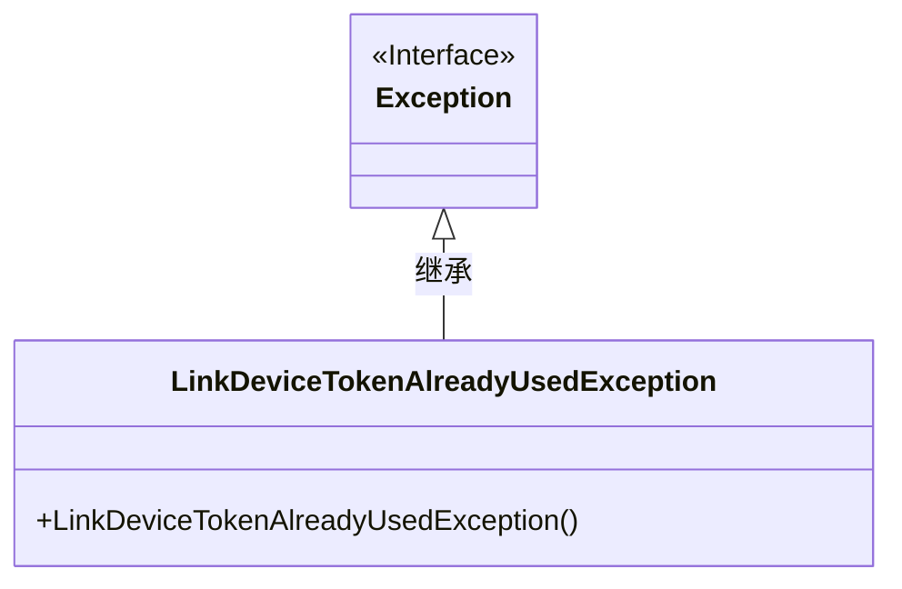
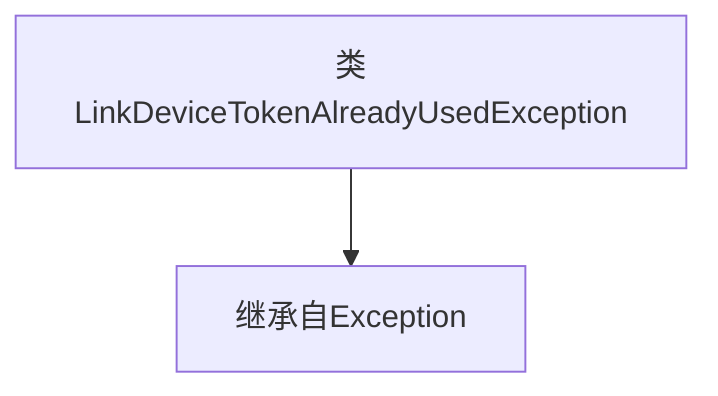

# 基础信息

|      |      |
|------|------|
| 名称 | LinkDeviceTokenAlreadyUsedException |
| 编码语言 | .java |
| 代码路径 | Signal-Server/service/src/main/java/org/whispersystems/textsecuregcm/storage/LinkDeviceTokenAlreadyUsedException.java |
| 包名 | org.whispersystems.textsecuregcm.storage |
| 依赖项 | [] |
| 概述说明 | LinkDeviceTokenAlreadyUsedException继承自Exception类。 |

# 说明

LinkDeviceTokenAlreadyUsedException是一个自定义异常类，它继承自Python中的Exception基类。该异常用于表示设备令牌已被使用的情况，通常在设备注册或绑定过程中，当检测到令牌已被占用时抛出。通过继承Exception类，它具备了异常处理的基本功能，并可根据具体需求进行扩展和定制。

# 类列表 Class Summary

| 名称   | 类型  | 说明 |
|-------|------|-------------|
| LinkDeviceTokenAlreadyUsedException | class | LinkDeviceTokenAlreadyUsedException继承自Exception类。 |

## 类 LinkDeviceTokenAlreadyUsedException

|      |      |
|------|------|
| 访问范围 | public |
| 类型 | class |
| 名称 | LinkDeviceTokenAlreadyUsedException |
| 说明 | LinkDeviceTokenAlreadyUsedException继承自Exception类。 |

### UML类图

这段代码定义了一个名为 `LinkDeviceTokenAlreadyUsedException` 的异常类，它继承自 `Exception` 类。该类没有定义任何额外的成员变量或方法，仅通过默认构造函数进行实例化。该异常类可能用于表示设备令牌已被使用的错误情况。

### 内部方法调用关系图

这段代码定义了一个名为 `LinkDeviceTokenAlreadyUsedException` 的类，该类继承自 `Exception`。这意味着 `LinkDeviceTokenAlreadyUsedException` 是一个自定义的异常类，用于在特定情况下抛出异常，通常用于表示设备令牌已被使用的错误场景。通过继承 `Exception`，该类具备了异常处理的基本功能，可以在程序中捕获和处理此类异常。

### 字段列表 Field List

| 名称  | 类型  | 说明 |
|-------|-------|------|

### 方法列表 Method List

| 名称  | 类型  | 说明 |
|-------|-------|------|

