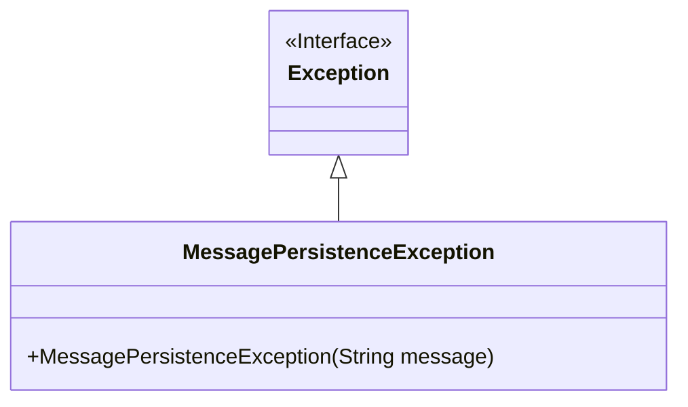
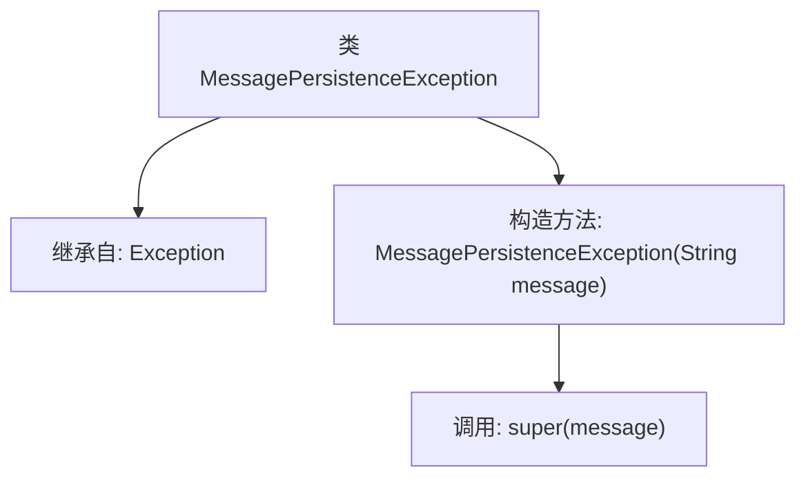

# 基础信息

|      |      |
|------|------|
| 名称 | MessagePersistenceException |
| 编码语言 | .java |
| 代码路径 | Signal-Server/service/src/main/java/org/whispersystems/textsecuregcm/storage/MessagePersistenceException.java |
| 包名 | org.whispersystems.textsecuregcm.storage |
| 依赖项 | [] |
| 概述说明 | MessagePersistenceException继承Exception，处理消息持久化异常。 |

# 说明

MessagePersistenceException是一个继承自Exception的异常类，专门用于处理消息持久化过程中出现的异常情况。该异常类的主要目的是捕获和处理与消息存储、检索或管理相关的错误，确保系统在消息持久化失败时能够进行适当的错误处理和恢复。通过继承Exception，MessagePersistenceException具备了标准异常类的所有特性，可以在程序中抛出并捕获，以便开发者能够根据具体情况进行处理。

# 类列表 Class Summary

| 名称   | 类型  | 说明 |
|-------|------|-------------|
| MessagePersistenceException | class | MessagePersistenceException继承Exception，用于处理消息持久化异常。 |

## 类 MessagePersistenceException

|      |      |
|------|------|
| 访问范围 | public |
| 类型 | class |
| 名称 | MessagePersistenceException |
| 说明 | MessagePersistenceException继承Exception，用于处理消息持久化异常。 |

### UML类图

这段代码定义了一个名为 `MessagePersistenceException` 的自定义异常类，它继承自 `Exception` 类。`MessagePersistenceException` 类包含一个构造函数，该构造函数接受一个 `String` 类型的参数 `message`，并将其传递给父类 `Exception` 的构造函数。这个自定义异常类通常用于在消息持久化过程中捕获和处理特定的异常情况，提供更详细的错误信息。

### 内部方法调用关系图

这段代码定义了一个名为 `MessagePersistenceException` 的类，该类继承自 `Exception` 类。`MessagePersistenceException` 类包含一个构造方法，该构造方法接受一个 `String` 类型的参数 `message`，并调用父类 `Exception` 的构造方法将 `message` 传递给父类。这个类通常用于表示在消息持久化过程中发生的异常情况。

### 字段列表 Field List

| 名称  | 类型  | 说明 |
|-------|-------|------|

### 方法列表 Method List

| 名称  | 类型  | 说明 |
|-------|-------|------|

