# 基础信息

|      |      |
|------|------|
| 名称 | MessagePersister |
| 编码语言 | .java |
| 代码路径 | Signal-Server/service/src/main/java/org/whispersystems/textsecuregcm/storage/MessagePersister.java |
| 包名 | org.whispersystems.textsecuregcm.storage |
| 依赖项 | ['org.whispersystems.textsecuregcm.metrics.MetricsUtil.name', 'com.google.common.annotations.VisibleForTesting', 'io.dropwizard.lifecycle.Managed', 'io.micrometer.core.instrument.Counter', 'io.micrometer.core.instrument.DistributionSummary', 'io.micrometer.core.instrument.Metrics', 'io.micrometer.core.instrument.Timer', 'java.time.Duration', 'java.time.Instant', 'java.util.List', 'java.util.Optional', 'java.util.UUID', 'java.util.concurrent.atomic.AtomicLong', 'org.apache.commons.lang3.tuple.Pair', 'org.slf4j.Logger', 'org.slf4j.LoggerFactory', 'org.whispersystems.textsecuregcm.configuration.dynamic.DynamicConfiguration', 'org.whispersystems.textsecuregcm.entities.MessageProtos', 'org.whispersystems.textsecuregcm.identity.IdentityType', 'org.whispersystems.textsecuregcm.util.Util', 'reactor.core.publisher.Flux', 'reactor.core.publisher.Mono', 'reactor.util.retry.Retry', 'software.amazon.awssdk.services.dynamodb.model.ItemCollectionSizeLimitExceededException'] |
| 概述说明 | MessagePersister类负责消息持久化，含缓存、管理器、配置，支持多线程处理队列并记录指标。 |

# 说明

MessagePersister类负责消息的持久化管理，集成了缓存、管理器和配置等多个组件。它支持多线程处理消息队列，确保高效的消息处理能力。同时，该类还记录了与消息持久化相关的各项指标，便于监控和优化系统性能。

# 类列表 Class Summary

| 名称   | 类型  | 说明 |
|-------|------|-------------|
| MessagePersister | class | MessagePersister类管理消息持久化，包含缓存、管理器、配置等组件，支持多线程处理队列，并记录相关指标。 |

## 类 MessagePersister

|      |      |
|------|------|
| 访问范围 | public |
| 类型 | class |
| 名称 | MessagePersister |
| 说明 | MessagePersister类管理消息持久化，包含缓存、管理器、配置等组件，支持多线程处理队列，并记录相关指标。 |

### UML类图

```mermaid
classDiagram
    class MessagePersister {
        -MessagesCache messagesCache
        -MessagesManager messagesManager
        -AccountsManager accountsManager
        -DynamicConfigurationManager~DynamicConfiguration~ dynamicConfigurationManager
        -Duration persistDelay
        -Thread[] workerThreads
        -volatile boolean running
        -static final String OVERSIZED_QUEUE_COUNTER_NAME
        -static final Timer GET_QUEUES_TIMER
        -static final Timer PERSIST_QUEUE_TIMER
        -static final Counter PERSIST_QUEUE_EXCEPTION_METER
        -static final Counter TRIMMED_MESSAGE_COUNTER
        -static final Counter TRIMMED_MESSAGE_BYTES_COUNTER
        -static final DistributionSummary QUEUE_COUNT_DISTRIBUTION_SUMMARY
        -static final DistributionSummary QUEUE_SIZE_DISTRIBUTION_SUMMARY
        -static final int QUEUE_BATCH_LIMIT
        -static final int MESSAGE_BATCH_LIMIT
        -static final long EXCEPTION_PAUSE_MILLIS
        -static final int CONSECUTIVE_EMPTY_CACHE_REMOVAL_LIMIT
        -static final Logger logger
        +MessagePersister(MessagesCache messagesCache, MessagesManager messagesManager, AccountsManager accountsManager, DynamicConfigurationManager~DynamicConfiguration~ dynamicConfigurationManager, Duration persistDelay, int dedicatedProcessWorkerThreadCount)
        +Duration getPersistDelay()
        +void start()
        +void stop()
        +int persistNextQueues(Instant currentTime)
        +void persistQueue(Account account, Device device) throws MessagePersistenceException
        -void trimQueue(Account account, byte deviceId)
    }

    class MessagesCache {
        +int getNextSlotToPersist()
        +List~String~ getQueuesToPersist(int slot, Instant time, int limit)
        +void addQueueToPersist(UUID accountUuid, byte deviceId)
        +void lockQueueForPersistence(UUID accountUuid, byte deviceId)
        +void unlockQueueForPersistence(UUID accountUuid, byte deviceId)
        +List~MessageProtos.Envelope~ getMessagesToPersist(UUID accountUuid, byte deviceId, int limit)
        +CompletableFuture~Long~ estimatePersistedQueueSizeBytes(UUID accountUuid, byte deviceId)
    }

    class MessagesManager {
        +int persistMessages(UUID accountUuid, Device device, List~MessageProtos.Envelope~ messages)
        +Flux~MessageProtos.Envelope~ getMessagesForDeviceReactive(UUID accountUuid, Device device, boolean includeStale)
        +CompletableFuture~Boolean~ delete(UUID accountUuid, Device device, UUID serverGuid, long serverTimestamp)
    }

    class AccountsManager {
        +Optional~Account~ getByAccountIdentifier(UUID accountUuid)
        +CompletableFuture~Void~ removeDevice(Account account, byte deviceId)
    }

    class DynamicConfigurationManager~T~ {
        +T getConfiguration()
    }

    class Account {
        +UUID getUuid()
        +Optional~Device~ getDevice(byte deviceId)
        +UUID getIdentifier(IdentityType identityType)
    }

    class Device {
        +byte getId()
    }

    class MessagePersistenceException {
        +MessagePersistenceException(String message)
    }

    class ItemCollectionSizeLimitExceededException {
        +ItemCollectionSizeLimitExceededException(String message)
    }

    MessagePersister --> MessagesCache : 依赖
    MessagePersister --> MessagesManager : 依赖
    MessagePersister --> AccountsManager : 依赖
    MessagePersister --> DynamicConfigurationManager~DynamicConfiguration~ : 依赖
    MessagePersister --> Account : 依赖
    MessagePersister --> Device : 依赖
    MessagePersister --> MessagePersistenceException : 依赖
    MessagePersister --> ItemCollectionSizeLimitExceededException : 依赖
    MessagesManager --> Account : 依赖
    MessagesManager --> Device : 依赖
    AccountsManager --> Account : 依赖
    AccountsManager --> Device : 依赖
```

### 描述
`MessagePersister` 是一个负责消息持久化的类，它通过多个线程从 `MessagesCache` 中获取待持久化的消息队列，并将这些消息持久化到 `MessagesManager` 中。它依赖于 `AccountsManager` 来获取账户信息，并使用 `DynamicConfigurationManager` 来获取动态配置。`MessagePersister` 还处理消息队列的异常情况，如队列过大时进行修剪或移除设备。整个流程涉及多个类的协作，确保消息能够被正确持久化并处理异常情况。

### 内部方法调用关系图

```mermaid
graph TD
    A["类MessagePersister"]
    B["属性: MessagesCache messagesCache"]
    C["属性: MessagesManager messagesManager"]
    D["属性: AccountsManager accountsManager"]
    E["属性: DynamicConfigurationManager dynamicConfigurationManager"]
    F["属性: Duration persistDelay"]
    G["属性: Thread[] workerThreads"]
    H["属性: volatile boolean running"]
    I["构造方法: MessagePersister"]
    J["方法: Duration getPersistDelay()"]
    K["方法: void start()"]
    L["方法: void stop()"]
    M["方法: int persistNextQueues(Instant currentTime)"]
    N["方法: void persistQueue(Account account, Device device)"]
    O["方法: void trimQueue(Account account, byte deviceId)"]
    P["内部调用: messagesCache.getNextSlotToPersist()"]
    Q["内部调用: messagesCache.getQueuesToPersist()"]
    R["内部调用: accountsManager.getByAccountIdentifier()"]
    S["内部调用: account.getDevice()"]
    T["内部调用: messagesCache.addQueueToPersist()"]
    U["内部调用: messagesCache.lockQueueForPersistence()"]
    V["内部调用: messagesCache.getMessagesToPersist()"]
    W["内部调用: messagesManager.persistMessages()"]
    X["内部调用: messagesCache.unlockQueueForPersistence()"]
    Y["内部调用: messagesCache.estimatePersistedQueueSizeBytes()"]
    Z["内部调用: messagesManager.getMessagesForDeviceReactive()"]
    AA["内部调用: messagesManager.delete()"]

    A --> B
    A --> C
    A --> D
    A --> E
    A --> F
    A --> G
    A --> H
    A --> I
    A --> J
    A --> K
    A --> L
    A --> M
    A --> N
    A --> O
    M --> P
    M --> Q
    M --> R
    M --> S
    M --> T
    N --> U
    N --> V
    N --> W
    N --> X
    O --> Y
    O --> Z
    O --> AA
```

这段代码实现了一个消息持久化器`MessagePersister`，它负责将缓存中的消息持久化到存储系统中。代码通过多线程处理消息队列，并提供了启动、停止、持久化队列等功能。流程图中展示了类的属性、构造方法、主要方法及其内部调用关系，清晰地反映了消息持久化的处理流程。

### 字段列表 Field List

| 名称  | 类型  | 说明 |
|-------|-------|------|
| messagesCache | MessagesCache | 私有且不可变的MessagesCache实例。 |
| messagesManager | MessagesManager | 私有消息管理器实例变量。 |
| QUEUE_BATCH_LIMIT = 100 | int | 队列批量处理限制为100。 |
| workerThreads | Thread[] | 私有线程数组workerThreads。 |
| PERSIST_QUEUE_EXCEPTION_METER =      Metrics.counter(name(MessagePersister.class, "persistQueueException")) | Counter | 定义用于监控消息持久化队列异常的计数器。 |
| logger = LoggerFactory.getLogger(MessagePersister.class) | Logger | MessagePersister类中定义了一个私有的静态Logger实例。 |
| TRIMMED_MESSAGE_COUNTER = Metrics.counter(name(MessagePersister.class, "trimmedMessage")) | Counter | 私有静态计数器用于记录修剪消息的数量。 |
| accountsManager | AccountsManager | 私有且不可变的账户管理器实例。 |
| persistDelay | Duration | 私有不可变持久化延迟时间。 |
| dynamicConfigurationManager | DynamicConfigurationManager<DynamicConfiguration> | 动态配置管理器用于管理动态配置对象。 |
| CONSECUTIVE_EMPTY_CACHE_REMOVAL_LIMIT = 3 | int | 私有静态常量，连续空缓存移除上限为3。 |
| PERSIST_QUEUE_TIMER = Metrics.timer(name(MessagePersister.class, "persistQueue")) | Timer | 定义了一个用于监控消息持久化队列性能的定时器。 |
| OVERSIZED_QUEUE_COUNTER_NAME = name(MessagePersister.class, "persistQueueOversized") | String | 定义静态常量用于记录消息持久化队列超限情况。 |
| GET_QUEUES_TIMER = Metrics.timer(name(MessagePersister.class, "getQueues")) | Timer | 定义了一个私有静态计时器，用于测量获取队列操作的性能。 |
| QUEUE_SIZE_DISTRIBUTION_SUMMARY = DistributionSummary.builder(          name(MessagePersister.class, "queueSize"))      .publishPercentileHistogram(true)      .register(Metrics.globalRegistry) | DistributionSummary | 创建名为"queueSize"的分布摘要，记录队列大小并发布百分位直方图。 |
| TRIMMED_MESSAGE_BYTES_COUNTER = Metrics.counter(name(MessagePersister.class, "trimmedMessageBytes")) | Counter | 定义计数器TRIMMED_MESSAGE_BYTES_COUNTER用于统计修剪消息字节数。 |
| MESSAGE_BATCH_LIMIT = 100 | int | 静态常量MESSAGE_BATCH_LIMIT值为100，用于限制消息批量处理数量。 |
| running | boolean | 私有易变布尔变量，表示运行状态。 |
| EXCEPTION_PAUSE_MILLIS = Duration.ofSeconds(3).toMillis() | long | 定义常量EXCEPTION_PAUSE_MILLIS，值为3秒的毫秒数。 |
| QUEUE_COUNT_DISTRIBUTION_SUMMARY = DistributionSummary.builder(          name(MessagePersister.class, "queueCount"))      .publishPercentileHistogram(true)      .register(Metrics.globalRegistry) | DistributionSummary | 私有静态常量QUEUE_COUNT_DISTRIBUTION_SUMMARY用于记录队列计数的分布摘要，并发布百分位直方图。 |

### 方法列表 Method List

| 名称  | 类型  | 说明 |
|-------|-------|------|
| getPersistDelay | Duration | 测试可见方法，返回持久化延迟值。 |
| stop | void | 停止线程，等待所有工作线程完成操作。 |
| start | void | 启动所有工作线程并将运行状态设为真。 |
| persistNextQueues | int | 方法持久化消息队列，处理异常并重试。 |
| persistQueue | void | 持久化消息队列，处理缓存消息并记录异常。 |
| trimQueue | void | 该方法根据设备消息队列大小计算需删除的字节数，并删除旧消息以释放空间。 |

