# 基础信息

|      |      |
|------|------|
| 名称 | MessagesCache |
| 编码语言 | .java |
| 代码路径 | Signal-Server/service/src/main/java/org/whispersystems/textsecuregcm/storage/MessagesCache.java |
| 包名 | org.whispersystems.textsecuregcm.storage |
| 依赖项 | ['com.codahale.metrics.MetricRegistry.name', 'com.google.common.annotations.VisibleForTesting', 'com.google.protobuf.ByteString', 'com.google.protobuf.InvalidProtocolBufferException', 'io.lettuce.core.Limit', 'io.lettuce.core.Range', 'io.lettuce.core.ScoredValue', 'io.lettuce.core.ZAddArgs', 'io.lettuce.core.cluster.SlotHash', 'io.micrometer.core.instrument.Counter', 'io.micrometer.core.instrument.Metrics', 'io.micrometer.core.instrument.Tag', 'io.micrometer.core.instrument.Timer', 'java.io.IOException', 'java.nio.ByteBuffer', 'java.nio.charset.StandardCharsets', 'java.time.Clock', 'java.time.Duration', 'java.time.Instant', 'java.util.ArrayList', 'java.util.Collections', 'java.util.HashMap', 'java.util.List', 'java.util.Map', 'java.util.Optional', 'java.util.UUID', 'java.util.concurrent.CompletableFuture', 'java.util.concurrent.ExecutorService', 'java.util.function.Function', 'java.util.function.Predicate', 'org.reactivestreams.Publisher', 'org.signal.libsignal.protocol.SealedSenderMultiRecipientMessage', 'org.signal.libsignal.protocol.ServiceId', 'org.slf4j.Logger', 'org.slf4j.LoggerFactory', 'org.whispersystems.textsecuregcm.entities.MessageProtos', 'org.whispersystems.textsecuregcm.identity.ServiceIdentifier', 'org.whispersystems.textsecuregcm.metrics.MetricsUtil', 'org.whispersystems.textsecuregcm.redis.FaultTolerantRedisClusterClient', 'org.whispersystems.textsecuregcm.util.Pair', 'org.whispersystems.textsecuregcm.util.RedisClusterUtil', 'reactor.core.observability.micrometer.Micrometer', 'reactor.core.publisher.Flux', 'reactor.core.publisher.Mono', 'reactor.core.scheduler.Scheduler', 'reactor.core.scheduler.Schedulers'] |
| 概述说明 | MessagesCache类负责消息缓存的插入、删除、获取及多接收者处理，同时监控状态和性能。 |

# 说明

MessagesCache类负责管理消息缓存，提供插入、删除和获取消息的功能，支持处理多接收者消息，同时监控缓存状态和性能，确保系统高效运行。

# 类列表 Class Summary

| 名称   | 类型  | 说明 |
|-------|------|-------------|
| MessagesCache | class | MessagesCache类管理消息缓存，支持插入、删除、获取消息，处理多接收者消息，并监控缓存状态和性能。 |

## 类 MessagesCache

|      |      |
|------|------|
| 访问范围 | public |
| 类型 | class |
| 名称 | MessagesCache |
| 说明 | MessagesCache类管理消息缓存，支持插入、删除、获取消息，处理多接收者消息，并监控缓存状态和性能。 |

### UML类图

```mermaid
classDiagram
    class MessagesCache {
        -FaultTolerantRedisClusterClient redisCluster
        -Clock clock
        -Scheduler messageDeliveryScheduler
        -ExecutorService messageDeletionExecutorService
        -Scheduler messageDeletionScheduler
        -MessagesCacheInsertScript insertScript
        -MessagesCacheInsertSharedMultiRecipientPayloadAndViewsScript insertMrmScript
        -MessagesCacheRemoveByGuidScript removeByGuidScript
        -MessagesCacheGetItemsScript getItemsScript
        -MessagesCacheRemoveQueueScript removeQueueScript
        -MessagesCacheGetQueuesToPersistScript getQueuesToPersistScript
        -MessagesCacheRemoveRecipientViewFromMrmDataScript removeRecipientViewFromMrmDataScript
        -MessagesCacheUnlockQueueScript unlockQueueScript
        -Timer insertTimer
        -Timer insertSharedMrmPayloadTimer
        -Timer getMessagesTimer
        -Timer getQueuesToPersistTimer
        -Timer removeByGuidTimer
        -Timer removeRecipientViewTimer
        -Timer clearQueueTimer
        -Counter removeMessageCounter
        -Counter staleEphemeralMessagesCounter
        -Counter staleMrmMessagesCounter
        -Counter mrmContentRetrievedCounter
        -String MRM_RETRIEVAL_ERROR_COUNTER_NAME
        -String EPHEMERAL_TAG_NAME
        -String MISSING_MRM_DATA_TAG_NAME
        -Counter skippedStaleEphemeralMrmCounter
        -Counter sharedMrmDataKeyRemovedCounter
        +MessagesCache(FaultTolerantRedisClusterClient redisCluster, Scheduler messageDeliveryScheduler, ExecutorService messageDeletionExecutorService, Clock clock) throws IOException
        +MessagesCache(FaultTolerantRedisClusterClient redisCluster, Scheduler messageDeliveryScheduler, ExecutorService messageDeletionExecutorService, Clock clock, MessagesCacheInsertScript insertScript, MessagesCacheInsertSharedMultiRecipientPayloadAndViewsScript insertMrmScript, MessagesCacheGetItemsScript getItemsScript, MessagesCacheRemoveByGuidScript removeByGuidScript, MessagesCacheRemoveQueueScript removeQueueScript, MessagesCacheGetQueuesToPersistScript getQueuesToPersistScript, MessagesCacheRemoveRecipientViewFromMrmDataScript removeRecipientViewFromMrmDataScript, MessagesCacheUnlockQueueScript unlockQueueScript) throws IOException
        +CompletableFuture~Boolean~ insert(UUID messageGuid, UUID destinationAccountIdentifier, byte destinationDeviceId, MessageProtos.Envelope message)
        +CompletableFuture~byte[]~ insertSharedMultiRecipientMessagePayload(SealedSenderMultiRecipientMessage sealedSenderMultiRecipientMessage)
        +CompletableFuture~Optional~RemovedMessage~~ remove(UUID destinationUuid, byte destinationDevice, UUID messageGuid)
        +CompletableFuture~List~RemovedMessage~~ remove(UUID destinationUuid, byte destinationDevice, List~UUID~ messageGuids)
        +boolean hasMessages(UUID destinationUuid, byte destinationDevice)
        +CompletableFuture~Boolean~ hasMessagesAsync(UUID destinationUuid, byte destinationDevice)
        +Publisher~MessageProtos.Envelope~ get(UUID destinationUuid, byte destinationDevice)
        +Mono~Long~ getEarliestUndeliveredTimestamp(UUID destinationUuid, byte destinationDevice)
        +CompletableFuture~Void~ clear(UUID destinationUuid)
        +CompletableFuture~Void~ clear(UUID destinationUuid, byte deviceId)
        +int getNextSlotToPersist()
        +List~String~ getQueuesToPersist(int slot, Instant maxTime, int limit)
        +void addQueueToPersist(UUID accountUuid, byte deviceId)
        +void lockQueueForPersistence(UUID accountUuid, byte deviceId)
        +void unlockQueueForPersistence(UUID accountUuid, byte deviceId)
        +static byte[] getMessageQueueKey(UUID accountUuid, byte deviceId)
        +static byte[] getMessageQueueMetadataKey(UUID accountUuid, byte deviceId)
        +static byte[] getQueueIndexKey(UUID accountUuid, byte deviceId)
        +static byte[] getQueueIndexKey(int slot)
        +static byte[] getSharedMrmKey(UUID mrmGuid)
        +static byte[] getPersistInProgressKey(UUID accountUuid, byte deviceId)
        +static byte[] getSharedMrmViewKey(ServiceId serviceId, byte deviceId)
        +static byte[] getSharedMrmViewKey(ServiceIdentifier serviceIdentifier, byte deviceId)
        +static UUID getAccountUuidFromQueueName(String queueName)
        +static byte getDeviceIdFromQueueName(String queueName)
    }

    class FaultTolerantRedisClusterClient {
        <<Interface>>
    }

    class Clock {
        <<Interface>>
    }

    class Scheduler {
        <<Interface>>
    }

    class ExecutorService {
        <<Interface>>
    }

    class MessagesCacheInsertScript {
        <<Interface>>
    }

    class MessagesCacheInsertSharedMultiRecipientPayloadAndViewsScript {
        <<Interface>>
    }

    class MessagesCacheRemoveByGuidScript {
        <<Interface>>
    }

    class MessagesCacheGetItemsScript {
        <<Interface>>
    }

    class MessagesCacheRemoveQueueScript {
        <<Interface>>
    }

    class MessagesCacheGetQueuesToPersistScript {
        <<Interface>>
    }

    class MessagesCacheRemoveRecipientViewFromMrmDataScript {
        <<Interface>>
    }

    class MessagesCacheUnlockQueueScript {
        <<Interface>>
    }

    MessagesCache --> FaultTolerantRedisClusterClient : 依赖
    MessagesCache --> Clock : 依赖
    MessagesCache --> Scheduler : 依赖
    MessagesCache --> ExecutorService : 依赖
    MessagesCache --> MessagesCacheInsertScript : 依赖
    MessagesCache --> MessagesCacheInsertSharedMultiRecipientPayloadAndViewsScript : 依赖
    MessagesCache --> MessagesCacheRemoveByGuidScript : 依赖
    MessagesCache --> MessagesCacheGetItemsScript : 依赖
    MessagesCache --> MessagesCacheRemoveQueueScript : 依赖
    MessagesCache --> MessagesCacheGetQueuesToPersistScript : 依赖
    MessagesCache --> MessagesCacheRemoveRecipientViewFromMrmDataScript : 依赖
    MessagesCache --> MessagesCacheUnlockQueueScript : 依赖
```

**描述**：`MessagesCache` 类是一个用于管理消息缓存的复杂组件，依赖于多个接口和脚本来处理消息的插入、删除、获取和持久化等操作。它使用 Redis 集群作为存储后端，并通过多个计时器和计数器来监控性能。类中的方法涵盖了从简单的消息插入到复杂的 MRM（多接收者消息）处理，确保消息的高效管理和交付。

### 内部方法调用关系图

```mermaid
graph TD
    A["类MessagesCache"]
    B["属性: FaultTolerantRedisClusterClient redisCluster"]
    C["属性: Clock clock"]
    D["属性: Scheduler messageDeliveryScheduler"]
    E["属性: ExecutorService messageDeletionExecutorService"]
    F["属性: Scheduler messageDeletionScheduler"]
    G["属性: MessagesCacheInsertScript insertScript"]
    H["属性: MessagesCacheInsertSharedMultiRecipientPayloadAndViewsScript insertMrmScript"]
    I["属性: MessagesCacheRemoveByGuidScript removeByGuidScript"]
    J["属性: MessagesCacheGetItemsScript getItemsScript"]
    K["属性: MessagesCacheRemoveQueueScript removeQueueScript"]
    L["属性: MessagesCacheGetQueuesToPersistScript getQueuesToPersistScript"]
    M["属性: MessagesCacheRemoveRecipientViewFromMrmDataScript removeRecipientViewFromMrmDataScript"]
    N["属性: MessagesCacheUnlockQueueScript unlockQueueScript"]
    O["方法: CompletableFuture<Boolean> insert(UUID messageGuid, UUID destinationAccountIdentifier, byte destinationDeviceId, MessageProtos.Envelope message)"]
    P["方法: CompletableFuture<byte[]> insertSharedMultiRecipientMessagePayload(SealedSenderMultiRecipientMessage sealedSenderMultiRecipientMessage)"]
    Q["方法: CompletableFuture<Optional<RemovedMessage>> remove(UUID destinationUuid, byte destinationDevice, UUID messageGuid)"]
    R["方法: CompletableFuture<List<RemovedMessage>> remove(UUID destinationUuid, byte destinationDevice, List<UUID> messageGuids)"]
    S["方法: boolean hasMessages(UUID destinationUuid, byte destinationDevice)"]
    T["方法: CompletableFuture<Boolean> hasMessagesAsync(UUID destinationUuid, byte destinationDevice)"]
    U["方法: Publisher<MessageProtos.Envelope> get(UUID destinationUuid, byte destinationDevice)"]
    V["方法: Mono<Long> getEarliestUndeliveredTimestamp(UUID destinationUuid, byte destinationDevice)"]
    W["方法: void removeRecipientViewFromMrmData(List<byte[]> sharedMrmKeys, ServiceIdentifier serviceIdentifier, byte deviceId)"]
    X["方法: CompletableFuture<Void> clear(UUID destinationUuid)"]
    Y["方法: CompletableFuture<Void> clear(UUID destinationUuid, byte deviceId)"]
    Z["方法: int getNextSlotToPersist()"]
    AA["方法: List<String> getQueuesToPersist(int slot, Instant maxTime, int limit)"]
    AB["方法: void addQueueToPersist(UUID accountUuid, byte deviceId)"]
    AC["方法: void lockQueueForPersistence(UUID accountUuid, byte deviceId)"]
    AD["方法: void unlockQueueForPersistence(UUID accountUuid, byte deviceId)"]

    A --> B
    A --> C
    A --> D
    A --> E
    A --> F
    A --> G
    A --> H
    A --> I
    A --> J
    A --> K
    A --> L
    A --> M
    A --> N
    A --> O
    A --> P
    A --> Q
    A --> R
    A --> S
    A --> T
    A --> U
    A --> V
    A --> W
    A --> X
    A --> Y
    A --> Z
    A --> AA
    A --> AB
    A --> AC
    A --> AD
```

这段代码定义了一个名为 `MessagesCache` 的类，用于管理与 Redis 集群中的消息缓存相关的操作。该类包含了多个属性和方法，用于处理消息的插入、删除、查询、清理等操作。代码中使用了多种 Redis 脚本来执行复杂的操作，并通过计时器和计数器来监控性能。流程图展示了类的主要属性和方法之间的调用关系，帮助理解类的结构和功能。

### 字段列表 Field List

| 名称  | 类型  | 说明 |
|-------|-------|------|
| removeRecipientViewTimer = Metrics.timer(name(MessagesCache.class, "removeRecipientView")) | Timer | 私有定时器用于监控移除接收者视图操作。 |
| redisCluster | FaultTolerantRedisClusterClient | 私有不可变的Redis集群客户端实例。 |
| messageDeletionScheduler | Scheduler | 私有调度器用于消息删除。 |
| messageDeliveryScheduler | Scheduler | 私有消息传递调度器实例。 |
| staleEphemeralMessagesCounter = Metrics.counter(      name(MessagesCache.class, "staleEphemeralMessages")) | Counter | 计数器用于统计过期临时消息数量。 |
| insertScript | MessagesCacheInsertScript | 私有成员insertScript为MessagesCacheInsertScript类型。 |
| staleMrmMessagesCounter = Metrics.counter(name(MessagesCache.class, "staleMrmMessages")) | Counter | 私有计数器用于统计过时的MRM消息数量。 |
| removeQueueScript | MessagesCacheRemoveQueueScript | 私有消息缓存移除队列脚本实例。 |
| messageDeletionExecutorService | ExecutorService | 私有线程池用于处理消息删除任务。 |
| insertSharedMrmPayloadTimer = Metrics.timer(name(MessagesCache.class, "insertSharedMrmPayload")) | Timer | 定义了用于测量插入共享MRM负载时间的计时器。 |
| getQueuesToPersistTimer = Metrics.timer(name(MessagesCache.class, "getQueuesToPersist")) | Timer | 定义私有定时器用于获取持久化队列的计时。 |
| getItemsScript | MessagesCacheGetItemsScript | 私有成员getItemsScript为MessagesCacheGetItemsScript类型。 |
| unlockQueueScript | MessagesCacheUnlockQueueScript | 私有成员变量unlockQueueScript为MessagesCacheUnlockQueueScript类型。 |
| skippedStaleEphemeralMrmCounter = Metrics.counter(      name(MessagesCache.class, "skippedStaleEphemeralMrm")) | Counter | 私有计数器记录跳过陈旧临时MRM的次数。 |
| PAGE_SIZE = 100 | int | 定义常量PAGE_SIZE，值为100。 |
| clearQueueTimer = Metrics.timer(name(MessagesCache.class, "clear")) | Timer | 私有计时器用于记录消息缓存清理操作的耗时。 |
| clock | Clock | 类中包含一个私有且不可变的Clock类型变量clock。 |
| getMessagesTimer = Metrics.timer(name(MessagesCache.class, "get")) | Timer | 定义了一个私有定时器用于监控消息缓存获取操作的性能。 |
| sharedMrmDataKeyRemovedCounter = Metrics.counter(      name(MessagesCache.class, "sharedMrmKeyRemoved")) | Counter | 私有计数器用于跟踪共享MRM数据键移除次数。 |
| removeByGuidScript | MessagesCacheRemoveByGuidScript | 私有成员变量removeByGuidScript为MessagesCacheRemoveByGuidScript类型。 |
| MRM_RETRIEVAL_ERROR_COUNTER_NAME = name(MessagesCache.class, "mrmRetrievalError") | String | MRM检索错误计数器名称定义为MessagesCache类的mrmRetrievalError。 |
| MISSING_MRM_DATA_TAG_NAME = "missingMrmData" | String | 定义私有常量字符串变量MISSING_MRM_DATA_TAG_NAME。 |
| removeMessageCounter = Metrics.counter(name(MessagesCache.class, "remove")) | Counter | 私有计数器用于统计消息缓存类中的移除操作。 |
| logger = LoggerFactory.getLogger(MessagesCache.class) | Logger | MessagesCache类中定义了一个私有的静态日志记录器。 |
| getQueuesToPersistScript | MessagesCacheGetQueuesToPersistScript | 私有成员变量，用于获取待持久化队列的脚本。 |
| insertMrmScript | MessagesCacheInsertSharedMultiRecipientPayloadAndViewsScript | 私有成员变量insertMrmScript用于插入多接收者消息缓存和视图脚本。 |
| LOCK_VALUE = "1".getBytes(StandardCharsets.UTF_8) | byte[] | 定义了一个私有的静态常量字节数组LOCK_VALUE，值为"1"的UTF-8编码。 |
| mrmContentRetrievedCounter = Metrics.counter(name(MessagesCache.class, "mrmViewRetrieved")) | Counter | 定义了一个私有计数器变量mrmContentRetrievedCounter，用于统计MRM视图检索次数。 |
| REMOVE_MRM_RECIPIENT_VIEW_CONCURRENCY = 8 | int | 私有静态常量REMOVE_MRM_RECIPIENT_VIEW_CONCURRENCY值为8。 |
| EPHEMERAL_TAG_NAME = "ephemeral" | String | 定义了一个名为EPHEMERAL_TAG_NAME的私有常量字符串，值为"ephemeral"。 |
| removeByGuidTimer = Metrics.timer(name(MessagesCache.class, "removeByGuid")) | Timer | 在MessagesCache类中，使用Metrics.timer创建名为removeByGuid的计时器。 |
| NEXT_SLOT_TO_PERSIST_KEY = "user_queue_persist_slot" | String | 定义常量NEXT_SLOT_TO_PERSIST_KEY为"user_queue_persist_slot"。 |
| STALE_MRM_KEY = ByteString.copyFromUtf8("stale") | ByteString | 测试用静态常量STALE_MRM_KEY，值为"stale"的字节字符串。 |
| removeRecipientViewFromMrmDataScript | MessagesCacheRemoveRecipientViewFromMrmDataScript | 私有成员变量removeRecipientViewFromMrmDataScript用于移除MRM数据中的收件人视图。 |
| insertTimer = Metrics.timer(name(MessagesCache.class, "insert")) | Timer | 在MessagesCache类中，使用Metrics.timer创建名为"insert"的计时器。 |
| MAX_EPHEMERAL_MESSAGE_DELAY = Duration.ofSeconds(10) | Duration | 测试可见的静态常量MAX_EPHEMERAL_MESSAGE_DELAY设为10秒。 |
| GET_FLUX_NAME = MetricsUtil.name(MessagesCache.class, "get") | String | 定义了一个私有静态常量GET_FLUX_NAME，用于缓存MetricsUtil的类名和方法名。 |

### 方法列表 Method List

| 名称  | 类型  | 说明 |
|-------|-------|------|
| isStaleMrmMessage | boolean | 判断消息是否为过期的共享MRM消息。 |
| isStaleEphemeralMessage | boolean | 静态方法检查消息是否为过期临时消息。 |
| getEarliestUndeliveredTimestamp | Mono<Long> | 获取最早未送达消息的时间戳。 |
| remove | CompletableFuture<Optional<RemovedMessage>> | 异步删除指定UUID和设备的消息，返回删除结果。 |
| getSharedMrmKey | byte[] | 生成基于UUID的共享MRM密钥字节数组。 |
| hasMessages | boolean | 检查指定设备和UUID的消息队列是否非空。 |
| hasMessagesAsync | CompletableFuture<Boolean> | 异步检查指定目标设备的消息队列是否为空。 |
| getDeviceIdFromQueueName | byte | 从队列名中提取设备ID的静态方法。 |
| insert | CompletableFuture<Boolean> | 异步插入带GUID的消息，记录执行时间。 |
| insertSharedMultiRecipientMessagePayload | CompletableFuture<byte[]> | 异步插入多接收者消息并返回共享密钥。 |
| clear | CompletableFuture<Void> | 异步清除指定目标UUID和设备ID的消息队列，处理消息并更新相关数据。 |
| getQueueIndexKey | byte[] | 生成基于槽位的Redis队列索引键的字节数组。 |
| getPersistInProgressKey | byte[] | 生成包含账户UUID和设备ID的持久化进度键字节数组。 |
| unlockQueueForPersistence | void | 解锁指定账户和设备ID的持久化队列。 |
| getSharedMrmViewKey | byte[] | 获取共享MRM视图密钥，基于服务标识符和设备ID。 |
| addQueueToPersist | void | 将账户和设备ID的消息队列添加到Redis集群持久化中。 |
| discardStaleMessages | void | 方法删除过时消息，更新计数器，记录错误日志。 |
| remove | CompletableFuture<List<RemovedMessage>> | 异步移除消息，解析信封并更新共享密钥，统计移除数量。 |
| getSharedMrmViewKey | byte[] | 生成18字节共享密钥，包含17字节服务ID和设备ID。 |
| get | Publisher<MessageProtos.Envelope> | 获取并过滤消息流，发布有效消息，丢弃过期消息。 |
| getQueuesToPersist | List<String> | 获取需持久化的队列列表，记录执行时间。 |
| getMessageWithSharedMrmData | Mono<MessageProtos.Envelope> | 获取共享MRM数据消息，处理缺失数据并返回处理结果。 |
| removeRecipientViewFromMrmData | void | 从MRM数据中移除接收者视图，处理共享密钥，记录错误并计时。 |
| getMessagesToPersist | List<MessageProtos.Envelope> | 从Redis获取消息，过滤非持久和过期消息，返回需持久化的消息列表。 |
| getNextSlotToPersist | int | 获取下一个待持久化的槽位编号，基于Redis集群自增操作取模计算。 |
| getMessageQueueMetadataKey | byte[] | 生成用户队列元数据键，包含账户UUID和设备ID。 |
| getMessageQueueKey | byte[] | 生成用户队列键，结合账户UUID和设备ID，使用UTF-8编码。 |
| getSharedMrmViewKey | byte[] | 静态方法getSharedMrmViewKey通过serviceId和deviceId生成共享MRM视图密钥。 |
| getAccountUuidFromQueueName | UUID | 从队列名中提取账户UUID，通过查找大括号和双冒号位置截取UUID字符串。 |
| lockQueueForPersistence | void | 锁定账户设备队列以进行持久化操作，设置30秒过期时间。 |
| parseAndFetchMrms | Flux<MessageProtos.Envelope> | 解析并获取MRMS消息，处理序列化消息流，返回处理后的消息流。 |
| getAllMessages | Flux<MessageProtos.Envelope> | 该方法按页获取消息，处理并过滤过期消息，最终返回合并后的消息流。 |
| getQueueIndexKey | byte[] | 生成队列索引键，基于账户UUID和设备ID计算哈希槽。 |
| getNextMessagePage | Mono<Pair<List<byte[]>, Long>> | 获取消息页，处理队列项，返回消息列表和最后消息ID。 |
| clear | CompletableFuture<Void> | 异步清除指定目标UUID的所有设备数据。 |
| estimatePersistedQueueSizeBytes | CompletableFuture<Long> | 计算持久化队列大小，过滤临时消息并累加序列化大小。 |

