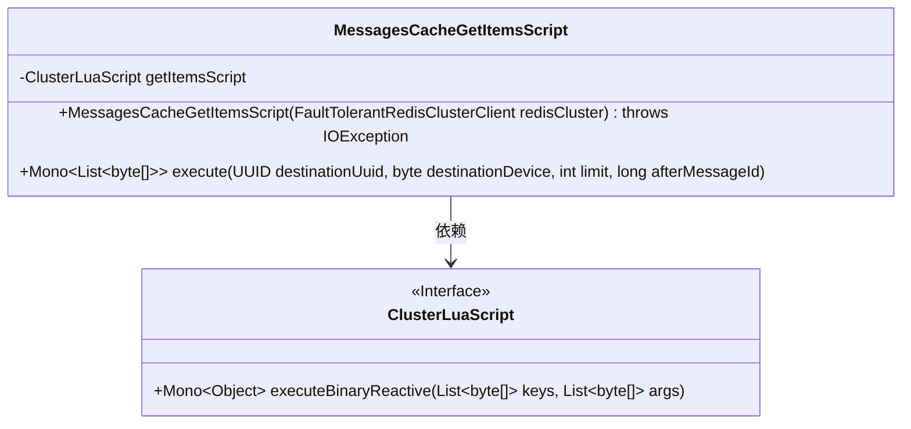
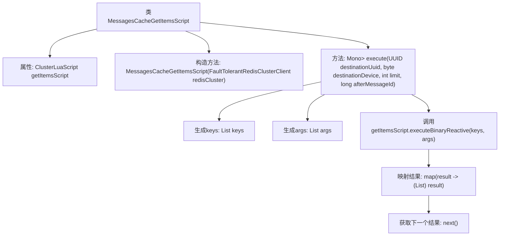

# 基础信息

|      |      |
|------|------|
| 名称 | MessagesCacheGetItemsScript |
| 编码语言 | .java |
| 代码路径 | Signal-Server/service/src/main/java/org/whispersystems/textsecuregcm/storage/MessagesCacheGetItemsScript.java |
| 包名 | org.whispersystems.textsecuregcm.storage |
| 依赖项 | ['io.lettuce.core.ScriptOutputType', 'java.io.IOException', 'java.nio.charset.StandardCharsets', 'java.util.List', 'java.util.UUID', 'org.whispersystems.textsecuregcm.redis.ClusterLuaScript', 'org.whispersystems.textsecuregcm.redis.FaultTolerantRedisClusterClient', 'reactor.core.publisher.Mono'] |
| 概述说明 | MessagesCacheGetItemsScript类用Lua脚本从Redis集群获取消息列表，支持UUID、设备ID、限制和消息ID参数。 |

# 说明

MessagesCacheGetItemsScript类是一个基于Lua脚本的工具，用于从Redis集群中获取消息列表。该类支持多种参数，包括UUID、设备ID、限制条件和消息ID，以便灵活地查询和筛选所需的消息数据。通过这种方式，可以高效地从Redis中检索特定条件下的消息列表，满足不同场景下的需求。

# 类列表 Class Summary

| 名称   | 类型  | 说明 |
|-------|------|-------------|
| MessagesCacheGetItemsScript | class | MessagesCacheGetItemsScript类通过Lua脚本从Redis集群获取消息列表，支持UUID、设备ID、限制和消息ID参数。 |

## 类 MessagesCacheGetItemsScript

|      |      |
|------|------|
| 访问范围 | None |
| 类型 | class |
| 名称 | MessagesCacheGetItemsScript |
| 说明 | MessagesCacheGetItemsScript类通过Lua脚本从Redis集群获取消息列表，支持UUID、设备ID、限制和消息ID参数。 |

### UML类图

**描述：**  
`MessagesCacheGetItemsScript` 类用于从 Redis 集群中获取消息项。它依赖于 `ClusterLuaScript` 接口来执行 Lua 脚本。`execute` 方法接收目标 UUID、设备 ID、限制和消息 ID 作为参数，生成键和参数列表，并通过 `ClusterLuaScript` 执行脚本，最终返回一个包含字节数组列表的 Mono 对象。

### 内部方法调用关系图

这段代码定义了一个名为 `MessagesCacheGetItemsScript` 的类，该类用于从Redis集群中获取消息队列中的项目。类中包含一个构造方法和一个 `execute` 方法。构造方法初始化了一个 `ClusterLuaScript` 对象，而 `execute` 方法则通过生成 `keys` 和 `args` 参数，调用 `getItemsScript.executeBinaryReactive` 方法来执行Lua脚本，并将结果映射为 `List<byte[]>` 类型，最后返回下一个结果。

### 字段列表 Field List

| 名称  | 类型  | 说明 |
|-------|-------|------|
| getItemsScript | ClusterLuaScript | 私有最终变量getItemsScript用于获取集群Lua脚本。 |

### 方法列表 Method List

| 名称  | 类型  | 说明 |
|-------|-------|------|
| execute | Mono<List<byte[]>> | 方法执行消息队列查询，返回指定条件的消息列表。 |

