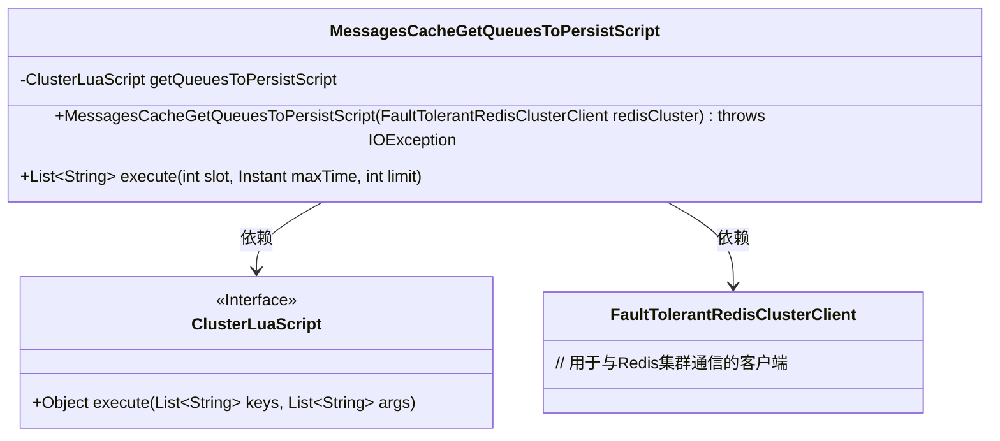
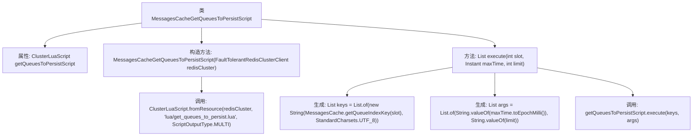

# 基础信息

|      |      |
|------|------|
| 名称 | MessagesCacheGetQueuesToPersistScript |
| 编码语言 | .java |
| 代码路径 | Signal-Server/service/src/main/java/org/whispersystems/textsecuregcm/storage/MessagesCacheGetQueuesToPersistScript.java |
| 包名 | org.whispersystems.textsecuregcm.storage |
| 依赖项 | ['io.lettuce.core.ScriptOutputType', 'java.io.IOException', 'java.nio.charset.StandardCharsets', 'java.time.Instant', 'java.util.List', 'org.whispersystems.textsecuregcm.redis.ClusterLuaScript', 'org.whispersystems.textsecuregcm.redis.FaultTolerantRedisClusterClient'] |
| 概述说明 | 类MessagesCacheGetQueuesToPersistScript用Lua脚本获取待持久化队列，支持时间和数量限制。 |

# 说明

类MessagesCacheGetQueuesToPersistScript使用Lua脚本从缓存中获取待持久化的队列列表。该功能支持用户指定时间限制和数量限制，以确保只获取符合特定条件的队列。通过这种方式，可以有效地管理和控制需要持久化的队列数据，提升系统的性能和资源利用率。

# 类列表 Class Summary

| 名称   | 类型  | 说明 |
|-------|------|-------------|
| MessagesCacheGetQueuesToPersistScript | class | 类MessagesCacheGetQueuesToPersistScript通过Lua脚本获取待持久化队列列表，支持指定时间限制和数量限制。 |

## 类 MessagesCacheGetQueuesToPersistScript

|      |      |
|------|------|
| 访问范围 | None |
| 类型 | class |
| 名称 | MessagesCacheGetQueuesToPersistScript |
| 说明 | 类MessagesCacheGetQueuesToPersistScript通过Lua脚本获取待持久化队列列表，支持指定时间限制和数量限制。 |

### UML类图

这段代码定义了一个名为 `MessagesCacheGetQueuesToPersistScript` 的类，用于从Redis集群中获取需要持久化的队列列表。该类依赖于 `ClusterLuaScript` 接口来执行Lua脚本，并通过 `FaultTolerantRedisClusterClient` 与Redis集群进行通信。`execute` 方法接收槽位、最大时间和限制参数，返回符合条件的队列列表。`ClusterLuaScript` 是一个接口，定义了执行Lua脚本的方法。

### 内部方法调用关系图

这段代码定义了一个名为 `MessagesCacheGetQueuesToPersistScript` 的类，该类用于从 Redis 集群中获取需要持久化的队列列表。类中包含一个私有属性 `getQueuesToPersistScript`，它是一个 `ClusterLuaScript` 对象，用于执行 Lua 脚本。构造方法通过 `ClusterLuaScript.fromResource` 方法初始化该对象。`execute` 方法根据传入的 `slot`、`maxTime` 和 `limit` 参数生成 `keys` 和 `args`，并调用 `getQueuesToPersistScript.execute` 方法执行 Lua 脚本，返回需要持久化的队列列表。

### 字段列表 Field List

| 名称  | 类型  | 说明 |
|-------|-------|------|
| getQueuesToPersistScript | ClusterLuaScript | 私有终态ClusterLuaScript变量getQueuesToPersistScript。 |

### 方法列表 Method List

| 名称  | 类型  | 说明 |
|-------|-------|------|
| execute | List<String> | 方法执行队列持久化脚本，返回指定时间范围内的键列表。 |

