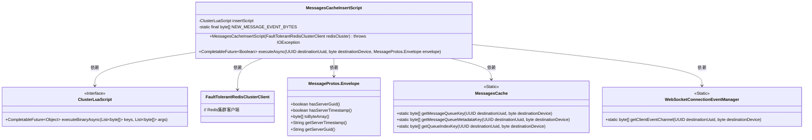
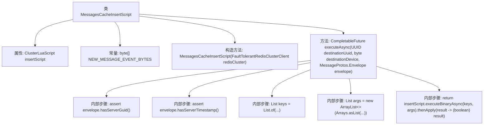

# 基础信息

|      |      |
|------|------|
| 名称 | MessagesCacheInsertScript |
| 编码语言 | .java |
| 代码路径 | Signal-Server/service/src/main/java/org/whispersystems/textsecuregcm/storage/MessagesCacheInsertScript.java |
| 包名 | org.whispersystems.textsecuregcm.storage |
| 依赖项 | ['io.lettuce.core.ScriptOutputType', 'java.io.IOException', 'java.nio.charset.StandardCharsets', 'java.util.ArrayList', 'java.util.Arrays', 'java.util.List', 'java.util.UUID', 'java.util.concurrent.CompletableFuture', 'org.whispersystems.textsecuregcm.entities.MessageProtos', 'org.whispersystems.textsecuregcm.push.ClientEvent', 'org.whispersystems.textsecuregcm.push.NewMessageAvailableEvent', 'org.whispersystems.textsecuregcm.push.WebSocketConnectionEventManager', 'org.whispersystems.textsecuregcm.redis.ClusterLuaScript', 'org.whispersystems.textsecuregcm.redis.FaultTolerantRedisClusterClient'] |
| 概述说明 | MessagesCacheInsertScript类通过Lua脚本和Redis集群异步插入消息并发布事件。 |

# 说明

MessagesCacheInsertScript类负责将消息插入设备队列并发布新消息事件，采用Lua脚本和Redis集群实现异步操作，确保高效处理和消息传递。

# 类列表 Class Summary

| 名称   | 类型  | 说明 |
|-------|------|-------------|
| MessagesCacheInsertScript | class | MessagesCacheInsertScript类用于将消息插入设备队列并发布新消息事件，使用Lua脚本和Redis集群实现异步操作。 |

## 类 MessagesCacheInsertScript

|      |      |
|------|------|
| 访问范围 | None |
| 类型 | class |
| 名称 | MessagesCacheInsertScript |
| 说明 | MessagesCacheInsertScript类用于将消息插入设备队列并发布新消息事件，使用Lua脚本和Redis集群实现异步操作。 |

### UML类图

**描述**：`MessagesCacheInsertScript`类用于将消息插入到指定设备的消息队列中，并发布“新消息可用”事件。它依赖于`ClusterLuaScript`接口执行Lua脚本，并通过`FaultTolerantRedisClusterClient`与Redis集群交互。`MessageProtos.Envelope`类表示消息信封，`MessagesCache`和`WebSocketConnectionEventManager`提供静态方法生成相关键值。该类通过异步方法`executeAsync`实现消息插入和事件发布。

### 内部方法调用关系图

这段代码定义了一个名为 `MessagesCacheInsertScript` 的类，主要用于将消息插入到指定设备的消息队列中，并发布“新消息可用”事件。类中包含一个 `ClusterLuaScript` 类型的属性 `insertScript`，用于执行 Lua 脚本。构造方法 `MessagesCacheInsertScript` 初始化了 `insertScript`，而 `executeAsync` 方法则负责执行插入操作，包括验证消息的有效性、生成键和参数列表，并最终通过 `insertScript.executeBinaryAsync` 方法异步执行脚本。

### 字段列表 Field List

| 名称  | 类型  | 说明 |
|-------|-------|------|
| insertScript | ClusterLuaScript | 私有终态的ClusterLuaScript插入脚本。 |
| NEW_MESSAGE_EVENT_BYTES = ClientEvent.newBuilder()      .setNewMessageAvailable(NewMessageAvailableEvent.getDefaultInstance())      .build()      .toByteArray() | byte[] | 将新消息事件构建为字节数组。 |

### 方法列表 Method List

| 名称  | 类型  | 说明 |
|-------|-------|------|
| executeAsync | CompletableFuture<Boolean> | 异步执行消息插入操作，验证消息完整性，生成键值对和参数列表，返回布尔结果。 |

