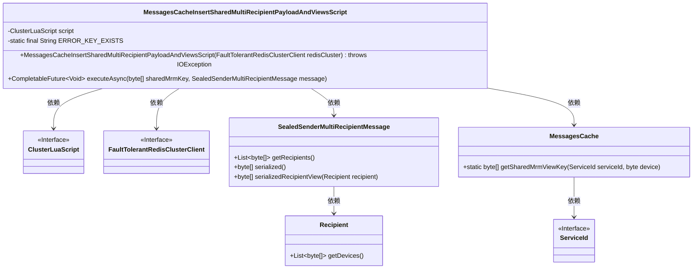
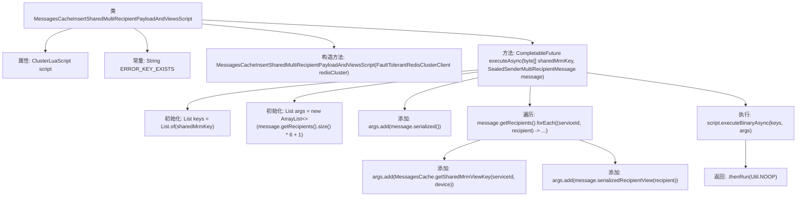

# 基础信息

|      |      |
|------|------|
| 名称 | MessagesCacheInsertSharedMultiRecipientPayloadAndViewsScript |
| 编码语言 | .java |
| 代码路径 | Signal-Server/service/src/main/java/org/whispersystems/textsecuregcm/storage/MessagesCacheInsertSharedMultiRecipientPayloadAndViewsScript.java |
| 包名 | org.whispersystems.textsecuregcm.storage |
| 依赖项 | ['io.lettuce.core.ScriptOutputType', 'java.io.IOException', 'java.util.ArrayList', 'java.util.List', 'java.util.concurrent.CompletableFuture', 'org.signal.libsignal.protocol.SealedSenderMultiRecipientMessage', 'org.whispersystems.textsecuregcm.redis.ClusterLuaScript', 'org.whispersystems.textsecuregcm.redis.FaultTolerantRedisClusterClient', 'org.whispersystems.textsecuregcm.util.Util'] |
| 概述说明 | Lua脚本插入多接收者消息数据和视图。 |

# 说明

类MessagesCacheInsertSharedMultiRecipientPayloadAndViewsScript通过Lua脚本实现多接收者消息数据和视图的插入操作。该脚本负责处理涉及多个接收者的消息数据，并将其与相关视图一并插入到缓存中，确保数据的完整性和一致性。

# 类列表 Class Summary

| 名称   | 类型  | 说明 |
|-------|------|-------------|
| MessagesCacheInsertSharedMultiRecipientPayloadAndViewsScript | class | 类MessagesCacheInsertSharedMultiRecipientPayloadAndViewsScript通过Lua脚本插入多接收者消息数据和视图。 |

## 类 MessagesCacheInsertSharedMultiRecipientPayloadAndViewsScript

|      |      |
|------|------|
| 访问范围 | None |
| 类型 | class |
| 名称 | MessagesCacheInsertSharedMultiRecipientPayloadAndViewsScript |
| 说明 | 类MessagesCacheInsertSharedMultiRecipientPayloadAndViewsScript通过Lua脚本插入多接收者消息数据和视图。 |

### UML类图

这段代码定义了一个 `MessagesCacheInsertSharedMultiRecipientPayloadAndViewsScript` 类，用于在 Redis 集群中插入共享的多接收者消息数据和视图。该类依赖于 `ClusterLuaScript` 和 `FaultTolerantRedisClusterClient` 接口来执行 Lua 脚本操作。`SealedSenderMultiRecipientMessage` 类表示密封发送的多接收者消息，包含接收者信息和序列化方法。`Recipient` 类表示接收者，包含设备列表。`MessagesCache` 类提供了获取共享视图键的静态方法。整个流程通过异步方式执行，确保高效处理多接收者消息数据。

### 内部方法调用关系图

这段代码定义了一个名为`MessagesCacheInsertSharedMultiRecipientPayloadAndViewsScript`的类，用于在Redis集群中插入共享的多接收者消息数据。类中包含一个`ClusterLuaScript`属性、一个常量`ERROR_KEY_EXISTS`、一个构造方法和一个`executeAsync`方法。`executeAsync`方法首先初始化键和参数列表，然后遍历接收者及其设备，将相关数据添加到参数列表中，最后通过`script.executeBinaryAsync`方法执行Lua脚本，并返回一个`CompletableFuture`。

### 字段列表 Field List

| 名称  | 类型  | 说明 |
|-------|-------|------|
| script | ClusterLuaScript | 私有最终变量ClusterLuaScript脚本。 |
| ERROR_KEY_EXISTS = "ERR key exists" | String | 错误键已存在。 |

### 方法列表 Method List

| 名称  | 类型  | 说明 |
|-------|-------|------|
| executeAsync | CompletableFuture<Void> | 异步执行多接收者消息处理，使用共享密钥和序列化消息生成参数列表，最后执行脚本并返回结果。 |

