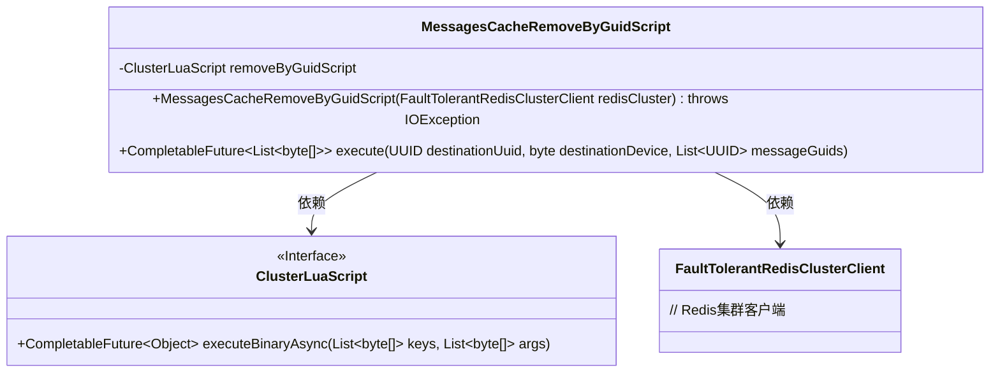
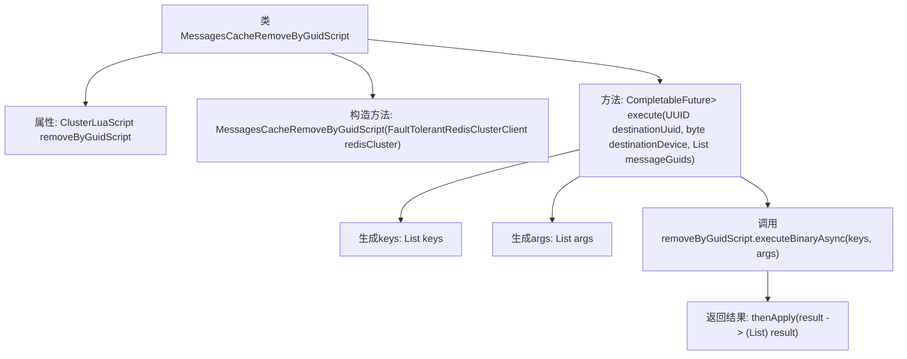

# 基础信息

|      |      |
|------|------|
| 名称 | MessagesCacheRemoveByGuidScript |
| 编码语言 | .java |
| 代码路径 | Signal-Server/service/src/main/java/org/whispersystems/textsecuregcm/storage/MessagesCacheRemoveByGuidScript.java |
| 包名 | org.whispersystems.textsecuregcm.storage |
| 依赖项 | ['io.lettuce.core.ScriptOutputType', 'java.io.IOException', 'java.nio.charset.StandardCharsets', 'java.util.List', 'java.util.UUID', 'java.util.concurrent.CompletableFuture', 'org.whispersystems.textsecuregcm.redis.ClusterLuaScript', 'org.whispersystems.textsecuregcm.redis.FaultTolerantRedisClusterClient'] |
| 概述说明 | Lua脚本在Redis集群中删除指定消息。 |

# 说明

MessagesCacheRemoveByGuidScript类利用Lua脚本在Redis集群中执行操作，具体功能是根据提供的消息标识符（Guid）从缓存中移除相应的消息。该脚本直接在Redis集群中运行，确保高效且原子性地完成消息移除任务。

# 类列表 Class Summary

| 名称   | 类型  | 说明 |
|-------|------|-------------|
| MessagesCacheRemoveByGuidScript | class | MessagesCacheRemoveByGuidScript类通过Lua脚本从Redis集群中移除指定消息。 |

## 类 MessagesCacheRemoveByGuidScript

|      |      |
|------|------|
| 访问范围 | None |
| 类型 | class |
| 名称 | MessagesCacheRemoveByGuidScript |
| 说明 | MessagesCacheRemoveByGuidScript类通过Lua脚本从Redis集群中移除指定消息。 |

### UML类图

这段代码定义了一个 `MessagesCacheRemoveByGuidScript` 类，用于通过 Lua 脚本从 Redis 集群中删除指定 GUID 的消息。该类依赖于 `ClusterLuaScript` 接口来执行 Lua 脚本，并通过 `FaultTolerantRedisClusterClient` 与 Redis 集群进行交互。`execute` 方法接受目标 UUID、设备 ID 和消息 GUID 列表作为参数，生成相应的 Redis 键和参数，并异步执行 Lua 脚本，最终返回一个 `CompletableFuture`，其中包含删除操作的结果。

### 内部方法调用关系图

这段代码定义了一个名为 `MessagesCacheRemoveByGuidScript` 的类，用于通过 Lua 脚本从 Redis 集群中移除指定 GUID 的消息。类中包含一个 `ClusterLuaScript` 类型的属性 `removeByGuidScript`，用于执行 Lua 脚本。构造方法初始化了这个属性，`execute` 方法则负责生成 Redis 的 keys 和 args，并调用 `removeByGuidScript.executeBinaryAsync` 方法异步执行脚本，最后将结果转换为 `List<byte[]>` 类型返回。

### 字段列表 Field List

| 名称  | 类型  | 说明 |
|-------|-------|------|
| removeByGuidScript | ClusterLuaScript | 私有常量ClusterLuaScript用于移除指定GUID的脚本。 |

### 方法列表 Method List

| 名称  | 类型  | 说明 |
|-------|-------|------|
| execute | CompletableFuture<List<byte[]>> | 方法通过UUID和设备ID生成密钥列表，异步执行删除操作并返回结果。 |

