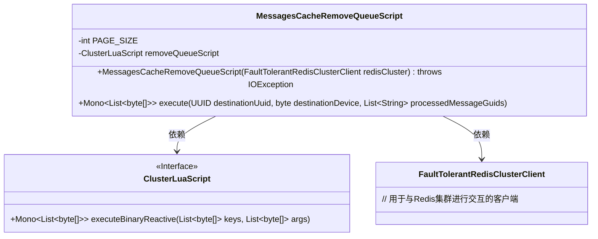
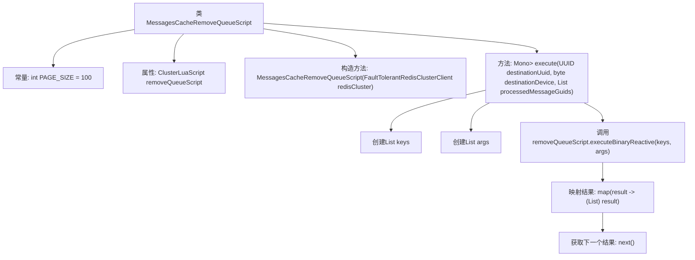

# 基础信息

|      |      |
|------|------|
| 名称 | MessagesCacheRemoveQueueScript |
| 编码语言 | .java |
| 代码路径 | Signal-Server/service/src/main/java/org/whispersystems/textsecuregcm/storage/MessagesCacheRemoveQueueScript.java |
| 包名 | org.whispersystems.textsecuregcm.storage |
| 依赖项 | ['io.lettuce.core.ScriptOutputType', 'java.io.IOException', 'java.nio.charset.StandardCharsets', 'java.util.ArrayList', 'java.util.List', 'java.util.UUID', 'org.whispersystems.textsecuregcm.redis.ClusterLuaScript', 'org.whispersystems.textsecuregcm.redis.FaultTolerantRedisClusterClient', 'reactor.core.publisher.Mono'] |
| 概述说明 | MessagesCacheRemoveQueueScript类从Redis集群移除消息队列，支持批量分页处理。 |

# 说明

MessagesCacheRemoveQueueScript类是一个用于从Redis集群中移除消息队列的工具，具备批量处理和分页操作的功能。该类设计用于高效地处理大量消息队列的移除任务，通过批量处理减少操作次数，提升性能。分页操作则确保在处理大规模数据时，系统资源得到合理分配，避免一次性处理过多数据导致性能下降。整体设计旨在优化Redis集群中消息队列的管理和维护，提高系统的稳定性和效率。

# 类列表 Class Summary

| 名称   | 类型  | 说明 |
|-------|------|-------------|
| MessagesCacheRemoveQueueScript | class | MessagesCacheRemoveQueueScript类用于从Redis集群中移除消息队列，支持批量处理和分页操作。 |

## 类 MessagesCacheRemoveQueueScript

|      |      |
|------|------|
| 访问范围 | None |
| 类型 | class |
| 名称 | MessagesCacheRemoveQueueScript |
| 说明 | MessagesCacheRemoveQueueScript类用于从Redis集群中移除消息队列，支持批量处理和分页操作。 |

### UML类图

### 描述
`MessagesCacheRemoveQueueScript` 类用于从Redis集群中移除消息队列。它依赖于 `ClusterLuaScript` 接口来执行Lua脚本，并通过 `FaultTolerantRedisClusterClient` 与Redis集群进行交互。`execute` 方法接收目标UUID、设备ID和已处理消息的GUID列表，构造Redis命令的键和参数，并调用Lua脚本执行移除操作。该类的设计旨在高效、可靠地处理消息队列的移除任务。

### 内部方法调用关系图

这段代码定义了一个名为 `MessagesCacheRemoveQueueScript` 的类，主要用于从 Redis 集群中移除消息队列。类中包含一个常量 `PAGE_SIZE` 和一个 `ClusterLuaScript` 类型的属性 `removeQueueScript`。构造方法通过加载 Lua 脚本来初始化 `removeQueueScript`。`execute` 方法接收目标 UUID、设备 ID 和已处理消息的 GUID 列表作为参数，生成 Redis 操作所需的键和参数列表，然后调用 Lua 脚本执行移除操作，并返回处理结果。

### 字段列表 Field List

| 名称  | 类型  | 说明 |
|-------|-------|------|
| PAGE_SIZE = 100 | int | 定义了私有静态常量PAGE_SIZE，值为100。 |
| removeQueueScript | ClusterLuaScript | 私有最终变量存储移除队列脚本。 |

### 方法列表 Method List

| 名称  | 类型  | 说明 |
|-------|-------|------|
| execute | Mono<List<byte[]>> | 方法执行消息队列操作，生成键列表和参数列表，调用脚本并返回结果。 |

