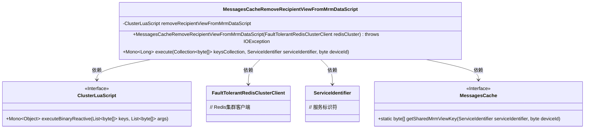
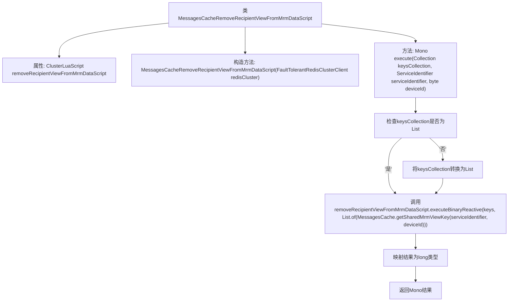

# 基础信息

|      |      |
|------|------|
| 名称 | MessagesCacheRemoveRecipientViewFromMrmDataScript |
| 编码语言 | .java |
| 代码路径 | Signal-Server/service/src/main/java/org/whispersystems/textsecuregcm/storage/MessagesCacheRemoveRecipientViewFromMrmDataScript.java |
| 包名 | org.whispersystems.textsecuregcm.storage |
| 依赖项 | ['io.lettuce.core.ScriptOutputType', 'java.io.IOException', 'java.util.ArrayList', 'java.util.Collection', 'java.util.List', 'org.whispersystems.textsecuregcm.identity.ServiceIdentifier', 'org.whispersystems.textsecuregcm.redis.ClusterLuaScript', 'org.whispersystems.textsecuregcm.redis.FaultTolerantRedisClusterClient', 'reactor.core.publisher.Mono'] |
| 概述说明 | Lua脚本从Redis集群移除收件人视图数据。 |

# 说明

类MessagesCacheRemoveRecipientViewFromMrmDataScript是一个Lua脚本，专门用于从Redis集群中移除与收件人视图相关的数据。该脚本通过执行特定的操作，确保Redis集群中不再保留与指定收件人视图相关的缓存信息。这一过程有助于维护数据的一致性和清理不再需要的缓存数据，从而优化系统性能。

# 类列表 Class Summary

| 名称   | 类型  | 说明 |
|-------|------|-------------|
| MessagesCacheRemoveRecipientViewFromMrmDataScript | class | 类MessagesCacheRemoveRecipientViewFromMrmDataScript通过Lua脚本从Redis集群中移除收件人视图数据。 |

## 类 MessagesCacheRemoveRecipientViewFromMrmDataScript

|      |      |
|------|------|
| 访问范围 | None |
| 类型 | class |
| 名称 | MessagesCacheRemoveRecipientViewFromMrmDataScript |
| 说明 | 类MessagesCacheRemoveRecipientViewFromMrmDataScript通过Lua脚本从Redis集群中移除收件人视图数据。 |

### UML类图

**描述：**  
`MessagesCacheRemoveRecipientViewFromMrmDataScript` 类负责从 Redis 集群中移除特定设备的 MRM 数据视图。它依赖于 `ClusterLuaScript` 接口来执行 Lua 脚本，并通过 `FaultTolerantRedisClusterClient` 与 Redis 集群进行交互。`ServiceIdentifier` 用于标识服务，`MessagesCache` 提供了获取共享 MRM 视图键的方法。该类通过 `execute` 方法接收键集合、服务标识符和设备 ID，执行 Lua 脚本并返回结果。

### 内部方法调用关系图

这段代码定义了一个名为`MessagesCacheRemoveRecipientViewFromMrmDataScript`的类，主要用于从Redis集群中移除指定收件人的视图数据。类中包含一个构造方法，用于初始化Lua脚本的执行环境，以及一个`execute`方法，用于执行Lua脚本并返回结果。`execute`方法首先检查输入的`keysCollection`是否为`List<byte[]>`类型，如果不是则将其转换为`List<byte[]>`，然后调用Lua脚本执行操作，并将结果映射为`long`类型返回。

### 字段列表 Field List

| 名称  | 类型  | 说明 |
|-------|-------|------|
| removeRecipientViewFromMrmDataScript | ClusterLuaScript | 私有ClusterLuaScript用于移除MRM数据中的接收者视图。 |

### 方法列表 Method List

| 名称  | 类型  | 说明 |
|-------|-------|------|
| execute | Mono<Long> | 该方法通过二进制反应操作移除指定服务标识和设备ID的MRM数据视图。 |

