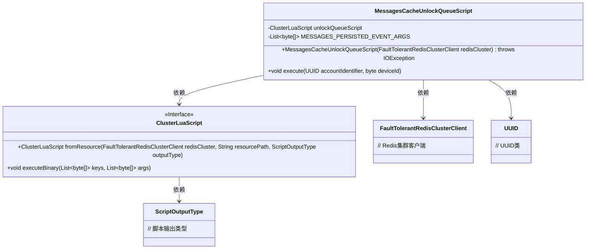
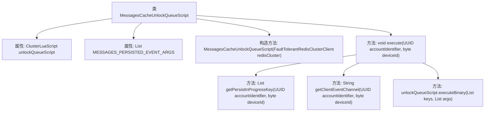

# 基础信息

|      |      |
|------|------|
| 名称 | MessagesCacheUnlockQueueScript |
| 编码语言 | .java |
| 代码路径 | Signal-Server/service/src/main/java/org/whispersystems/textsecuregcm/storage/MessagesCacheUnlockQueueScript.java |
| 包名 | org.whispersystems.textsecuregcm.storage |
| 依赖项 | ['io.lettuce.core.ScriptOutputType', 'org.whispersystems.textsecuregcm.push.ClientEvent', 'org.whispersystems.textsecuregcm.push.MessagesPersistedEvent', 'org.whispersystems.textsecuregcm.push.WebSocketConnectionEventManager', 'org.whispersystems.textsecuregcm.redis.ClusterLuaScript', 'org.whispersystems.textsecuregcm.redis.FaultTolerantRedisClusterClient', 'java.io.IOException', 'java.util.List', 'java.util.UUID'] |
| 概述说明 | MessagesCacheUnlockQueueScript类处理Lua脚本和事件参数以解锁队列。 |

# 说明

MessagesCacheUnlockQueueScript类的主要功能是解锁队列。该类通过执行Lua脚本来实现解锁操作，并处理与事件相关的参数。具体来说，它负责管理和协调队列的解锁过程，确保事件参数在解锁过程中得到正确处理，从而实现队列的有效管理和操作。

# 类列表 Class Summary

| 名称   | 类型  | 说明 |
|-------|------|-------------|
| MessagesCacheUnlockQueueScript | class | MessagesCacheUnlockQueueScript类用于解锁队列，包含Lua脚本执行和事件参数处理。 |

## 类 MessagesCacheUnlockQueueScript

|      |      |
|------|------|
| 访问范围 | None |
| 类型 | class |
| 名称 | MessagesCacheUnlockQueueScript |
| 说明 | MessagesCacheUnlockQueueScript类用于解锁队列，包含Lua脚本执行和事件参数处理。 |

### UML类图

这段代码定义了一个 `MessagesCacheUnlockQueueScript` 类，用于执行一个 Lua 脚本以解锁消息队列。该类依赖于 `ClusterLuaScript` 接口来执行 Lua 脚本，并使用了 `FaultTolerantRedisClusterClient` 作为 Redis 集群客户端。`execute` 方法接受账户标识符和设备 ID 作为参数，生成相应的键并执行 Lua 脚本。Lua 脚本的路径和输出类型在构造函数中指定。整个流程通过 `ClusterLuaScript` 接口与 Redis 集群进行交互，确保消息队列的解锁操作能够正确执行。

### 内部方法调用关系图

这段代码定义了一个名为 `MessagesCacheUnlockQueueScript` 的类，该类用于执行与Redis集群相关的Lua脚本操作。类中包含一个构造方法和一个 `execute` 方法。构造方法初始化了一个 `ClusterLuaScript` 实例，而 `execute` 方法则通过传入的账户标识符和设备ID生成一组键，并调用 `unlockQueueScript.executeBinary` 方法来执行Lua脚本。整个流程涉及生成键、执行脚本，最终实现对Redis集群的操作。

### 字段列表 Field List

| 名称  | 类型  | 说明 |
|-------|-------|------|
| unlockQueueScript | ClusterLuaScript | ClusterLuaScript用于解锁队列的私有最终变量。 |
| MESSAGES_PERSISTED_EVENT_ARGS = List.of(ClientEvent.newBuilder()      .setMessagesPersisted(MessagesPersistedEvent.getDefaultInstance())      .build()      .toByteArray()) | List<byte[]> | 定义私有常量MESSAGES_PERSISTED_EVENT_ARGS，存储序列化后的ClientEvent消息。 |

### 方法列表 Method List

| 名称  | 类型  | 说明 |
|-------|-------|------|
| execute | void | 方法执行解锁队列操作，使用账户标识和设备ID生成并解锁相关键。 |

