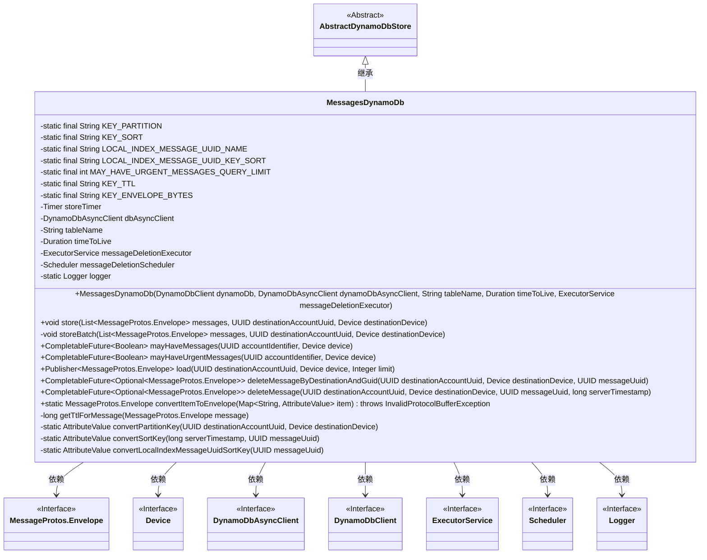

# 基础信息

|      |      |
|------|------|
| 名称 | MessagesDynamoDb |
| 编码语言 | .java |
| 代码路径 | Signal-Server/service/src/main/java/org/whispersystems/textsecuregcm/storage/MessagesDynamoDb.java |
| 包名 | org.whispersystems.textsecuregcm.storage |
| 依赖项 | ['com.codahale.metrics.MetricRegistry.name', 'io.micrometer.core.instrument.Metrics.timer', 'com.google.common.annotations.VisibleForTesting', 'com.google.common.collect.ImmutableMap', 'com.google.protobuf.InvalidProtocolBufferException', 'io.micrometer.core.instrument.Timer', 'java.nio.ByteBuffer', 'java.time.Duration', 'java.util.ArrayList', 'java.util.List', 'java.util.Map', 'java.util.Objects', 'java.util.Optional', 'java.util.UUID', 'java.util.concurrent.CompletableFuture', 'java.util.concurrent.ExecutorService', 'java.util.function.Predicate', 'org.reactivestreams.Publisher', 'org.slf4j.Logger', 'org.slf4j.LoggerFactory', 'org.whispersystems.textsecuregcm.entities.MessageProtos', 'org.whispersystems.textsecuregcm.util.AttributeValues', 'reactor.core.publisher.Flux', 'reactor.core.publisher.Mono', 'reactor.core.scheduler.Scheduler', 'reactor.core.scheduler.Schedulers', 'software.amazon.awssdk.core.SdkBytes', 'software.amazon.awssdk.services.dynamodb.DynamoDbAsyncClient', 'software.amazon.awssdk.services.dynamodb.DynamoDbClient', 'software.amazon.awssdk.services.dynamodb.model.AttributeValue', 'software.amazon.awssdk.services.dynamodb.model.DeleteItemRequest', 'software.amazon.awssdk.services.dynamodb.model.PutRequest', 'software.amazon.awssdk.services.dynamodb.model.QueryRequest', 'software.amazon.awssdk.services.dynamodb.model.ReturnValue', 'software.amazon.awssdk.services.dynamodb.model.WriteRequest'] |
| 概述说明 | MessagesDynamoDb类负责DynamoDB消息的存储、查询、删除，支持批量写入、TTL和异步处理。 |

# 说明

MessagesDynamoDb类负责管理DynamoDB中的消息存储、查询和删除操作，支持批量写入、TTL（生存时间）设置以及异步处理功能，确保高效且灵活的消息管理。

# 类列表 Class Summary

| 名称   | 类型  | 说明 |
|-------|------|-------------|
| MessagesDynamoDb | class | MessagesDynamoDb类管理DynamoDB中的消息存储、查询和删除操作，支持批量写入、TTL设置和异步处理。 |

## 类 MessagesDynamoDb

|      |      |
|------|------|
| 访问范围 | public |
| 类型 | class |
| 名称 | MessagesDynamoDb |
| 说明 | MessagesDynamoDb类管理DynamoDB中的消息存储、查询和删除操作，支持批量写入、TTL设置和异步处理。 |

### UML类图

### 描述
`MessagesDynamoDb` 类继承自 `AbstractDynamoDbStore`，主要用于处理与 DynamoDB 数据库的交互，包括消息的存储、查询和删除。该类包含多个私有常量和方法，用于处理消息的分区键、排序键、TTL（生存时间）等。`MessagesDynamoDb` 依赖于多个接口和类，如 `MessageProtos.Envelope`、`Device`、`DynamoDbAsyncClient` 等，以实现其功能。该类还提供了异步操作的支持，如 `CompletableFuture` 和 `Publisher`，用于处理消息的查询和删除操作。

### 内部方法调用关系图

```mermaid
graph TD
    A["类MessagesDynamoDb"]
    B["继承自: AbstractDynamoDbStore"]
    C["常量: KEY_PARTITION, KEY_SORT, LOCAL_INDEX_MESSAGE_UUID_NAME, LOCAL_INDEX_MESSAGE_UUID_KEY_SORT, MAY_HAVE_URGENT_MESSAGES_QUERY_LIMIT, KEY_TTL, KEY_ENVELOPE_BYTES"]
    D["属性: Timer storeTimer, DynamoDbAsyncClient dbAsyncClient, String tableName, Duration timeToLive, ExecutorService messageDeletionExecutor, Scheduler messageDeletionScheduler, Logger logger"]
    E["构造方法: MessagesDynamoDb(DynamoDbClient dynamoDb, DynamoDbAsyncClient dynamoDbAsyncClient, String tableName, Duration timeToLive, ExecutorService messageDeletionExecutor)"]
    F["方法: store(List<MessageProtos.Envelope> messages, UUID destinationAccountUuid, Device destinationDevice)"]
    G["方法: storeBatch(List<MessageProtos.Envelope> messages, UUID destinationAccountUuid, Device destinationDevice)"]
    H["方法: mayHaveMessages(UUID accountIdentifier, Device device)"]
    I["方法: mayHaveUrgentMessages(UUID accountIdentifier, Device device)"]
    J["方法: load(UUID destinationAccountUuid, Device device, Integer limit)"]
    K["方法: deleteMessageByDestinationAndGuid(UUID destinationAccountUuid, Device destinationDevice, UUID messageUuid)"]
    L["方法: deleteMessage(UUID destinationAccountUuid, Device destinationDevice, UUID messageUuid, long serverTimestamp)"]
    M["方法: convertItemToEnvelope(Map<String, AttributeValue> item)"]
    N["方法: getTtlForMessage(MessageProtos.Envelope message)"]
    O["方法: convertPartitionKey(UUID destinationAccountUuid, Device destinationDevice)"]
    P["方法: convertSortKey(long serverTimestamp, UUID messageUuid)"]
    Q["方法: convertLocalIndexMessageUuidSortKey(UUID messageUuid)"]

    A --> B
    A --> C
    A --> D
    A --> E
    A --> F
    A --> G
    A --> H
    A --> I
    A --> J
    A --> K
    A --> L
    A --> M
    A --> N
    A --> O
    A --> P
    A --> Q
```

这段代码定义了一个名为`MessagesDynamoDb`的类，继承自`AbstractDynamoDbStore`，主要用于处理与DynamoDB数据库的交互。类中包含了多个常量、属性和方法，用于存储、查询、删除消息等操作。通过构造方法初始化了数据库客户端、表名、生存时间等属性，并提供了多种方法来实现具体的业务逻辑，如批量存储消息、查询消息是否存在、删除消息等。每个方法都通过DynamoDB的异步客户端进行操作，确保高效处理大量数据。

### 字段列表 Field List

| 名称  | 类型  | 说明 |
|-------|-------|------|
| KEY_ENVELOPE_BYTES = "EB" | String | 定义常量KEY_ENVELOPE_BYTES，值为"EB"。 |
| KEY_PARTITION = "H" | String | 测试用静态常量KEY_PARTITION定义为"H"。 |
| tableName | String | 私有字符串变量表名。 |
| timeToLive | Duration | 私有常量，定义存活时间。 |
| messageDeletionScheduler | Scheduler | 私有调度器用于消息删除任务。 |
| KEY_SORT = "S" | String | 用于测试的静态常量KEY_SORT，值为"S"。 |
| MAY_HAVE_URGENT_MESSAGES_QUERY_LIMIT = 20 | int | 测试用常量定义，限制查询紧急消息数量为20。 |
| messageDeletionExecutor | ExecutorService | 私有线程池用于处理消息删除任务。 |
| dbAsyncClient | DynamoDbAsyncClient | 私有异步DynamoDB客户端实例。 |
| logger = LoggerFactory.getLogger(MessagesDynamoDb.class) | Logger | MessagesDynamoDb类中声明了一个私有的静态Logger常量。 |
| LOCAL_INDEX_MESSAGE_UUID_KEY_SORT = "U" | String | 测试用本地索引消息UUID键排序常量定义为"U"。 |
| KEY_TTL = "E" | String | 定义私有静态常量KEY_TTL，值为"E"。 |
| storeTimer = timer(name(getClass(), "store")) | Timer | 声明并初始化一个名为storeTimer的私有Timer对象。 |
| LOCAL_INDEX_MESSAGE_UUID_NAME = "Message_UUID_Index" | String | 测试可见的静态常量用于本地索引消息UUID名称。 |

### 方法列表 Method List

| 名称  | 类型  | 说明 |
|-------|-------|------|
| getTtlForMessage | long | 计算消息TTL：服务器时间戳除以1000加存活时间秒数。 |
| store | void | 存储消息列表至指定账户和设备，采用批量写入方式。 |
| deleteMessage | CompletableFuture<Optional<MessageProtos.Envelope>> | 异步删除消息并返回旧值。 |
| mayHaveMessages | CompletableFuture<Boolean> | 异步查询数据库，检查指定账户和设备是否存在消息。 |
| convertSortKey | AttributeValue | 将时间戳和UUID转换为24字节的AttributeValue。 |
| mayHaveUrgentMessages | CompletableFuture<Boolean> | 该方法通过查询判断指定账户和设备是否有紧急消息。 |
| convertPartitionKey | AttributeValue | 将UUID和设备信息转换为24字节的ByteBuffer，并返回AttributeValue对象。 |
| convertItemToEnvelope | MessageProtos.Envelope | 静态方法将Map转换为MessageProtos.Envelope对象。 |
| convertLocalIndexMessageUuidSortKey | AttributeValue | 将UUID转换为AttributeValue的静态私有方法。 |
| deleteMessageByDestinationAndGuid | CompletableFuture<Optional<MessageProtos.Envelope>> | 根据目标账户和设备删除指定消息，返回删除结果。 |
| storeBatch | void | 批量存储消息至DynamoDB，检查消息数量，转换键值，构建写入请求并执行。 |
| load | Publisher<MessageProtos.Envelope> | 加载消息方法：根据账户和设备查询数据库，支持分页和限制结果集大小，转换并过滤无效消息。 |

