# 基础信息

|      |      |
|------|------|
| 名称 | MessagesManager |
| 编码语言 | .java |
| 代码路径 | Signal-Server/service/src/main/java/org/whispersystems/textsecuregcm/storage/MessagesManager.java |
| 包名 | org.whispersystems.textsecuregcm.storage |
| 依赖项 | ['org.whispersystems.textsecuregcm.metrics.MetricsUtil.name', 'com.google.protobuf.ByteString', 'io.micrometer.core.instrument.Counter', 'io.micrometer.core.instrument.Metrics', 'java.time.Clock', 'java.time.Instant', 'java.util.List', 'java.util.Map', 'java.util.Optional', 'java.util.UUID', 'java.util.concurrent.CompletableFuture', 'java.util.concurrent.ConcurrentHashMap', 'java.util.concurrent.ExecutionException', 'java.util.concurrent.ExecutorService', 'java.util.concurrent.TimeUnit', 'java.util.concurrent.TimeoutException', 'java.util.stream.Collectors', 'java.util.stream.IntStream', 'javax.annotation.Nullable', 'org.reactivestreams.Publisher', 'org.signal.libsignal.protocol.SealedSenderMultiRecipientMessage', 'org.slf4j.Logger', 'org.slf4j.LoggerFactory', 'org.whispersystems.textsecuregcm.entities.MessageProtos', 'org.whispersystems.textsecuregcm.entities.MessageProtos.Envelope', 'org.whispersystems.textsecuregcm.identity.IdentityType', 'org.whispersystems.textsecuregcm.identity.ServiceIdentifier', 'org.whispersystems.textsecuregcm.metrics.MetricsUtil', 'org.whispersystems.textsecuregcm.util.Pair', 'reactor.core.observability.micrometer.Micrometer', 'reactor.core.publisher.Flux', 'reactor.core.publisher.Mono'] |
| 概述说明 | MessagesManager类管理设备消息，支持插入、查询、删除及多接收者处理。 |

# 说明

MessagesManager类负责管理设备消息，具备插入、查询、删除和持久化等核心功能。该类还支持处理多接收者的消息，确保消息能够高效地传递给多个目标。通过这一管理机制，MessagesManager类实现了对设备消息的全面控制和有效处理，提升了消息管理的灵活性和可靠性。

# 类列表 Class Summary

| 名称   | 类型  | 说明 |
|-------|------|-------------|
| MessagesManager | class | MessagesManager类管理设备消息，包括插入、查询、删除和持久化操作，支持多接收者消息处理。 |

## 类 MessagesManager

|      |      |
|------|------|
| 访问范围 | public |
| 类型 | class |
| 名称 | MessagesManager |
| 说明 | MessagesManager类管理设备消息，包括插入、查询、删除和持久化操作，支持多接收者消息处理。 |

### UML类图

```mermaid
classDiagram
    class MessagesManager {
        -int RESULT_SET_CHUNK_SIZE
        -String GET_MESSAGES_FOR_DEVICE_FLUX_NAME
        -Logger logger
        -Counter PERSIST_MESSAGE_COUNTER
        -Counter PERSIST_MESSAGE_BYTES_COUNTER
        -String MAY_HAVE_MESSAGES_COUNTER_NAME
        -MessagesDynamoDb messagesDynamoDb
        -MessagesCache messagesCache
        -ReportMessageManager reportMessageManager
        -ExecutorService messageDeletionExecutor
        -Clock clock
        +MessagesManager(MessagesDynamoDb messagesDynamoDb, MessagesCache messagesCache, ReportMessageManager reportMessageManager, ExecutorService messageDeletionExecutor, Clock clock)
        +Map~Byte, Boolean~ insert(UUID accountIdentifier, Map~Byte, Envelope~ messagesByDeviceId)
        -CompletableFuture~Map~Byte, Boolean~~ insertAsync(UUID accountIdentifier, Map~Byte, Envelope~ messagesByDeviceId)
        +CompletableFuture~Map~Account, Map~Byte, Boolean~~~ insertMultiRecipientMessage(SealedSenderMultiRecipientMessage multiRecipientMessage, Map~SealedSenderMultiRecipientMessage.Recipient, Account~ resolvedRecipients, long clientTimestamp, boolean isStory, boolean isEphemeral, boolean isUrgent)
        +CompletableFuture~Boolean~ mayHavePersistedMessages(UUID destinationUuid, Device destinationDevice)
        +CompletableFuture~Boolean~ mayHaveMessages(UUID destinationUuid, Device destinationDevice)
        +CompletableFuture~Boolean~ mayHaveUrgentPersistedMessages(UUID destinationUuid, Device destinationDevice)
        +Mono~Pair~List~Envelope~, Boolean~~ getMessagesForDevice(UUID destinationUuid, Device destinationDevice, boolean cachedMessagesOnly)
        +Publisher~Envelope~ getMessagesForDeviceReactive(UUID destinationUuid, Device destinationDevice, boolean cachedMessagesOnly)
        -Publisher~Envelope~ getMessagesForDevice(UUID destinationUuid, Device destinationDevice, Integer limit, boolean cachedMessagesOnly)
        +CompletableFuture~Void~ clear(UUID destinationUuid)
        +CompletableFuture~Void~ clear(UUID destinationUuid, byte deviceId)
        +CompletableFuture~Optional~RemovedMessage~~ delete(UUID destinationUuid, Device destinationDevice, UUID guid, Long serverTimestamp)
        +int persistMessages(UUID destinationUuid, Device destinationDevice, List~Envelope~ messages)
        +CompletableFuture~Optional~Instant~~ getEarliestUndeliveredTimestampForDevice(UUID destinationUuid, Device destinationDevice)
        -CompletableFuture~byte[]~ insertSharedMultiRecipientMessagePayload(SealedSenderMultiRecipientMessage sealedSenderMultiRecipientMessage)
    }

    class MessagesDynamoDb {
        <<Interface>>
        +CompletableFuture~Boolean~ mayHaveMessages(UUID destinationUuid, Device destinationDevice)
        +CompletableFuture~Boolean~ mayHaveUrgentMessages(UUID destinationUuid, Device destinationDevice)
        +CompletableFuture~Optional~MessageProtos.Envelope~~ deleteMessageByDestinationAndGuid(UUID destinationUuid, Device destinationDevice, UUID guid)
        +CompletableFuture~Optional~MessageProtos.Envelope~~ deleteMessage(UUID destinationUuid, Device destinationDevice, UUID guid, Long serverTimestamp)
        +void store(List~Envelope~ messages, UUID destinationUuid, Device destinationDevice)
        +Publisher~Envelope~ load(UUID destinationUuid, Device destinationDevice, Integer limit)
    }

    class MessagesCache {
        <<Interface>>
        +CompletableFuture~Boolean~ insert(UUID messageGuid, UUID accountIdentifier, byte deviceId, Envelope message)
        +CompletableFuture~Boolean~ hasMessagesAsync(UUID destinationUuid, byte deviceId)
        +Publisher~Envelope~ get(UUID destinationUuid, byte deviceId)
        +CompletableFuture~Void~ clear(UUID destinationUuid)
        +CompletableFuture~Void~ clear(UUID destinationUuid, byte deviceId)
        +CompletableFuture~Optional~RemovedMessage~~ remove(UUID destinationUuid, byte deviceId, UUID guid)
        +CompletableFuture~List~UUID~~ remove(UUID destinationUuid, byte deviceId, List~UUID~ messageGuids)
        +CompletableFuture~Optional~Instant~~ getEarliestUndeliveredTimestamp(UUID destinationUuid, byte deviceId)
        +CompletableFuture~byte[]~ insertSharedMultiRecipientMessagePayload(SealedSenderMultiRecipientMessage sealedSenderMultiRecipientMessage)
    }

    class ReportMessageManager {
        <<Interface>>
        +void store(String sourceServiceId, UUID messageGuid)
    }

    MessagesManager --> MessagesDynamoDb : 依赖
    MessagesManager --> MessagesCache : 依赖
    MessagesManager --> ReportMessageManager : 依赖
```

**描述：**  
`MessagesManager` 是一个消息管理类，负责处理与设备相关的消息操作，包括消息的插入、删除、查询和持久化等。它依赖于 `MessagesDynamoDb` 和 `MessagesCache` 来处理消息的存储和缓存，同时使用 `ReportMessageManager` 来报告消息的状态。该类提供了多种异步方法，支持批量操作和复杂的消息处理逻辑，确保消息的高效管理和传递。

### 内部方法调用关系图

```mermaid
graph TD
    A["类MessagesManager"]
    B["常量: int RESULT_SET_CHUNK_SIZE"]
    C["常量: String GET_MESSAGES_FOR_DEVICE_FLUX_NAME"]
    D["常量: Logger logger"]
    E["常量: Counter PERSIST_MESSAGE_COUNTER"]
    F["常量: Counter PERSIST_MESSAGE_BYTES_COUNTER"]
    G["常量: String MAY_HAVE_MESSAGES_COUNTER_NAME"]
    H["属性: MessagesDynamoDb messagesDynamoDb"]
    I["属性: MessagesCache messagesCache"]
    J["属性: ReportMessageManager reportMessageManager"]
    K["属性: ExecutorService messageDeletionExecutor"]
    L["属性: Clock clock"]
    M["构造方法: MessagesManager(MessagesDynamoDb, MessagesCache, ReportMessageManager, ExecutorService, Clock)"]
    N["方法: Map<Byte, Boolean> insert(UUID, Map<Byte, Envelope>)"]
    O["方法: CompletableFuture<Map<Byte, Boolean>> insertAsync(UUID, Map<Byte, Envelope>)"]
    P["方法: CompletableFuture<Map<Account, Map<Byte, Boolean>>> insertMultiRecipientMessage(SealedSenderMultiRecipientMessage, Map<Recipient, Account>, long, boolean, boolean, boolean)"]
    Q["方法: CompletableFuture<Boolean> mayHavePersistedMessages(UUID, Device)"]
    R["方法: CompletableFuture<Boolean> mayHaveMessages(UUID, Device)"]
    S["方法: CompletableFuture<Boolean> mayHaveUrgentPersistedMessages(UUID, Device)"]
    T["方法: Mono<Pair<List<Envelope>, Boolean>> getMessagesForDevice(UUID, Device, boolean)"]
    U["方法: Publisher<Envelope> getMessagesForDeviceReactive(UUID, Device, boolean)"]
    V["方法: Publisher<Envelope> getMessagesForDevice(UUID, Device, Integer, boolean)"]
    W["方法: CompletableFuture<Void> clear(UUID)"]
    X["方法: CompletableFuture<Void> clear(UUID, byte)"]
    Y["方法: CompletableFuture<Optional<RemovedMessage>> delete(UUID, Device, UUID, Long)"]
    Z["方法: int persistMessages(UUID, Device, List<Envelope>)"]
    AA["方法: CompletableFuture<Optional<Instant>> getEarliestUndeliveredTimestampForDevice(UUID, Device)"]
    AB["方法: CompletableFuture<byte[]> insertSharedMultiRecipientMessagePayload(SealedSenderMultiRecipientMessage)"]

    A --> B
    A --> C
    A --> D
    A --> E
    A --> F
    A --> G
    A --> H
    A --> I
    A --> J
    A --> K
    A --> L
    A --> M
    A --> N
    A --> O
    A --> P
    A --> Q
    A --> R
    A --> S
    A --> T
    A --> U
    A --> V
    A --> W
    A --> X
    A --> Y
    A --> Z
    A --> AA
    A --> AB
```

这段代码定义了一个`MessagesManager`类，用于管理设备的消息队列。类中包含多个方法，用于插入、删除、查询消息，并处理多接收者消息。代码通过`MessagesDynamoDb`和`MessagesCache`来持久化和缓存消息，并通过`ReportMessageManager`报告消息状态。`MessagesManager`类还提供了异步操作的支持，使用`CompletableFuture`和`Publisher`来处理消息的插入和查询。类中的方法涵盖了从简单的消息插入到复杂的多接收者消息处理，确保消息的高效管理和传递。

### 字段列表 Field List

| 名称  | 类型  | 说明 |
|-------|-------|------|
| RESULT_SET_CHUNK_SIZE = 100 | int | 定义了常量RESULT_SET_CHUNK_SIZE，值为100。 |
| PERSIST_MESSAGE_BYTES_COUNTER = Metrics.counter(      name(MessagesManager.class, "persistMessageBytes")) | Counter | 定义计数器用于统计消息字节持久化量。 |
| reportMessageManager | ReportMessageManager | 私有常量ReportMessageManager实例。 |
| messageDeletionExecutor | ExecutorService | 私有线程池用于消息删除任务。 |
| messagesCache | MessagesCache | 私有成员变量messagesCache类型为MessagesCache。 |
| logger = LoggerFactory.getLogger(MessagesManager.class) | Logger | MessagesManager类中定义了一个私有的静态Logger实例。 |
| GET_MESSAGES_FOR_DEVICE_FLUX_NAME = name(MessagesManager.class, "getMessagesForDevice") | String | 定义获取设备消息的常量名称为GET_MESSAGES_FOR_DEVICE_FLUX_NAME。 |
| clock | Clock | 定义了一个私有且不可变的Clock类型变量clock。 |
| PERSIST_MESSAGE_COUNTER = Metrics.counter(      name(MessagesManager.class, "persistMessage")) | Counter | 定义私有静态计数器PERSIST_MESSAGE_COUNTER用于消息持久化统计。 |
| messagesDynamoDb | MessagesDynamoDb | 私有成员变量messagesDynamoDb类型为MessagesDynamoDb。 |
| MAY_HAVE_MESSAGES_COUNTER_NAME =      MetricsUtil.name(MessagesManager.class, "mayHaveMessages") | String | 定义常量MAY_HAVE_MESSAGES_COUNTER_NAME用于消息管理类指标。 |

### 方法列表 Method List

| 名称  | 类型  | 说明 |
|-------|-------|------|
| getMessagesForDevice | Mono<Pair<List<Envelope>, Boolean>> | 获取设备消息并返回列表及是否满块的布尔值。 |
| clear | CompletableFuture<Void> | 清除指定UUID的消息缓存。 |
| clear | CompletableFuture<Void> | 异步清除指定设备和目标UUID的消息缓存。 |
| persistMessages | int | 持久化消息并更新缓存和计数器。 |
| mayHaveUrgentPersistedMessages | CompletableFuture<Boolean> | 检查指定设备是否有紧急持久化消息。 |
| insertSharedMultiRecipientMessagePayload | CompletableFuture<byte[]> | 异步插入多接收者加密消息负载至缓存。 |
| getEarliestUndeliveredTimestampForDevice | CompletableFuture<Optional<Instant>> | 获取设备最早未送达消息时间戳的方法。 |
| mayHaveMessages | CompletableFuture<Boolean> | 异步检查消息缓存和数据库，返回是否有消息存在。 |
| delete | CompletableFuture<Optional<RemovedMessage>> | 删除消息方法，支持缓存和数据库操作，返回删除结果。 |
| getMessagesForDeviceReactive | Publisher<Envelope> | 获取指定设备消息的响应式发布者，支持缓存消息。 |
| mayHavePersistedMessages | CompletableFuture<Boolean> | 该方法检查指定设备和UUID是否有持久化消息，返回CompletableFuture<Boolean>。 |
| insertAsync | CompletableFuture<Map<Byte, Boolean>> | 异步插入消息并返回设备状态映射。 |
| insert | Map<Byte, Boolean> | 方法`insert`通过异步插入账户标识符和设备消息映射，返回字节与布尔值的映射。 |
| getMessagesForDevice | Publisher<Envelope> | 获取设备消息，结合DynamoDB和缓存数据，支持限制和仅缓存选项。 |
| insertMultiRecipientMessage | CompletableFuture<Map<Account, Map<Byte, Boolean>>> | 插入多接收者消息，生成信封并异步存储，返回账户设备状态。 |

