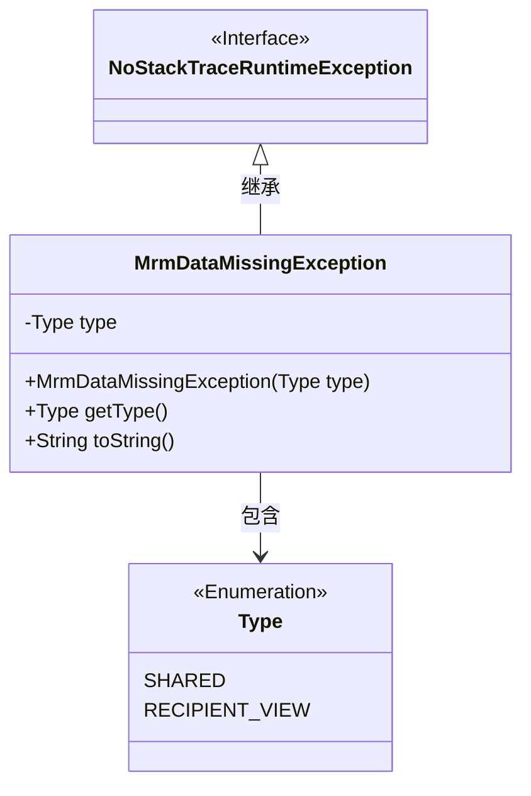
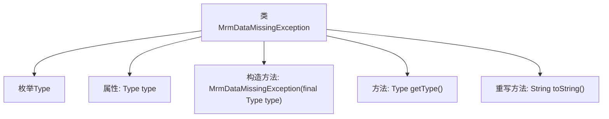

# 基础信息

|      |      |
|------|------|
| 名称 | MrmDataMissingException |
| 编码语言 | .java |
| 代码路径 | Signal-Server/service/src/main/java/org/whispersystems/textsecuregcm/storage/MrmDataMissingException.java |
| 包名 | org.whispersystems.textsecuregcm.storage |
| 依赖项 | ['org.whispersystems.textsecuregcm.util.NoStackTraceRuntimeException'] |
| 概述说明 | MrmDataMissingException继承NoStackTraceRuntimeException，含Type枚举和类型字段。 |

# 说明

MrmDataMissingException是一个继承自NoStackTraceRuntimeException的异常类。它包含一个Type枚举和一个类型字段，用于进一步描述异常的具体情况。这种设计使得异常处理更加精细化和可扩展。

# 类列表 Class Summary

| 名称   | 类型  | 说明 |
|-------|------|-------------|
| MrmDataMissingException | class | MrmDataMissingException继承NoStackTraceRuntimeException，包含Type枚举和类型字段。 |

## 类 MrmDataMissingException

|      |      |
|------|------|
| 访问范围 | None |
| 类型 | class |
| 名称 | MrmDataMissingException |
| 说明 | MrmDataMissingException继承NoStackTraceRuntimeException，包含Type枚举和类型字段。 |

### UML类图

这段代码定义了一个 `MrmDataMissingException` 类，该类继承自 `NoStackTraceRuntimeException` 接口。`MrmDataMissingException` 类包含一个枚举类型 `Type`，用于表示异常的类型。该类通过构造函数初始化异常类型，并提供了获取类型和重写 `toString` 方法的功能。类图清晰地展示了类之间的继承关系和包含关系。

### 内部方法调用关系图

这段代码定义了一个名为 `MrmDataMissingException` 的类，该类继承自 `NoStackTraceRuntimeException`。类中包含一个枚举类型 `Type`，用于表示异常的类型。类的主要功能包括通过构造方法初始化异常类型，提供获取异常类型的方法 `getType()`，以及重写 `toString()` 方法以格式化输出异常信息。流程图展示了类的结构及其内部方法之间的调用关系。

### 字段列表 Field List

| 名称  | 类型  | 说明 |
|-------|-------|------|
| type | Type | 定义了一个私有且不可变的Type类型变量。 |

### 方法列表 Method List

| 名称  | 类型  | 说明 |
|-------|-------|------|
| getType | Type | 该方法返回对象的类型。 |
| toString | String | 重写toString方法，返回包含异常类型的格式化字符串。 |

