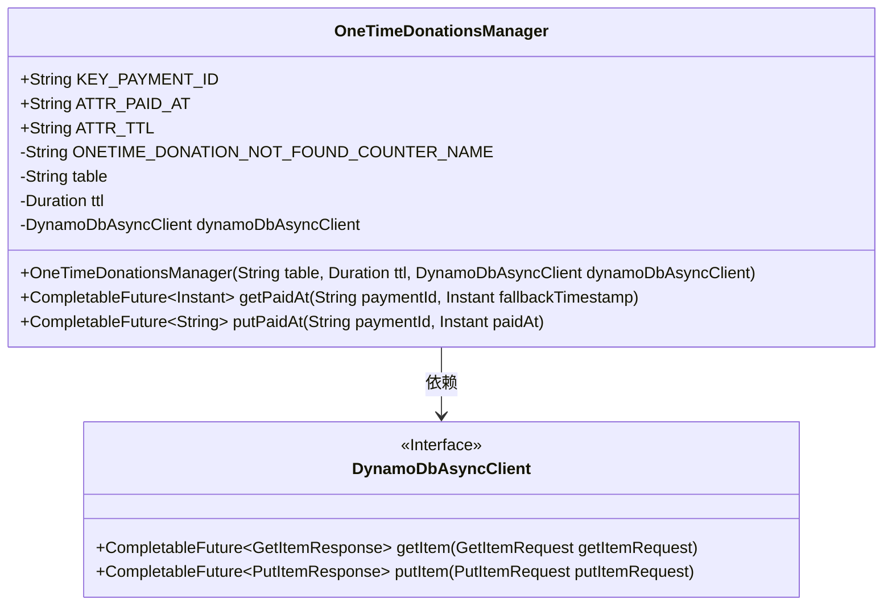

# 基础信息

|      |      |
|------|------|
| 名称 | OneTimeDonationsManager |
| 编码语言 | .java |
| 代码路径 | Signal-Server/service/src/main/java/org/whispersystems/textsecuregcm/storage/OneTimeDonationsManager.java |
| 包名 | org.whispersystems.textsecuregcm.storage |
| 依赖项 | ['com.codahale.metrics.MetricRegistry.name', 'io.micrometer.core.instrument.Metrics', 'java.time.Duration', 'java.time.Instant', 'java.util.Map', 'java.util.Objects', 'java.util.concurrent.CompletableFuture', 'javax.annotation.Nonnull', 'org.whispersystems.textsecuregcm.util.AttributeValues', 'software.amazon.awssdk.services.dynamodb.DynamoDbAsyncClient', 'software.amazon.awssdk.services.dynamodb.model.GetItemRequest', 'software.amazon.awssdk.services.dynamodb.model.PutItemRequest'] |
| 概述说明 | 管理捐赠，处理支付时间与TTL，采用DynamoDB异步客户端。 |

# 说明

管理一次性捐赠涉及处理支付时间和TTL（生存时间），确保支付流程的时效性和数据一致性。通过使用DynamoDB异步客户端，系统能够高效地处理捐赠数据的存储和检索，同时优化响应速度和资源利用率。异步操作确保了在高并发场景下的性能稳定，避免了阻塞和延迟。DynamoDB的特性支持灵活的数据模型和自动扩展，适用于处理大规模的捐赠事务。整体设计旨在提升捐赠管理的效率和可靠性，确保支付流程的顺畅和数据的安全性。

# 类列表 Class Summary

| 名称   | 类型  | 说明 |
|-------|------|-------------|
| OneTimeDonationsManager | class | 管理一次性捐赠，处理支付时间和TTL，使用DynamoDB异步客户端。 |

## 类 OneTimeDonationsManager

|      |      |
|------|------|
| 访问范围 | public |
| 类型 | class |
| 名称 | OneTimeDonationsManager |
| 说明 | 管理一次性捐赠，处理支付时间和TTL，使用DynamoDB异步客户端。 |

### UML类图

**描述**：  
`OneTimeDonationsManager` 类用于管理一次性捐赠的支付信息，包含两个主要方法：`getPaidAt` 和 `putPaidAt`。`getPaidAt` 方法通过支付ID从DynamoDB中获取支付时间，若未找到则返回备用时间戳。`putPaidAt` 方法将支付时间和TTL（生存时间）存储到DynamoDB中。该类依赖于 `DynamoDbAsyncClient` 接口与DynamoDB进行异步交互。

### 内部方法调用关系图

```mermaid
graph TD
    A["类OneTimeDonationsManager"]
    B["常量: KEY_PAYMENT_ID = 'P'"]
    C["常量: ATTR_PAID_AT = 'A'"]
    D["常量: ATTR_TTL = 'E'"]
    E["常量: ONETIME_DONATION_NOT_FOUND_COUNTER_NAME"]
    F["属性: String table"]
    G["属性: Duration ttl"]
    H["属性: DynamoDbAsyncClient dynamoDbAsyncClient"]
    I["构造方法: OneTimeDonationsManager(String table, Duration ttl, DynamoDbAsyncClient dynamoDbAsyncClient)"]
    J["方法: CompletableFuture<Instant> getPaidAt(String paymentId, Instant fallbackTimestamp)"]
    K["方法: CompletableFuture<String> putPaidAt(String paymentId, Instant paidAt)"]
    L["内部调用: GetItemRequest.builder()"]
    M["内部调用: dynamoDbAsyncClient.getItem(getItemRequest)"]
    N["内部调用: Metrics.counter(ONETIME_DONATION_NOT_FOUND_COUNTER_NAME).increment()"]
    O["内部调用: Instant.ofEpochSecond(AttributeValues.getLong(...))"]
    P["内部调用: PutItemRequest.builder()"]
    Q["内部调用: dynamoDbAsyncClient.putItem(putItemRequest)"]
    R["内部调用: thenApply(...)"]

    A --> B
    A --> C
    A --> D
    A --> E
    A --> F
    A --> G
    A --> H
    A --> I
    A --> J
    A --> K
    J --> L
    J --> M
    J --> N
    J --> O
    J --> R
    K --> P
    K --> Q
    K --> R
```

这段代码定义了一个名为 `OneTimeDonationsManager` 的类，用于管理一次性捐赠的支付信息。类中包含两个主要方法：`getPaidAt` 和 `putPaidAt`，分别用于获取和存储支付时间。`getPaidAt` 方法通过查询 DynamoDB 表获取支付时间，如果未找到记录则返回备用时间戳并增加计数器。`putPaidAt` 方法则将支付时间和 TTL 信息存储到 DynamoDB 表中。代码中使用了 `DynamoDbAsyncClient` 进行异步操作，并通过 `CompletableFuture` 处理异步结果。

### 字段列表 Field List

| 名称  | 类型  | 说明 |
|-------|-------|------|
| KEY_PAYMENT_ID = "P" | String | 定义常量KEY_PAYMENT_ID，值为"P"。 |
| dynamoDbAsyncClient | DynamoDbAsyncClient | 私有异步DynamoDB客户端实例。 |
| ATTR_TTL = "E" | String | 定义静态常量ATTR_TTL，值为"E"。 |
| table | String | 私有不可变字符串变量table。 |
| ttl | Duration | 私有常量ttl表示持续时间。 |
| ATTR_PAID_AT = "A" | String | 定义常量字符串ATTR_PAID_AT，值为"A"。 |
| ONETIME_DONATION_NOT_FOUND_COUNTER_NAME = name(OneTimeDonationsManager.class, "onetimeDonationNotFound") | String | 私有静态常量用于记录一次性捐赠未找到的计数器名称。 |

### 方法列表 Method List

| 名称  | 类型  | 说明 |
|-------|-------|------|
| getPaidAt | CompletableFuture<Instant> | 通过支付ID查询付款时间，若无记录则返回默认时间。 |
| putPaidAt | CompletableFuture<String> | 异步方法，通过DynamoDB存储支付ID及支付时间，返回支付ID。 |

