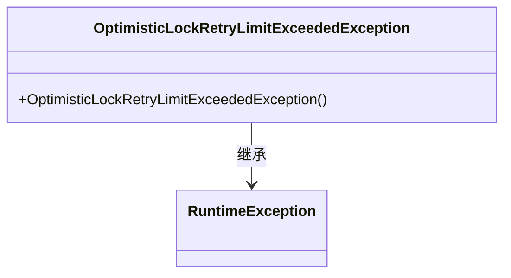
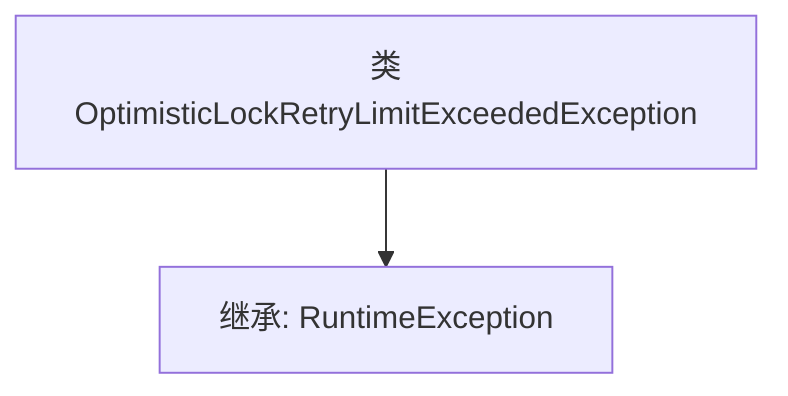

# 基础信息

|      |      |
|------|------|
| 名称 | OptimisticLockRetryLimitExceededException |
| 编码语言 | .java |
| 代码路径 | Signal-Server/service/src/main/java/org/whispersystems/textsecuregcm/storage/OptimisticLockRetryLimitExceededException.java |
| 包名 | org.whispersystems.textsecuregcm.storage |
| 依赖项 | [] |
| 概述说明 | 乐观锁重试超限异常继承自运行时异常。 |

# 说明

乐观锁重试超限异常是一种继承自运行时异常的特定异常类型。该异常通常用于处理在并发环境下，由于乐观锁机制导致的重试操作超出预设限制的情况。当系统检测到重试次数达到或超过设定的阈值时，会抛出此异常，以提示开发者或系统管理员需要进行相应的处理或调整。该异常的设计旨在帮助开发者在并发控制中更好地管理资源，避免因无限重试导致的性能问题或死锁情况。

# 类列表 Class Summary

| 名称   | 类型  | 说明 |
|-------|------|-------------|
| OptimisticLockRetryLimitExceededException | class | 乐观锁重试超限异常继承运行时异常。 |

## 类 OptimisticLockRetryLimitExceededException

|      |      |
|------|------|
| 访问范围 | public |
| 类型 | class |
| 名称 | OptimisticLockRetryLimitExceededException |
| 说明 | 乐观锁重试超限异常继承运行时异常。 |

### UML类图

这段代码定义了一个名为 `OptimisticLockRetryLimitExceededException` 的异常类，它继承自 `RuntimeException`。该类没有定义任何额外的成员变量或方法，仅提供了一个默认的构造函数。该异常类通常用于在乐观锁机制中，当重试次数超过限制时抛出异常。

### 内部方法调用关系图

这段代码定义了一个名为 `OptimisticLockRetryLimitExceededException` 的异常类，它继承自 `RuntimeException`。这个类没有定义任何额外的属性或方法，仅仅是作为 `RuntimeException` 的一个子类存在。通常情况下，这种自定义异常类用于在特定的业务逻辑中抛出异常，例如在乐观锁重试次数超过限制时抛出该异常。

### 字段列表 Field List

| 名称  | 类型  | 说明 |
|-------|-------|------|

### 方法列表 Method List

| 名称  | 类型  | 说明 |
|-------|-------|------|

