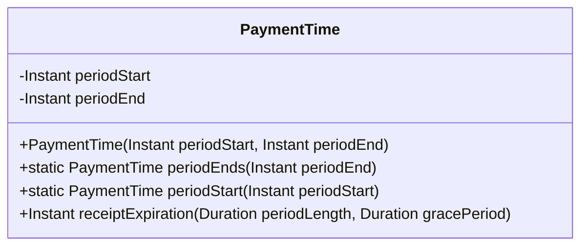
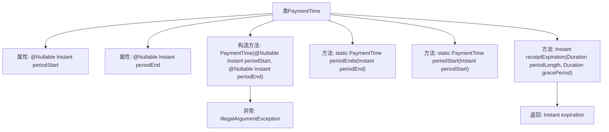

# 基础信息

|      |      |
|------|------|
| 名称 | PaymentTime |
| 编码语言 | .java |
| 代码路径 | Signal-Server/service/src/main/java/org/whispersystems/textsecuregcm/storage/PaymentTime.java |
| 包名 | org.whispersystems.textsecuregcm.storage |
| 依赖项 | ['java.time.Duration', 'java.time.Instant', 'java.time.temporal.ChronoUnit', 'java.util.Objects', 'javax.annotation.Nullable'] |
| 概述说明 | PaymentTime类管理支付时间，支持计算收据过期时间。 |

# 说明

PaymentTime类负责管理支付时间，其主要功能是支持仅提供periodStart或periodEnd参数，并基于这些参数计算收据的过期时间。该类简化了支付时间的管理流程，确保在只提供开始或结束时间的情况下，仍能准确计算出收据的过期时间。

# 类列表 Class Summary

| 名称   | 类型  | 说明 |
|-------|------|-------------|
| PaymentTime | class | PaymentTime类用于管理支付时间，支持仅提供periodStart或periodEnd，计算收据过期时间。 |

## 类 PaymentTime

|      |      |
|------|------|
| 访问范围 | public |
| 类型 | class |
| 名称 | PaymentTime |
| 说明 | PaymentTime类用于管理支付时间，支持仅提供periodStart或periodEnd，计算收据过期时间。 |

### UML类图

这段代码定义了一个名为 `PaymentTime` 的类，用于处理支付时间相关的逻辑。该类包含两个可空的 `Instant` 类型字段 `periodStart` 和 `periodEnd`，分别表示支付周期的开始和结束时间。构造函数确保只提供一个时间点（开始或结束），否则抛出异常。类提供了两个静态工厂方法 `periodEnds` 和 `periodStart` 来创建 `PaymentTime` 实例。`receiptExpiration` 方法根据提供的周期长度和宽限期计算收据的过期时间，并返回截断到天并加一天的 `Instant` 对象。

### 内部方法调用关系图

这段代码定义了一个`PaymentTime`类，用于处理支付时间相关的逻辑。类中包含两个可空的`Instant`属性`periodStart`和`periodEnd`，并通过私有构造方法确保只能提供其中一个属性。类提供了两个静态工厂方法`periodEnds`和`periodStart`来创建实例，并提供了一个`receiptExpiration`方法来计算收据的过期时间。方法中会根据`periodStart`或`periodEnd`来计算过期时间，并返回截断到天的时间加一天。

### 字段列表 Field List

| 名称  | 类型  | 说明 |
|-------|-------|------|
| periodStart | Instant | 可空的时间戳字段periodStart。 |
| periodEnd | Instant | 可空的结束时间点变量。 |

### 方法列表 Method List

| 名称  | 类型  | 说明 |
|-------|-------|------|
| periodStart | PaymentTime | 静态方法periodStart创建并返回一个PaymentTime对象，仅设置periodStart属性。 |
| periodEnds | PaymentTime | 静态方法periodEnds创建并返回一个包含指定结束时间的PaymentTime对象。 |
| receiptExpiration | Instant | 计算收据过期时间，考虑周期和宽限期，返回次日零点。 |

