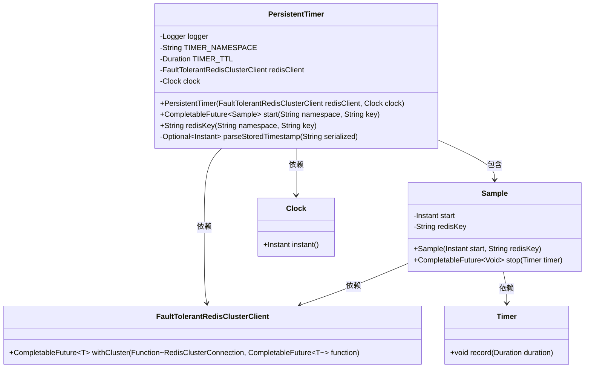
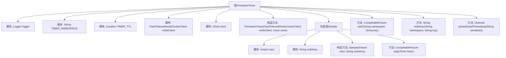

# 基础信息

|      |      |
|------|------|
| 名称 | PersistentTimer |
| 编码语言 | .java |
| 代码路径 | Signal-Server/service/src/main/java/org/whispersystems/textsecuregcm/storage/PersistentTimer.java |
| 包名 | org.whispersystems.textsecuregcm.storage |
| 依赖项 | ['com.google.common.annotations.VisibleForTesting', 'io.lettuce.core.SetArgs', 'io.micrometer.core.instrument.Timer', 'java.time.Clock', 'java.time.Duration', 'java.time.Instant', 'java.util.Optional', 'java.util.concurrent.CompletableFuture', 'javax.annotation.Nullable', 'org.slf4j.Logger', 'org.slf4j.LoggerFactory', 'org.whispersystems.textsecuregcm.redis.FaultTolerantRedisClusterClient', 'org.whispersystems.textsecuregcm.util.Util'] |
| 概述说明 | 持久计时器类利用Redis记录时间，支持停止和解析功能。 |

# 说明

持久计时器类是一种利用Redis进行时间记录的组件，具备启动、停止和解析时间的功能。它通过Redis的持久化特性，确保计时数据在系统重启后仍能保留。用户可以通过该类的接口启动计时器，记录特定事件的时间点，并在需要时停止计时。此外，该类还提供了时间解析功能，能够将记录的计时数据转换为可读的时间格式，便于后续分析和使用。

# 类列表 Class Summary

| 名称   | 类型  | 说明 |
|-------|------|-------------|
| PersistentTimer | class | 持久计时器类，使用Redis记录时间并支持停止和解析功能。 |

## 类 PersistentTimer

|      |      |
|------|------|
| 访问范围 | public |
| 类型 | class |
| 名称 | PersistentTimer |
| 说明 | 持久计时器类，使用Redis记录时间并支持停止和解析功能。 |

### UML类图

**描述：**  
`PersistentTimer` 类用于管理持久化计时器，通过 Redis 存储计时器的开始时间，并支持在计时结束时记录持续时间。`Sample` 类是 `PersistentTimer` 的内部类，用于表示一个计时器样本，提供 `stop` 方法来停止计时并记录持续时间。`FaultTolerantRedisClusterClient` 和 `Clock` 是 `PersistentTimer` 的依赖，分别用于与 Redis 集群交互和获取当前时间。`Timer` 类用于记录计时器的持续时间。

### 内部方法调用关系图

**描述：**  
`PersistentTimer`类用于管理持久化计时器，通过Redis集群客户端实现计时器的启动和停止。类中包含一个内部类`Sample`，用于记录计时器的开始时间和Redis键。`start`方法用于启动计时器并返回`Sample`对象，`stop`方法用于停止计时器并记录持续时间。`redisKey`方法生成Redis键，`parseStoredTimestamp`方法解析存储的时间戳。整个过程通过异步操作完成，确保高效性和可靠性。

### 字段列表 Field List

| 名称  | 类型  | 说明 |
|-------|-------|------|
| logger = LoggerFactory.getLogger(PersistentTimer.class) | Logger | 持久计时器类中定义了一个私有的静态日志记录器实例。 |
| TIMER_NAMESPACE = "persistent_timer" | String | 定义私有静态字符串常量TIMER_NAMESPACE为"persistent_timer"。 |
| TIMER_TTL = Duration.ofHours(1) | Duration | 测试可见的静态常量TIMER_TTL，时长为1小时。 |
| clock | Clock | 定义了一个私有且不可变的Clock类型变量clock。 |
| redisClient | FaultTolerantRedisClusterClient | 私有终态的容错Redis集群客户端实例。 |

### 方法列表 Method List

| 名称  | 类型  | 说明 |
|-------|-------|------|
| parseStoredTimestamp | Optional<Instant> | 解析存储时间戳，返回Optional<Instant>。 |
| redisKey | String | 测试可见方法生成Redis键，格式为“TIMER_NAMESPACE::namespace::key”。 |
| start | CompletableFuture<Sample> | 方法`start`使用Redis异步设置键值并返回`CompletableFuture<Sample>`。 |

