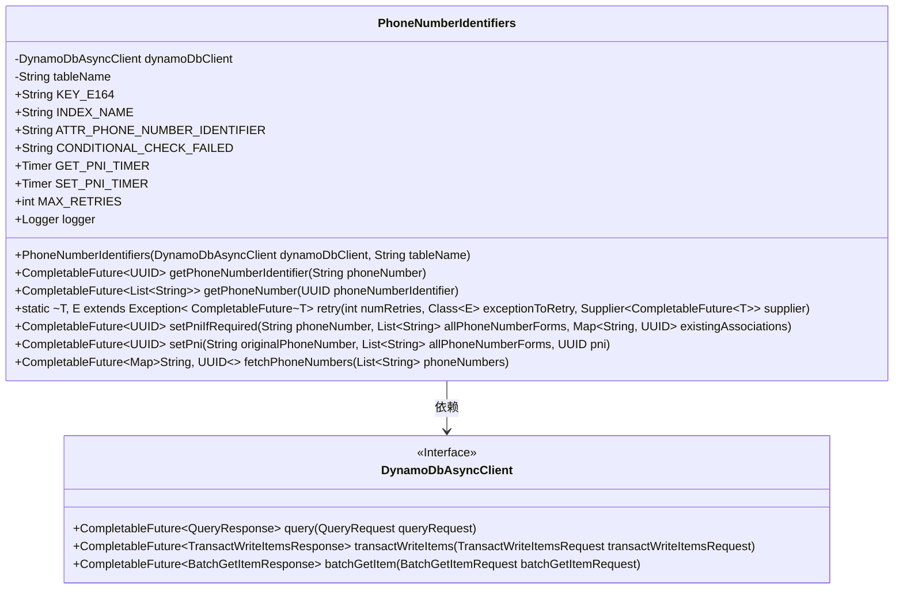

# 基础信息

|      |      |
|------|------|
| 名称 | PhoneNumberIdentifiers |
| 编码语言 | .java |
| 代码路径 | Signal-Server/service/src/main/java/org/whispersystems/textsecuregcm/storage/PhoneNumberIdentifiers.java |
| 包名 | org.whispersystems.textsecuregcm.storage |
| 依赖项 | ['org.whispersystems.textsecuregcm.metrics.MetricsUtil.name', 'com.google.common.annotations.VisibleForTesting', 'io.micrometer.core.instrument.Metrics', 'io.micrometer.core.instrument.Timer', 'java.util.ArrayList', 'java.util.List', 'java.util.Map', 'java.util.Optional', 'java.util.UUID', 'java.util.concurrent.CompletableFuture', 'java.util.function.Supplier', 'java.util.stream.Collectors', 'org.slf4j.Logger', 'org.slf4j.LoggerFactory', 'org.whispersystems.textsecuregcm.util.AttributeValues', 'org.whispersystems.textsecuregcm.util.ExceptionUtils', 'org.whispersystems.textsecuregcm.util.Util', 'reactor.core.publisher.Flux', 'reactor.core.scheduler.Scheduler', 'reactor.util.function.Tuple2', 'reactor.util.function.Tuples', 'software.amazon.awssdk.services.dynamodb.DynamoDbAsyncClient', 'software.amazon.awssdk.services.dynamodb.model.AttributeValue', 'software.amazon.awssdk.services.dynamodb.model.BatchGetItemRequest', 'software.amazon.awssdk.services.dynamodb.model.CancellationReason', 'software.amazon.awssdk.services.dynamodb.model.GetItemRequest', 'software.amazon.awssdk.services.dynamodb.model.KeysAndAttributes', 'software.amazon.awssdk.services.dynamodb.model.QueryRequest', 'software.amazon.awssdk.services.dynamodb.model.ReturnValue', 'software.amazon.awssdk.services.dynamodb.model.ReturnValuesOnConditionCheckFailure', 'software.amazon.awssdk.services.dynamodb.model.ScanRequest', 'software.amazon.awssdk.services.dynamodb.model.TransactWriteItem', 'software.amazon.awssdk.services.dynamodb.model.TransactWriteItemsRequest', 'software.amazon.awssdk.services.dynamodb.model.TransactionCanceledException', 'software.amazon.awssdk.services.dynamodb.model.TransactionConflictException', 'software.amazon.awssdk.services.dynamodb.model.Update'] |
| 概述说明 | 类PhoneNumberIdentifiers管理电话号码标识符，支持PNI查询和设置，使用DynamoDB存储和重试机制。 |

# 说明

类PhoneNumberIdentifiers用于管理电话号码标识符，支持查询和设置PNI（电话号码标识符）。该类利用DynamoDB进行数据存储，并实现了重试机制以确保操作的可靠性和稳定性。通过这一设计，系统能够高效地处理电话号码标识符的相关操作，确保数据的一致性和可用性。

# 类列表 Class Summary

| 名称   | 类型  | 说明 |
|-------|------|-------------|
| PhoneNumberIdentifiers | class | 类PhoneNumberIdentifiers用于管理电话号码标识符，支持查询和设置PNI，使用DynamoDB进行数据存储和重试机制。 |

## 类 PhoneNumberIdentifiers

|      |      |
|------|------|
| 访问范围 | public |
| 类型 | class |
| 名称 | PhoneNumberIdentifiers |
| 说明 | 类PhoneNumberIdentifiers用于管理电话号码标识符，支持查询和设置PNI，使用DynamoDB进行数据存储和重试机制。 |

### UML类图

**类图描述：**

`PhoneNumberIdentifiers` 类用于管理与电话号码标识符（PNI）相关的操作，包括获取和设置电话号码的PNI。该类依赖于 `DynamoDbAsyncClient` 接口来执行与 DynamoDB 数据库的异步交互。`PhoneNumberIdentifiers` 提供了多个方法，如 `getPhoneNumberIdentifier` 用于获取或创建电话号码的PNI，`getPhoneNumber` 用于根据PNI获取电话号码列表，`setPniIfRequired` 和 `setPni` 用于设置PNI，`fetchPhoneNumbers` 用于从数据库中获取电话号码的PNI映射。`retry` 方法提供了重试机制，以处理可能的冲突或异常。

### 内部方法调用关系图

```mermaid
graph TD
    A["类PhoneNumberIdentifiers"]
    B["属性: DynamoDbAsyncClient dynamoDbClient"]
    C["属性: String tableName"]
    D["常量: String KEY_E164 = 'P'"]
    E["常量: String INDEX_NAME = 'pni_to_p'"]
    F["常量: String ATTR_PHONE_NUMBER_IDENTIFIER = 'PNI'"]
    G["常量: String CONDITIONAL_CHECK_FAILED = 'ConditionalCheckFailed'"]
    H["常量: Timer GET_PNI_TIMER = Metrics.timer(name(PhoneNumberIdentifiers.class, 'get'))"]
    I["常量: Timer SET_PNI_TIMER = Metrics.timer(name(PhoneNumberIdentifiers.class, 'set'))"]
    J["常量: int MAX_RETRIES = 10"]
    K["常量: Logger logger = LoggerFactory.getLogger(PhoneNumberIdentifiers.class)"]
    L["构造方法: PhoneNumberIdentifiers(DynamoDbAsyncClient dynamoDbClient, String tableName)"]
    M["方法: CompletableFuture<UUID> getPhoneNumberIdentifier(String phoneNumber)"]
    N["方法: CompletableFuture<List<String>> getPhoneNumber(UUID phoneNumberIdentifier)"]
    O["方法: CompletableFuture<T> retry(int numRetries, Class<E> exceptionToRetry, Supplier<CompletableFuture<T>> supplier)"]
    P["方法: CompletableFuture<UUID> setPniIfRequired(String phoneNumber, List<String> allPhoneNumberForms, Map<String, UUID> existingAssociations)"]
    Q["方法: CompletableFuture<UUID> setPni(String originalPhoneNumber, List<String> allPhoneNumberForms, UUID pni)"]
    R["方法: CompletableFuture<Map<String, UUID>> fetchPhoneNumbers(List<String> phoneNumbers)"]

    A --> B
    A --> C
    A --> D
    A --> E
    A --> F
    A --> G
    A --> H
    A --> I
    A --> J
    A --> K
    A --> L
    A --> M
    A --> N
    A --> O
    A --> P
    A --> Q
    A --> R
```

这段代码定义了一个名为 `PhoneNumberIdentifiers` 的类，用于处理与电话号码标识符（PNI）相关的操作。类中包含多个方法，用于获取和设置电话号码标识符，并处理可能的冲突和重试逻辑。代码使用了 `DynamoDbAsyncClient` 与 DynamoDB 进行异步交互，并通过计时器和日志记录来监控操作性能。流程图展示了类的属性和方法之间的调用关系，帮助理解代码结构和功能。

### 字段列表 Field List

| 名称  | 类型  | 说明 |
|-------|-------|------|
| tableName | String | 声明了一个私有且不可变的字符串变量tableName。 |
| KEY_E164 = "P" | String | 测试可见的静态常量KEY_E164值为"P"。 |
| dynamoDbClient | DynamoDbAsyncClient | 私有DynamoDb异步客户端实例。 |
| INDEX_NAME = "pni_to_p" | String | 测试用静态常量INDEX_NAME定义为"pni_to_p"。 |
| CONDITIONAL_CHECK_FAILED = "ConditionalCheckFailed" | String | 常量 CONDITIONAL_CHECK_FAILED 表示条件检查失败。 |
| GET_PNI_TIMER = Metrics.timer(name(PhoneNumberIdentifiers.class, "get")) | Timer | PhoneNumberIdentifiers类中定义了一个名为GET_PNI_TIMER的静态计时器。 |
| ATTR_PHONE_NUMBER_IDENTIFIER = "PNI" | String | 测试用静态常量ATTR_PHONE_NUMBER_IDENTIFIER值为"PNI"。 |
| SET_PNI_TIMER = Metrics.timer(name(PhoneNumberIdentifiers.class, "set")) | Timer | 定义名为SET_PNI_TIMER的静态计时器，用于PhoneNumberIdentifiers类的set方法。 |
| MAX_RETRIES = 10 | int | 定义了最大重试次数为10的私有静态常量。 |
| logger = LoggerFactory.getLogger(PhoneNumberIdentifiers.class) | Logger | PhoneNumberIdentifiers类中定义了一个静态的日志记录器实例。 |

### 方法列表 Method List

| 名称  | 类型  | 说明 |
|-------|-------|------|
| retry | CompletableFuture<T> | 定义重试方法，支持异常处理和递归重试。 |
| setPniIfRequired | CompletableFuture<UUID> | 方法根据电话号码设置PNI，处理现有关联并处理异常情况。 |
| getPhoneNumber | CompletableFuture<List<String>> | 通过DynamoDB查询获取指定UUID对应的电话号码列表。 |
| setPni | CompletableFuture<UUID> | 方法`setPni`验证并更新电话号码与PNI的关联，处理并发冲突，返回PNI。 |
| fetchPhoneNumbers | CompletableFuture<Map<String, UUID>> | 异步方法从DynamoDB批量获取电话号码及其UUID，使用非一致性读取，并记录执行时间。 |
| getPhoneNumberIdentifier | CompletableFuture<UUID> | 根据手机号获取唯一标识符，处理等价类并设置PNI。 |

