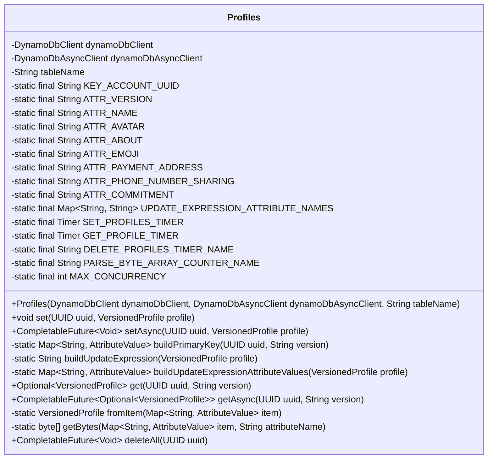

# 基础信息

|      |      |
|------|------|
| 名称 | Profiles |
| 编码语言 | .java |
| 代码路径 | Signal-Server/service/src/main/java/org/whispersystems/textsecuregcm/storage/Profiles.java |
| 包名 | org.whispersystems.textsecuregcm.storage |
| 依赖项 | ['org.whispersystems.textsecuregcm.metrics.MetricsUtil.name', 'com.google.common.annotations.VisibleForTesting', 'io.micrometer.core.instrument.Metrics', 'io.micrometer.core.instrument.Timer', 'java.util.ArrayList', 'java.util.HashMap', 'java.util.List', 'java.util.Map', 'java.util.Optional', 'java.util.UUID', 'java.util.concurrent.CompletableFuture', 'java.util.stream.Collectors', 'org.apache.commons.lang3.StringUtils', 'org.whispersystems.textsecuregcm.util.AsyncTimerUtil', 'org.whispersystems.textsecuregcm.util.AttributeValues', 'org.whispersystems.textsecuregcm.util.Util', 'reactor.core.publisher.Flux', 'reactor.core.publisher.Mono', 'software.amazon.awssdk.services.dynamodb.DynamoDbAsyncClient', 'software.amazon.awssdk.services.dynamodb.DynamoDbClient', 'software.amazon.awssdk.services.dynamodb.model.AttributeValue', 'software.amazon.awssdk.services.dynamodb.model.DeleteItemRequest', 'software.amazon.awssdk.services.dynamodb.model.GetItemRequest', 'software.amazon.awssdk.services.dynamodb.model.GetItemResponse', 'software.amazon.awssdk.services.dynamodb.model.QueryRequest', 'software.amazon.awssdk.services.dynamodb.model.UpdateItemRequest'] |
| 概述说明 | Profiles类管理用户档案，支持同步异步操作，使用DynamoDB存储数据。 |

# 说明

Profiles类负责管理用户档案，提供同步和异步操作功能，支持设置、获取和删除档案的操作。该类使用DynamoDB作为数据存储方案，确保数据的持久性和高效访问。通过同步和异步两种方式，用户可以根据需求选择适合的操作模式，提升系统的灵活性和响应速度。该设计旨在为用户档案管理提供全面且高效的支持。

# 类列表 Class Summary

| 名称   | 类型  | 说明 |
|-------|------|-------------|
| Profiles | class | Profiles类管理用户档案，支持同步和异步操作，包括设置、获取和删除档案，使用DynamoDB存储数据。 |

## 类 Profiles

|      |      |
|------|------|
| 访问范围 | public |
| 类型 | class |
| 名称 | Profiles |
| 说明 | Profiles类管理用户档案，支持同步和异步操作，包括设置、获取和删除档案，使用DynamoDB存储数据。 |

### UML类图

**描述：**  
`Profiles` 类用于管理与 DynamoDB 数据库中的用户配置文件相关的操作。它提供了同步和异步的方法来设置、获取和删除配置文件。类中包含多个静态常量，用于定义数据库中的属性名称和更新表达式。`Profiles` 类通过 `DynamoDbClient` 和 `DynamoDbAsyncClient` 与数据库进行交互，并提供了丰富的功能来处理用户配置文件的增删改查操作。

### 内部方法调用关系图

```mermaid
graph TD
    A["类Profiles"]
    B["属性: DynamoDbClient dynamoDbClient"]
    C["属性: DynamoDbAsyncClient dynamoDbAsyncClient"]
    D["属性: String tableName"]
    E["常量: KEY_ACCOUNT_UUID, ATTR_VERSION, ATTR_NAME, ATTR_AVATAR, ATTR_ABOUT, ATTR_EMOJI, ATTR_PAYMENT_ADDRESS, ATTR_PHONE_NUMBER_SHARING, ATTR_COMMITMENT"]
    F["常量: UPDATE_EXPRESSION_ATTRIBUTE_NAMES"]
    G["常量: SET_PROFILES_TIMER, GET_PROFILE_TIMER, DELETE_PROFILES_TIMER_NAME, PARSE_BYTE_ARRAY_COUNTER_NAME"]
    H["常量: MAX_CONCURRENCY"]
    I["构造方法: Profiles(DynamoDbClient dynamoDbClient, DynamoDbAsyncClient dynamoDbAsyncClient, String tableName)"]
    J["方法: void set(UUID uuid, VersionedProfile profile)"]
    K["方法: CompletableFuture<Void> setAsync(UUID uuid, VersionedProfile profile)"]
    L["方法: Map<String, AttributeValue> buildPrimaryKey(UUID uuid, String version)"]
    M["方法: String buildUpdateExpression(VersionedProfile profile)"]
    N["方法: Map<String, AttributeValue> buildUpdateExpressionAttributeValues(VersionedProfile profile)"]
    O["方法: Optional<VersionedProfile> get(UUID uuid, String version)"]
    P["方法: CompletableFuture<Optional<VersionedProfile>> getAsync(UUID uuid, String version)"]
    Q["方法: VersionedProfile fromItem(Map<String, AttributeValue> item)"]
    R["方法: byte[] getBytes(Map<String, AttributeValue> item, String attributeName)"]
    S["方法: CompletableFuture<Void> deleteAll(UUID uuid)"]

    A --> B
    A --> C
    A --> D
    A --> E
    A --> F
    A --> G
    A --> H
    A --> I
    A --> J
    A --> K
    A --> L
    A --> M
    A --> N
    A --> O
    A --> P
    A --> Q
    A --> R
    A --> S
```

这段代码定义了一个名为 `Profiles` 的类，用于管理与 DynamoDB 数据库中的用户配置文件相关的操作。类中包含多个常量和属性，用于定义数据库表的结构和操作。类提供了同步和异步的方法来设置、获取和删除用户配置文件，并通过 `DynamoDbClient` 和 `DynamoDbAsyncClient` 与数据库进行交互。代码还包含了一些辅助方法，用于构建主键、更新表达式和属性值。整体设计旨在高效地处理用户配置文件的增删改查操作，并支持并发处理。

### 字段列表 Field List

| 名称  | 类型  | 说明 |
|-------|-------|------|
| dynamoDbClient | DynamoDbClient | 私有DynamoDbClient实例变量。 |
| ATTR_VERSION = "V" | String | 测试可见的静态常量字符串属性。 |
| ATTR_NAME = "N" | String | 定义私有静态常量字符串ATTR_NAME，值为"N"。 |
| ATTR_ABOUT = "B" | String | 定义常量ATTR_ABOUT，值为"B"。 |
| UPDATE_EXPRESSION_ATTRIBUTE_NAMES = Map.of(      "#commitment", ATTR_COMMITMENT,      "#name", ATTR_NAME,      "#avatar", ATTR_AVATAR,      "#about", ATTR_ABOUT,      "#aboutEmoji", ATTR_EMOJI,      "#paymentAddress", ATTR_PAYMENT_ADDRESS,      "#phoneNumberSharing", ATTR_PHONE_NUMBER_SHARING) | Map<String, String> | 定义常量映射，关联更新表达式属性名与对应属性。 |
| tableName | String | 定义了一个私有的不可变字符串变量tableName。 |
| ATTR_COMMITMENT = "C" | String | 定义私有静态常量字符串ATTR_COMMITMENT，值为"C"。 |
| KEY_ACCOUNT_UUID = "U" | String | 测试用静态常量KEY_ACCOUNT_UUID值为"U"。 |
| GET_PROFILE_TIMER = Metrics.timer(name(Profiles.class, "get")) | Timer | 定义了一个私有静态定时器，用于测量获取配置文件的性能。 |
| ATTR_EMOJI = "E" | String | 定义私有静态常量ATTR_EMOJI，值为"E"。 |
| ATTR_PHONE_NUMBER_SHARING = "S" | String | 定义私有静态常量ATTR_PHONE_NUMBER_SHARING，值为"S"。 |
| ATTR_PAYMENT_ADDRESS = "P" | String | 定义私有静态常量ATTR_PAYMENT_ADDRESS，值为"P"。 |
| ATTR_AVATAR = "A" | String | 定义私有静态常量ATTR_AVATAR，值为"A"。 |
| MAX_CONCURRENCY = 32 | int | 私有静态常量MAX_CONCURRENCY值为32。 |
| dynamoDbAsyncClient | DynamoDbAsyncClient | 私有且不可变的DynamoDb异步客户端实例。 |
| DELETE_PROFILES_TIMER_NAME = name(Profiles.class, "delete") | String | Profiles类中定义删除定时器名称为delete。 |
| PARSE_BYTE_ARRAY_COUNTER_NAME = name(Profiles.class, "parseByteArray") | String | Profiles类中定义了一个静态常量PARSE_BYTE_ARRAY_COUNTER_NAME，用于标识解析字节数组的计数器名称。 |
| SET_PROFILES_TIMER = Metrics.timer(name(Profiles.class, "set")) | Timer | 定义了一个名为SET_PROFILES_TIMER的静态定时器，用于监控Profiles类中的set方法。 |

### 方法列表 Method List

| 名称  | 类型  | 说明 |
|-------|-------|------|
| getBytes | byte[] | 从Map中获取指定属性名的字节数组，若属性值为空则返回null。 |
| set | void | 方法使用DynamoDB更新指定UUID和版本的配置信息。 |
| deleteAll | CompletableFuture<Void> | 异步删除DynamoDB表中指定UUID的所有记录，并记录性能指标。 |
| buildUpdateExpression | String | 方法根据VersionedProfile属性生成更新表达式，包含更新和删除操作。 |
| getAsync | CompletableFuture<Optional<VersionedProfile>> | 异步获取UUID和版本号对应的VersionedProfile，返回CompletableFuture。 |
| setAsync | CompletableFuture<Void> | 异步更新DynamoDB表中的用户配置文件，使用UUID和版本号作为主键。 |
| fromItem | VersionedProfile | 从Map创建VersionedProfile对象，提取版本、名称、头像、表情、简介、支付地址、电话号码共享和承诺等属性。 |
| buildUpdateExpressionAttributeValues | Map<String, AttributeValue> | 构建更新表达式属性值，包含commitment、name、avatar、about、aboutEmoji、paymentAddress和phoneNumberSharing。 |
| get | Optional<VersionedProfile> | 根据UUID和版本号从DynamoDB获取版本化配置项。 |
| buildPrimaryKey | Map<String, AttributeValue> | 构建主键方法，接收UUID和版本，返回包含账户UUID和版本属性的映射。 |

