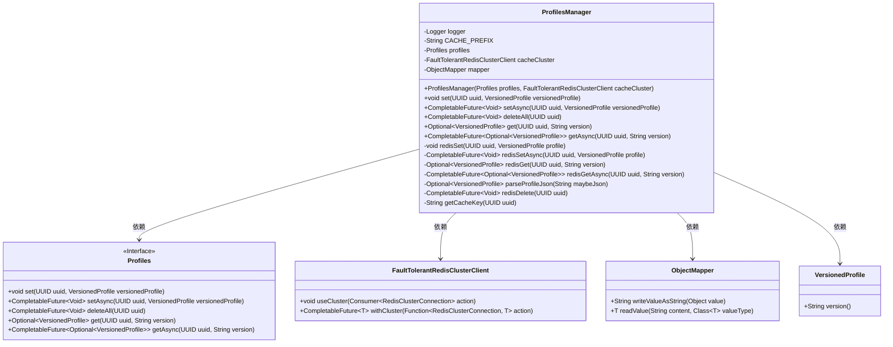

# 基础信息

|      |      |
|------|------|
| 名称 | ProfilesManager |
| 编码语言 | .java |
| 代码路径 | Signal-Server/service/src/main/java/org/whispersystems/textsecuregcm/storage/ProfilesManager.java |
| 包名 | org.whispersystems.textsecuregcm.storage |
| 依赖项 | ['com.fasterxml.jackson.core.JsonProcessingException', 'com.fasterxml.jackson.databind.ObjectMapper', 'io.lettuce.core.RedisException', 'java.io.IOException', 'java.util.Optional', 'java.util.UUID', 'java.util.concurrent.CompletableFuture', 'org.slf4j.Logger', 'org.slf4j.LoggerFactory', 'org.whispersystems.textsecuregcm.redis.FaultTolerantRedisClusterClient', 'org.whispersystems.textsecuregcm.util.SystemMapper', 'org.whispersystems.textsecuregcm.util.Util', 'javax.annotation.Nullable'] |
| 概述说明 | ProfilesManager管理用户配置，支持同步异步操作，集成Redis缓存和持久化存储。 |

# 说明

ProfilesManager负责管理用户配置，提供同步和异步操作功能，并集成了Redis缓存和持久化存储机制，确保数据高效访问和长期保存。

# 类列表 Class Summary

| 名称   | 类型  | 说明 |
|-------|------|-------------|
| ProfilesManager | class | ProfilesManager管理用户配置，支持同步和异步操作，集成Redis缓存和持久化存储。 |

## 类 ProfilesManager

|      |      |
|------|------|
| 访问范围 | public |
| 类型 | class |
| 名称 | ProfilesManager |
| 说明 | ProfilesManager管理用户配置，支持同步和异步操作，集成Redis缓存和持久化存储。 |

### UML类图

**描述**：`ProfilesManager`类负责管理用户配置文件的存储和检索，支持同步和异步操作。它依赖于`Profiles`接口来持久化数据，使用`FaultTolerantRedisClusterClient`进行缓存操作，并通过`ObjectMapper`进行JSON序列化和反序列化。该类提供了设置、删除和获取配置文件的方法，并通过Redis缓存优化性能。

### 内部方法调用关系图

```mermaid
graph TD
    A["类ProfilesManager"]
    B["属性: Logger logger"]
    C["属性: String CACHE_PREFIX"]
    D["属性: Profiles profiles"]
    E["属性: FaultTolerantRedisClusterClient cacheCluster"]
    F["属性: ObjectMapper mapper"]
    G["构造方法: ProfilesManager(Profiles profiles, FaultTolerantRedisClusterClient cacheCluster)"]
    H["方法: void set(UUID uuid, VersionedProfile versionedProfile)"]
    I["方法: CompletableFuture<Void> setAsync(UUID uuid, VersionedProfile versionedProfile)"]
    J["方法: CompletableFuture<Void> deleteAll(UUID uuid)"]
    K["方法: Optional<VersionedProfile> get(UUID uuid, String version)"]
    L["方法: CompletableFuture<Optional<VersionedProfile>> getAsync(UUID uuid, String version)"]
    M["私有方法: void redisSet(UUID uuid, VersionedProfile profile)"]
    N["私有方法: CompletableFuture<Void> redisSetAsync(UUID uuid, VersionedProfile profile)"]
    O["私有方法: Optional<VersionedProfile> redisGet(UUID uuid, String version)"]
    P["私有方法: CompletableFuture<Optional<VersionedProfile>> redisGetAsync(UUID uuid, String version)"]
    Q["私有方法: Optional<VersionedProfile> parseProfileJson(String maybeJson)"]
    R["私有方法: CompletableFuture<Void> redisDelete(UUID uuid)"]
    S["私有方法: String getCacheKey(UUID uuid)"]

    A --> B
    A --> C
    A --> D
    A --> E
    A --> F
    A --> G
    A --> H
    A --> I
    A --> J
    A --> K
    A --> L
    A --> M
    A --> N
    A --> O
    A --> P
    A --> Q
    A --> R
    A --> S
```

这段代码定义了一个名为`ProfilesManager`的类，负责管理用户配置文件的操作。它包含多个方法，用于同步和异步地设置、获取和删除配置文件。代码还使用了Redis集群来缓存配置文件，并通过`ObjectMapper`进行JSON序列化和反序列化。流程图展示了类的属性和方法之间的调用关系，帮助理解代码的结构和功能。

### 字段列表 Field List

| 名称  | 类型  | 说明 |
|-------|-------|------|
| logger = LoggerFactory.getLogger(ProfilesManager.class) | Logger | ProfilesManager类中定义了一个私有的Logger实例。 |
| mapper | ObjectMapper | 私有不可变对象映射器实例。 |
| cacheCluster | FaultTolerantRedisClusterClient | 私有不可变的容错Redis集群客户端实例。 |
| CACHE_PREFIX = "profiles::" | String | 定义常量CACHE_PREFIX，值为"profiles::"。 |
| profiles | Profiles | 私有且不可变的Profiles实例变量。 |

### 方法列表 Method List

| 名称  | 类型  | 说明 |
|-------|-------|------|
| parseProfileJson | Optional<VersionedProfile> | 解析JSON为VersionedProfile，失败返回空，捕获异常记录日志。 |
| deleteAll | CompletableFuture<Void> | 异步删除指定UUID的Redis和所有配置数据。 |
| getCacheKey | String | 生成缓存键方法：前缀加UUID字符串。 |
| redisSet | void | 将UUID和版本化配置文件序列化后存入Redis缓存集群。 |
| redisSetAsync | CompletableFuture<Void> | 异步将UUID和版本化配置文件存入Redis。 |
| redisDelete | CompletableFuture<Void> | 异步删除Redis中指定UUID的缓存数据。 |
| redisGetAsync | CompletableFuture<Optional<VersionedProfile>> | 异步从Redis获取版本化配置文件，异常时返回空。 |
| setAsync | CompletableFuture<Void> | 异步设置UUID和版本化配置文件，并更新Redis缓存。 |
| set | void | 方法设置UUID和版本化配置，存储至Redis和本地。 |
| redisGet | Optional<VersionedProfile> | 通过Redis获取指定UUID和版本的配置，异常时返回空。 |
| get | Optional<VersionedProfile> | 通过UUID和版本号获取版本化配置，优先从Redis读取，未找到则从主数据源获取并缓存至Redis。 |
| getAsync | CompletableFuture<Optional<VersionedProfile>> | 异步获取版本化配置，优先从Redis读取，未找到则从DynamoDB读取并缓存到Redis。 |

