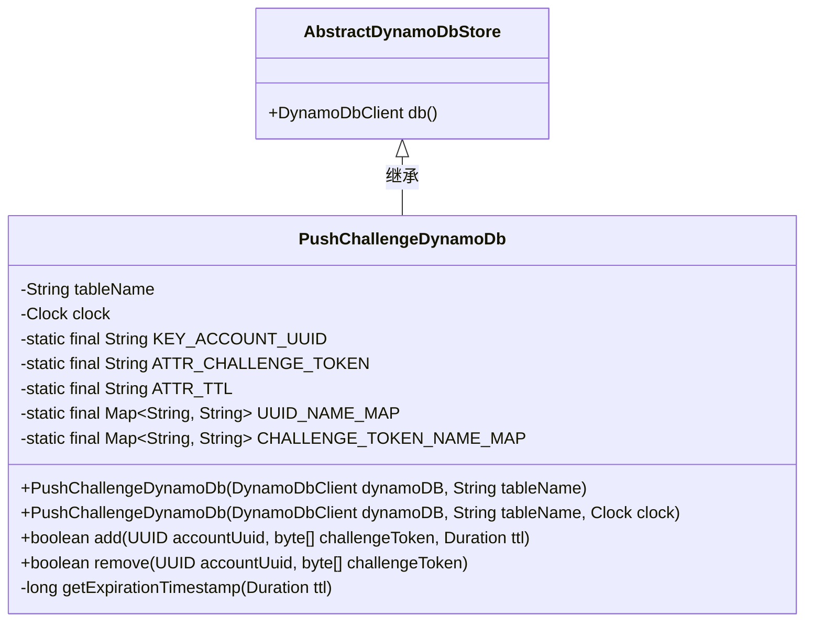
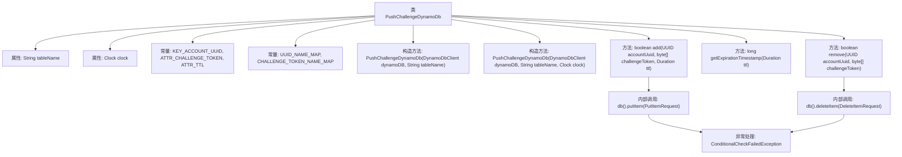

# 基础信息

|      |      |
|------|------|
| 名称 | PushChallengeDynamoDb |
| 编码语言 | .java |
| 代码路径 | Signal-Server/service/src/main/java/org/whispersystems/textsecuregcm/storage/PushChallengeDynamoDb.java |
| 包名 | org.whispersystems.textsecuregcm.storage |
| 依赖项 | ['com.google.common.annotations.VisibleForTesting', 'java.time.Clock', 'java.time.Duration', 'java.util.Map', 'java.util.UUID', 'org.whispersystems.textsecuregcm.util.AttributeValues', 'software.amazon.awssdk.services.dynamodb.DynamoDbClient', 'software.amazon.awssdk.services.dynamodb.model.ConditionalCheckFailedException', 'software.amazon.awssdk.services.dynamodb.model.DeleteItemRequest', 'software.amazon.awssdk.services.dynamodb.model.PutItemRequest'] |
| 概述说明 | PushChallengeDynamoDb类管理用户推送挑战令牌，支持增删操作。 |

# 说明

PushChallengeDynamoDb类负责管理DynamoDB中的用户推送挑战令牌，提供添加和删除令牌的功能。该类确保用户推送挑战令牌在DynamoDB中的有效存储和操作，支持系统对用户推送挑战的管理需求。

# 类列表 Class Summary

| 名称   | 类型  | 说明 |
|-------|------|-------------|
| PushChallengeDynamoDb | class | PushChallengeDynamoDb类管理DynamoDB中的用户推送挑战令牌，支持添加和删除操作。 |

## 类 PushChallengeDynamoDb

|      |      |
|------|------|
| 访问范围 | public |
| 类型 | class |
| 名称 | PushChallengeDynamoDb |
| 说明 | PushChallengeDynamoDb类管理DynamoDB中的用户推送挑战令牌，支持添加和删除操作。 |

### UML类图

**描述：**  
`PushChallengeDynamoDb` 类继承自 `AbstractDynamoDbStore`，用于管理 DynamoDB 中的推送挑战令牌。它包含两个主要方法：`add` 用于存储新的挑战令牌，`remove` 用于删除匹配的令牌。类中定义了多个静态常量用于映射 DynamoDB 表的属性名，并通过 `Clock` 对象处理时间相关的逻辑。`add` 方法在存储令牌时检查是否存在冲突，`remove` 方法在删除令牌时进行条件检查以确保令牌匹配。

### 内部方法调用关系图

这段代码定义了一个名为 `PushChallengeDynamoDb` 的类，用于管理 DynamoDB 中的推送挑战令牌。类中包含两个构造方法，分别用于初始化 DynamoDB 客户端、表名和时钟。`add` 方法用于在特定条件下向表中添加新的挑战令牌，`remove` 方法用于删除匹配的挑战令牌。代码还包含了异常处理逻辑，确保在条件不满足时能够正确处理。

### 字段列表 Field List

| 名称  | 类型  | 说明 |
|-------|-------|------|
| tableName | String | 私有常量字符串变量tableName。 |
| clock | Clock | 私有且不可变的时钟对象。 |
| CHALLENGE_TOKEN_NAME_MAP = Map.of("#challenge", ATTR_CHALLENGE_TOKEN, "#ttl",      ATTR_TTL) | Map<String, String> | 定义静态常量映射，关联挑战令牌名称与属性。 |
| KEY_ACCOUNT_UUID = "U" | String | 静态常量KEY_ACCOUNT_UUID存储账户UUID。 |
| ATTR_TTL = "T" | String | 定义了一个静态常量字符串ATTR_TTL，值为"T"。 |
| ATTR_CHALLENGE_TOKEN = "C" | String | 定义静态常量ATTR_CHALLENGE_TOKEN，值为"C"。 |
| UUID_NAME_MAP = Map.of("#uuid", KEY_ACCOUNT_UUID) | Map<String, String> | 定义静态常量UUID_NAME_MAP，映射字符串#uuid到KEY_ACCOUNT_UUID。 |

### 方法列表 Method List

| 名称  | 类型  | 说明 |
|-------|-------|------|
| getExpirationTimestamp | long | 方法根据给定TTL计算并返回过期时间戳。 |
| remove | boolean | 该方法通过UUID和挑战令牌删除数据库项，成功返回true，失败返回false。 |
| add | boolean | 添加账户UUID、挑战令牌和TTL到数据库，成功返回true，失败返回false。 |

