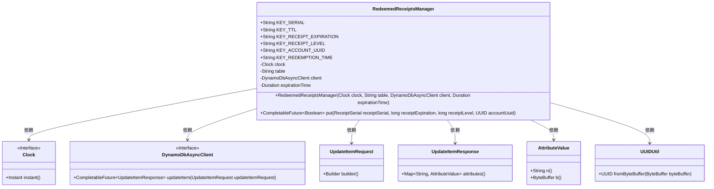

# 基础信息

|      |      |
|------|------|
| 名称 | RedeemedReceiptsManager |
| 编码语言 | .java |
| 代码路径 | Signal-Server/service/src/main/java/org/whispersystems/textsecuregcm/storage/RedeemedReceiptsManager.java |
| 包名 | org.whispersystems.textsecuregcm.storage |
| 依赖项 | ['java.time.Clock', 'java.time.Duration', 'java.time.Instant', 'java.util.Map', 'java.util.Objects', 'java.util.UUID', 'java.util.concurrent.CompletableFuture', 'javax.annotation.Nonnull', 'org.signal.libsignal.zkgroup.receipts.ReceiptSerial', 'org.whispersystems.textsecuregcm.util.AttributeValues', 'org.whispersystems.textsecuregcm.util.UUIDUtil', 'software.amazon.awssdk.services.dynamodb.DynamoDbAsyncClient', 'software.amazon.awssdk.services.dynamodb.model.AttributeValue', 'software.amazon.awssdk.services.dynamodb.model.ReturnValue', 'software.amazon.awssdk.services.dynamodb.model.UpdateItemRequest'] |
| 概述说明 | RedeemedReceiptsManager类负责管理已兑换收据，支持插入和更新，并确保请求幂等性。 |

# 说明

RedeemedReceiptsManager类负责管理已兑换的收据，提供插入和更新功能，确保操作的幂等性，即多次执行同一请求不会产生重复或冲突的结果。

# 类列表 Class Summary

| 名称   | 类型  | 说明 |
|-------|------|-------------|
| RedeemedReceiptsManager | class | RedeemedReceiptsManager类管理已兑换收据，支持插入和更新操作，确保请求幂等性。 |

## 类 RedeemedReceiptsManager

|      |      |
|------|------|
| 访问范围 | public |
| 类型 | class |
| 名称 | RedeemedReceiptsManager |
| 说明 | RedeemedReceiptsManager类管理已兑换收据，支持插入和更新操作，确保请求幂等性。 |

### UML类图

**描述：**  
`RedeemedReceiptsManager` 类用于管理已兑换的收据，依赖 `Clock` 和 `DynamoDbAsyncClient` 等接口。它通过 `put` 方法将收据信息插入 DynamoDB 表，并确保请求的幂等性。类中定义了多个常量用于标识 DynamoDB 表中的键，并通过 `UpdateItemRequest` 和 `UpdateItemResponse` 与 DynamoDB 进行交互。`AttributeValue` 和 `UUIDUtil` 用于处理属性值和 UUID 的转换。

### 内部方法调用关系图

这段代码定义了一个`RedeemedReceiptsManager`类，用于管理已兑换的收据。类中包含常量定义、属性声明、构造方法和一个`put`方法。`put`方法用于插入或更新收据记录，首先检查输入参数是否为空，然后获取当前时间并计算行过期时间，接着构建`UpdateItemRequest`并发送请求，最后处理响应并比较返回的属性值与输入值是否一致。

### 字段列表 Field List

| 名称  | 类型  | 说明 |
|-------|-------|------|
| KEY_SERIAL = "S" | String | 定义常量KEY_SERIAL，值为"S"。 |
| KEY_RECEIPT_EXPIRATION = "G" | String | 常量KEY_RECEIPT_EXPIRATION值为"G"。 |
| clock | Clock | 私有不可变的时钟对象。 |
| table | String | 定义了一个私有不可变的字符串变量`table`。 |
| KEY_TTL = "E" | String | 定义常量KEY_TTL，值为"E"。 |
| expirationTime | Duration | 私有不可变的过期时间变量。 |
| KEY_REDEMPTION_TIME = "R" | String | 定义常量KEY_REDEMPTION_TIME，值为"R"。 |
| KEY_ACCOUNT_UUID = "U" | String | 定义常量KEY_ACCOUNT_UUID，值为"U"。 |
| KEY_RECEIPT_LEVEL = "L" | String | 定义常量KEY_RECEIPT_LEVEL，值为"L"。 |
| client | DynamoDbAsyncClient | 私有不可变的异步DynamoDB客户端实例。 |

### 方法列表 Method List

| 名称  | 类型  | 说明 |
|-------|-------|------|
| put | CompletableFuture<Boolean> | 异步更新数据库条目，验证输入后设置属性并返回结果。 |

