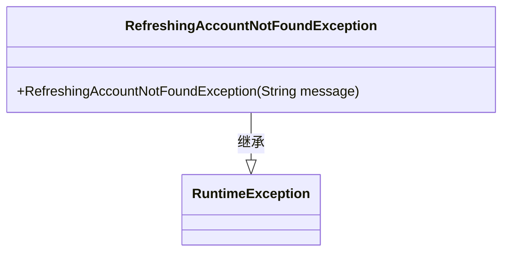
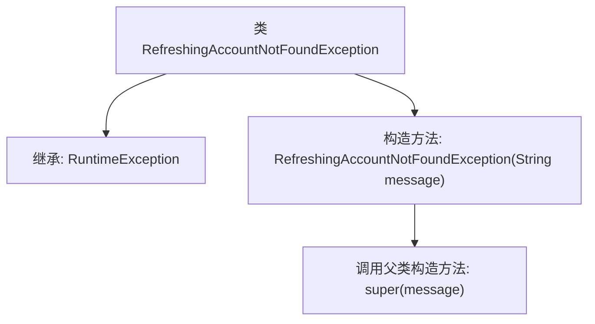

# 基础信息

|      |      |
|------|------|
| 名称 | RefreshingAccountNotFoundException |
| 编码语言 | .java |
| 代码路径 | Signal-Server/service/src/main/java/org/whispersystems/textsecuregcm/storage/RefreshingAccountNotFoundException.java |
| 包名 | org.whispersystems.textsecuregcm.storage |
| 依赖项 | [] |
| 概述说明 | 刷新账户未找到异常类继承运行时异常。 |

# 说明

刷新账户未找到异常类是一个继承自运行时异常的自定义异常类。该类用于处理在刷新账户信息时未找到相关账户的异常情况。通过继承运行时异常，该异常类可以在程序运行过程中捕获并处理特定错误，确保程序在遇到账户未找到的情况时能够进行适当的错误处理或提示，从而提高系统的健壮性和用户体验。

# 类列表 Class Summary

| 名称   | 类型  | 说明 |
|-------|------|-------------|
| RefreshingAccountNotFoundException | class | 刷新账户未找到异常类，继承自运行时异常。 |

## 类 RefreshingAccountNotFoundException

|      |      |
|------|------|
| 访问范围 | public |
| 类型 | class |
| 名称 | RefreshingAccountNotFoundException |
| 说明 | 刷新账户未找到异常类，继承自运行时异常。 |

### UML类图

这段代码定义了一个名为 `RefreshingAccountNotFoundException` 的异常类，它继承自 `RuntimeException`。该类包含一个构造函数，接受一个字符串参数 `message`，并将其传递给父类的构造函数。这个异常类通常用于表示在刷新账户信息时未能找到相关账户的情况。通过继承 `RuntimeException`，它可以在程序运行时抛出，而不需要显式地捕获或声明。

### 内部方法调用关系图

这段代码定义了一个名为 `RefreshingAccountNotFoundException` 的异常类，该类继承自 `RuntimeException`。它包含一个构造方法，该构造方法接受一个字符串参数 `message`，并将其传递给父类的构造方法。这个类通常用于在应用程序中抛出特定的运行时异常，以指示刷新账户时未找到相关账户的情况。

### 字段列表 Field List

| 名称  | 类型  | 说明 |
|-------|-------|------|

### 方法列表 Method List

| 名称  | 类型  | 说明 |
|-------|-------|------|

