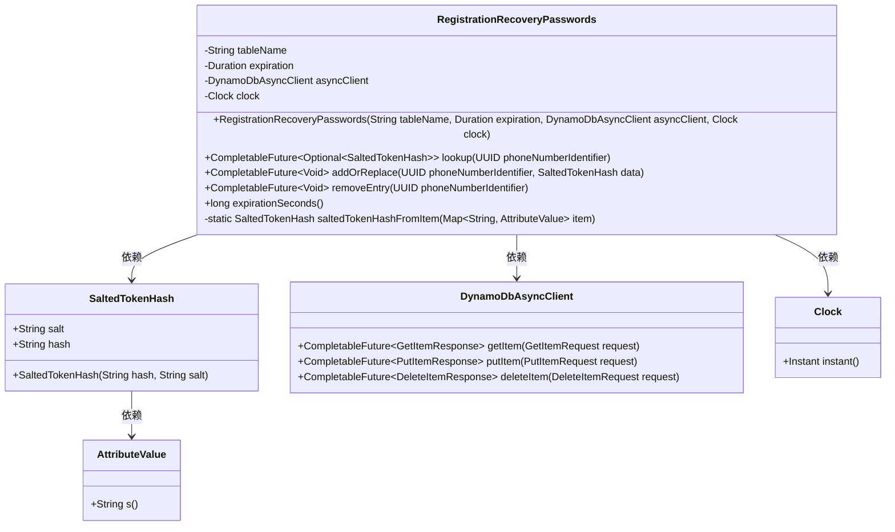

# 基础信息

|      |      |
|------|------|
| 名称 | RegistrationRecoveryPasswords |
| 编码语言 | .java |
| 代码路径 | Signal-Server/service/src/main/java/org/whispersystems/textsecuregcm/storage/RegistrationRecoveryPasswords.java |
| 包名 | org.whispersystems.textsecuregcm.storage |
| 依赖项 | ['java.util.Objects.requireNonNull', 'com.google.common.annotations.VisibleForTesting', 'java.time.Clock', 'java.time.Duration', 'java.util.Map', 'java.util.Optional', 'java.util.UUID', 'java.util.concurrent.CompletableFuture', 'org.whispersystems.textsecuregcm.auth.SaltedTokenHash', 'org.whispersystems.textsecuregcm.util.AttributeValues', 'org.whispersystems.textsecuregcm.util.Util', 'software.amazon.awssdk.services.dynamodb.DynamoDbAsyncClient', 'software.amazon.awssdk.services.dynamodb.model.AttributeValue', 'software.amazon.awssdk.services.dynamodb.model.DeleteItemRequest', 'software.amazon.awssdk.services.dynamodb.model.GetItemRequest', 'software.amazon.awssdk.services.dynamodb.model.PutItemRequest'] |
| 概述说明 | 注册恢复密码类用于管理用户密码的查找、添加、替换和删除操作。 |

# 说明

注册恢复密码类负责管理用户密码的相关操作，包括查找、添加、替换和删除密码。该类提供了全面的功能，确保用户能够方便地找回、更新或移除其密码，从而增强系统的安全性和用户体验。通过该类的操作，用户可以有效地管理其账户密码，保障账户信息的安全性和可访问性。

# 类列表 Class Summary

| 名称   | 类型  | 说明 |
|-------|------|-------------|
| RegistrationRecoveryPasswords | class | 注册恢复密码类，管理用户密码的查找、添加替换和删除操作。 |

## 类 RegistrationRecoveryPasswords

|      |      |
|------|------|
| 访问范围 | public |
| 类型 | class |
| 名称 | RegistrationRecoveryPasswords |
| 说明 | 注册恢复密码类，管理用户密码的查找、添加替换和删除操作。 |

### UML类图

这段代码定义了一个 `RegistrationRecoveryPasswords` 类，用于管理与电话号码标识符（UUID）相关的密码恢复信息。它通过 `DynamoDbAsyncClient` 与 DynamoDB 数据库进行异步交互，支持查找、添加/替换和删除操作。`SaltedTokenHash` 类用于存储哈希值和盐值，`Clock` 类用于处理时间相关的逻辑。整体设计通过异步操作提高了系统的响应性能。

### 内部方法调用关系图

```mermaid
graph TD
    A["类RegistrationRecoveryPasswords"]
    B["静态常量: KEY_PNI, ATTR_EXP, ATTR_SALT, ATTR_HASH"]
    C["属性: String tableName"]
    D["属性: Duration expiration"]
    E["属性: DynamoDbAsyncClient asyncClient"]
    F["属性: Clock clock"]
    G["构造方法: RegistrationRecoveryPasswords(String tableName, Duration expiration, DynamoDbAsyncClient asyncClient, Clock clock)"]
    H["方法: CompletableFuture<Optional<SaltedTokenHash>> lookup(UUID phoneNumberIdentifier)"]
    I["方法: CompletableFuture<Void> addOrReplace(UUID phoneNumberIdentifier, SaltedTokenHash data)"]
    J["方法: CompletableFuture<Void> removeEntry(UUID phoneNumberIdentifier)"]
    K["方法: long expirationSeconds()"]
    L["私有方法: static SaltedTokenHash saltedTokenHashFromItem(Map<String, AttributeValue> item)"]

    A --> B
    A --> C
    A --> D
    A --> E
    A --> F
    A --> G
    A --> H
    A --> I
    A --> J
    A --> K
    A --> L
```

该流程图展示了`RegistrationRecoveryPasswords`类的结构，包括其静态常量、属性、构造方法和主要方法。类的主要功能是通过`DynamoDbAsyncClient`与数据库进行交互，实现查找、添加或替换、删除操作。每个方法都通过异步调用来完成相应的数据库操作，并且通过`Clock`对象来计算过期时间。

### 字段列表 Field List

| 名称  | 类型  | 说明 |
|-------|-------|------|
| ATTR_EXP = "E" | String | 定义静态常量ATTR_EXP，值为"E"。 |
| ATTR_SALT = "S" | String | 定义常量ATTR_SALT，值为"S"。 |
| clock | Clock | 类中包含一个私有的Clock类型成员变量clock。 |
| KEY_PNI = "P" | String | 定义静态常量KEY_PNI，值为"P"。 |
| tableName | String | 类中定义了一个私有不可变的字符串变量tableName。 |
| ATTR_HASH = "H" | String | 定义静态常量ATTR_HASH，值为"H"。 |
| expiration | Duration | 私有常量，类型为Duration，名称为expiration。 |
| asyncClient | DynamoDbAsyncClient | 私有且不可变的异步DynamoDB客户端实例。 |

### 方法列表 Method List

| 名称  | 类型  | 说明 |
|-------|-------|------|
| addOrReplace | CompletableFuture<Void> | 异步更新或替换数据库中指定电话号码标识符的盐值和哈希数据。 |
| removeEntry | CompletableFuture<Void> | 该方法异步删除指定UUID的条目，完成后不执行操作。 |
| lookup | CompletableFuture<Optional<SaltedTokenHash>> | 异步查询UUID对应的SaltedTokenHash，使用consistentRead确保数据一致性。 |
| expirationSeconds | long | 测试可见方法返回当前时间加上过期时间的秒数。 |
| saltedTokenHashFromItem | SaltedTokenHash | 从Map中提取哈希和盐值生成SaltedTokenHash对象。 |

