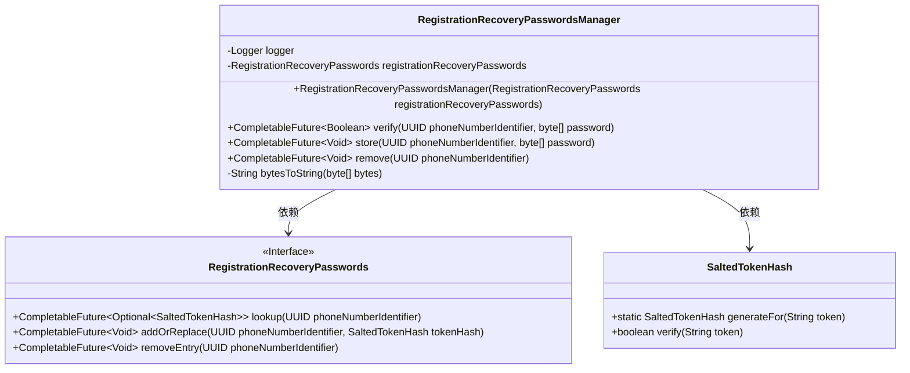

# 基础信息

|      |      |
|------|------|
| 名称 | RegistrationRecoveryPasswordsManager |
| 编码语言 | .java |
| 代码路径 | Signal-Server/service/src/main/java/org/whispersystems/textsecuregcm/storage/RegistrationRecoveryPasswordsManager.java |
| 包名 | org.whispersystems.textsecuregcm.storage |
| 依赖项 | ['java.util.Objects.requireNonNull', 'java.lang.invoke.MethodHandles', 'java.util.HexFormat', 'java.util.Optional', 'java.util.UUID', 'java.util.concurrent.CompletableFuture', 'org.slf4j.Logger', 'org.slf4j.LoggerFactory', 'org.whispersystems.textsecuregcm.auth.SaltedTokenHash', 'software.amazon.awssdk.services.dynamodb.model.ResourceNotFoundException'] |
| 概述说明 | 管理注册密码恢复，支持验证、存储、删除及UUID与字节数组操作。 |

# 说明

该功能模块专注于管理注册恢复密码的流程，提供了全面的验证、存储和删除功能。它支持使用UUID和字节数组进行操作，确保密码管理的高效性和安全性。通过验证功能，系统能够确认密码的合法性和有效性；存储功能则确保密码数据的安全保存；删除功能允许在需要时彻底移除密码信息。此外，支持UUID和字节数组操作增强了系统的灵活性和兼容性，适用于多种应用场景。

# 类列表 Class Summary

| 名称   | 类型  | 说明 |
|-------|------|-------------|
| RegistrationRecoveryPasswordsManager | class | 管理注册恢复密码，提供验证、存储和删除功能，支持UUID和字节数组操作。 |

## 类 RegistrationRecoveryPasswordsManager

|      |      |
|------|------|
| 访问范围 | public |
| 类型 | class |
| 名称 | RegistrationRecoveryPasswordsManager |
| 说明 | 管理注册恢复密码，提供验证、存储和删除功能，支持UUID和字节数组操作。 |

### UML类图

这段代码展示了 `RegistrationRecoveryPasswordsManager` 类，它通过 `RegistrationRecoveryPasswords` 接口管理密码的验证、存储和删除操作。`RegistrationRecoveryPasswords` 接口定义了查找、添加/替换和删除密码的方法。`SaltedTokenHash` 类负责生成和验证密码哈希。`RegistrationRecoveryPasswordsManager` 依赖于 `RegistrationRecoveryPasswords` 和 `SaltedTokenHash` 来完成其功能，并处理可能的异常情况。

### 内部方法调用关系图

```mermaid
graph TD
    A["类RegistrationRecoveryPasswordsManager"]
    B["属性: Logger logger"]
    C["属性: RegistrationRecoveryPasswords registrationRecoveryPasswords"]
    D["构造方法: RegistrationRecoveryPasswordsManager(RegistrationRecoveryPasswords registrationRecoveryPasswords)"]
    E["方法: CompletableFuture<Boolean> verify(UUID phoneNumberIdentifier, byte[] password)"]
    F["方法: CompletableFuture<Void> store(UUID phoneNumberIdentifier, byte[] password)"]
    G["方法: CompletableFuture<Void> remove(UUID phoneNumberIdentifier)"]
    H["私有方法: String bytesToString(byte[] bytes)"]
    I["调用: registrationRecoveryPasswords.lookup(phoneNumberIdentifier)"]
    J["调用: maybeHash.filter(hash -> hash.verify(bytesToString(password)))"]
    K["调用: logger.warn('Failed to lookup Registration Recovery Password', error)"]
    L["调用: Optional::isPresent"]
    M["调用: bytesToString(password)"]
    N["调用: SaltedTokenHash.generateFor(token)"]
    O["调用: registrationRecoveryPasswords.addOrReplace(phoneNumberIdentifier, tokenHash)"]
    P["调用: logger.warn('Failed to store Registration Recovery Password', error)"]
    Q["调用: registrationRecoveryPasswords.removeEntry(phoneNumberIdentifier)"]
    R["调用: logger.warn('Failed to remove Registration Recovery Password', error)"]
    S["调用: HexFormat.of().formatHex(bytes)"]

    A --> B
    A --> C
    A --> D
    A --> E
    A --> F
    A --> G
    A --> H
    E --> I
    E --> J
    E --> K
    E --> L
    F --> M
    F --> N
    F --> O
    F --> P
    G --> Q
    G --> R
    H --> S
```

这段代码展示了`RegistrationRecoveryPasswordsManager`类的结构及其主要方法。该类负责管理注册恢复密码的验证、存储和删除操作。通过`CompletableFuture`处理异步任务，并在操作失败时记录日志。流程图清晰地展示了类内部方法的调用关系及其依赖关系，帮助理解代码的执行流程。

### 字段列表 Field List

| 名称  | 类型  | 说明 |
|-------|-------|------|
| logger = LoggerFactory.getLogger(MethodHandles.lookup().lookupClass()) | Logger | 私有静态日志记录器初始化为当前类的日志实例。 |
| registrationRecoveryPasswords | RegistrationRecoveryPasswords | 私有变量registrationRecoveryPasswords用于注册密码恢复。 |

### 方法列表 Method List

| 名称  | 类型  | 说明 |
|-------|-------|------|
| bytesToString | String | 将字节数组转换为十六进制字符串。 |
| verify | CompletableFuture<Boolean> | 验证手机号标识符与密码是否匹配，返回布尔值。 |
| remove | CompletableFuture<Void> | 异步移除指定UUID的注册恢复密码，忽略已删除异常，记录其他错误。 |
| store | CompletableFuture<Void> | 存储电话号码标识符和密码哈希，处理异常并记录日志。 |

