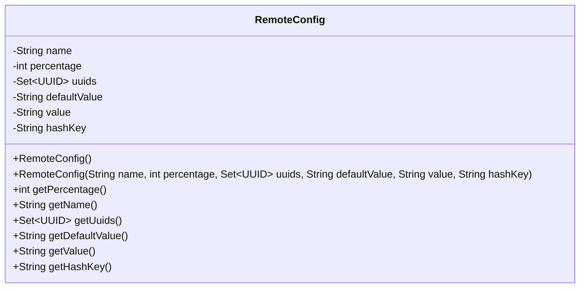
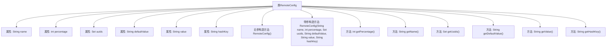

# 基础信息

|      |      |
|------|------|
| 名称 | RemoteConfig |
| 编码语言 | .java |
| 代码路径 | Signal-Server/service/src/main/java/org/whispersystems/textsecuregcm/storage/RemoteConfig.java |
| 包名 | org.whispersystems.textsecuregcm.storage |
| 依赖项 | ['com.fasterxml.jackson.annotation.JsonProperty', 'jakarta.validation.constraints.Max', 'jakarta.validation.constraints.Min', 'jakarta.validation.constraints.NotNull', 'jakarta.validation.constraints.Pattern', 'java.util.HashSet', 'java.util.Set', 'java.util.UUID'] |
| 概述说明 | RemoteConfig类包含名称、百分比、UUID集合、默认值、值和哈希键，提供getter方法。 |

# 说明

RemoteConfig类包含多个关键属性，包括名称、百分比、UUID集合、默认值、值和哈希键。这些属性分别用于存储配置的名称、应用百分比、唯一标识符集合、默认配置值、实际配置值以及哈希键。类中还提供了相应的getter方法，用于获取这些属性的值，确保数据的可访问性和封装性。

# 类列表 Class Summary

| 名称   | 类型  | 说明 |
|-------|------|-------------|
| RemoteConfig | class | RemoteConfig类包含名称、百分比、UUID集合、默认值、值和哈希键，并提供相应getter方法。 |

## 类 RemoteConfig

|      |      |
|------|------|
| 访问范围 | public |
| 类型 | class |
| 名称 | RemoteConfig |
| 说明 | RemoteConfig类包含名称、百分比、UUID集合、默认值、值和哈希键，并提供相应getter方法。 |

### UML类图

这段代码定义了一个名为 `RemoteConfig` 的类，用于存储远程配置的相关信息。类中包含多个私有属性，如 `name`、`percentage`、`uuids`、`defaultValue`、`value` 和 `hashKey`，并通过构造函数和多个 getter 方法来初始化和访问这些属性。类图展示了 `RemoteConfig` 类的结构，包括其属性和方法，以及属性的访问权限。

### 内部方法调用关系图

这段代码定义了一个名为 `RemoteConfig` 的类，该类包含多个属性，如 `name`、`percentage`、`uuids`、`defaultValue`、`value` 和 `hashKey`。类提供了无参构造方法和带参构造方法，用于初始化这些属性。此外，类还提供了多个 getter 方法，用于获取这些属性的值。代码通过注解对属性进行了约束，如 `@Pattern`、`@NotNull`、`@Min` 和 `@Max`，以确保数据的有效性和合法性。

### 字段列表 Field List

| 名称  | 类型  | 说明 |
|-------|-------|------|
| percentage | int | 属性percentage为整数，范围0到100，不可为空。 |
| value | String | JSON属性映射为私有字符串变量value。 |
| name | String | 属性name使用JsonProperty注解，并匹配字母数字和点号的正则表达式。 |
| hashKey | String | 使用JsonProperty注解定义私有字符串变量hashKey。 |
| defaultValue | String | JsonProperty注解用于指定JSON字段默认值。 |
| uuids = new HashSet<>() | Set<UUID> | 该代码定义了一个非空且初始化为空集的UUID集合。 |

### 方法列表 Method List

| 名称  | 类型  | 说明 |
|-------|-------|------|
| getDefaultValue | String | 该方法返回默认值字符串。 |
| getName | String | 该方法返回对象的名称属性。 |
| getPercentage | int | 该方法返回一个整型变量percentage的值。 |
| getValue | String | 该方法返回字符串类型的值。 |
| getHashKey | String | 该方法返回字符串类型的哈希键值。 |
| getUuids | Set<UUID> | 返回UUID集合。 |

