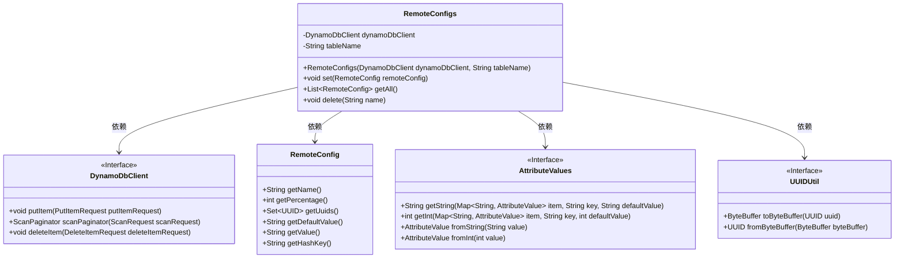
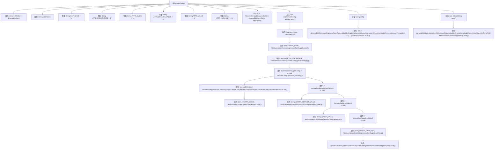

# 基础信息

|      |      |
|------|------|
| 名称 | RemoteConfigs |
| 编码语言 | .java |
| 代码路径 | Signal-Server/service/src/main/java/org/whispersystems/textsecuregcm/storage/RemoteConfigs.java |
| 包名 | org.whispersystems.textsecuregcm.storage |
| 依赖项 | ['org.whispersystems.textsecuregcm.util.AttributeValues', 'org.whispersystems.textsecuregcm.util.UUIDUtil', 'software.amazon.awssdk.core.SdkBytes', 'software.amazon.awssdk.services.dynamodb.DynamoDbClient', 'software.amazon.awssdk.services.dynamodb.model.AttributeValue', 'software.amazon.awssdk.services.dynamodb.model.DeleteItemRequest', 'software.amazon.awssdk.services.dynamodb.model.PutItemRequest', 'software.amazon.awssdk.services.dynamodb.model.ScanRequest', 'java.util.Collections', 'java.util.HashMap', 'java.util.List', 'java.util.Map', 'java.util.Set', 'java.util.UUID', 'java.util.stream.Collectors'] |
| 概述说明 | RemoteConfigs类管理DynamoDB远程配置，支持设置、获取和删除操作。 |

# 说明

RemoteConfigs类专门用于管理DynamoDB中的远程配置，提供了设置、获取和删除配置项的功能。该类简化了远程配置的操作，使用户能够高效地管理和维护存储在DynamoDB中的配置数据。通过该类，用户可以轻松地执行配置项的增删改查操作，确保配置数据的一致性和可用性。

# 类列表 Class Summary

| 名称   | 类型  | 说明 |
|-------|------|-------------|
| RemoteConfigs | class | RemoteConfigs类用于管理DynamoDB中的远程配置，支持设置、获取和删除配置项。 |

## 类 RemoteConfigs

|      |      |
|------|------|
| 访问范围 | public |
| 类型 | class |
| 名称 | RemoteConfigs |
| 说明 | RemoteConfigs类用于管理DynamoDB中的远程配置，支持设置、获取和删除配置项。 |

### UML类图

**描述：**
`RemoteConfigs` 类负责管理与远程配置相关的操作，包括设置、获取和删除配置。它依赖于 `DynamoDbClient` 与 DynamoDB 数据库进行交互，并使用 `AttributeValues` 和 `UUIDUtil` 工具类来处理数据类型转换。`RemoteConfig` 类表示单个远程配置项，包含名称、百分比、UUID 集合、默认值、值和哈希键等属性。通过 `RemoteConfigs` 类，可以方便地对远程配置进行管理和操作。

### 内部方法调用关系图

这段代码定义了一个`RemoteConfigs`类，用于管理远程配置。类中包含三个主要方法：`set`用于设置配置项，`getAll`用于获取所有配置项，`delete`用于删除指定配置项。`set`方法通过构建一个包含配置信息的`Map`对象，并将其插入到DynamoDB表中。`getAll`方法通过扫描DynamoDB表，将结果映射为`RemoteConfig`对象列表。`delete`方法通过指定配置项的名称，从DynamoDB表中删除对应的配置项。

### 字段列表 Field List

| 名称  | 类型  | 说明 |
|-------|-------|------|
| dynamoDbClient | DynamoDbClient | 私有且不可变的DynamoDbClient实例。 |
| ATTR_DEFAULT_VALUE = "D" | String | 定义私有静态常量ATTR_DEFAULT_VALUE，默认值为"D"。 |
| ATTR_HASH_KEY = "H" | String | 定义了一个私有静态常量字符串ATTR_HASH_KEY，值为"H"。 |
| KEY_NAME = "N" | String | 定义常量KEY_NAME，值为"N"。 |
| ATTR_VALUE = "V" | String | 定义私有静态常量ATTR_VALUE，值为"V"。 |
| ATTR_PERCENTAGE = "P" | String | 定义私有静态常量字符串ATTR_PERCENTAGE为"P"。 |
| ATTR_UUIDS = "U" | String | 定义私有静态常量ATTR_UUIDS，值为"U"。 |
| tableName | String | 私有不可变的字符串变量tableName。 |

### 方法列表 Method List

| 名称  | 类型  | 说明 |
|-------|-------|------|
| set | void | 设置远程配置并存储到DynamoDB表。 |
| getAll | List<RemoteConfig> | 从DynamoDB表中扫描数据并映射为RemoteConfig对象列表。 |
| delete | void | 删除指定名称的DynamoDB表项。 |

