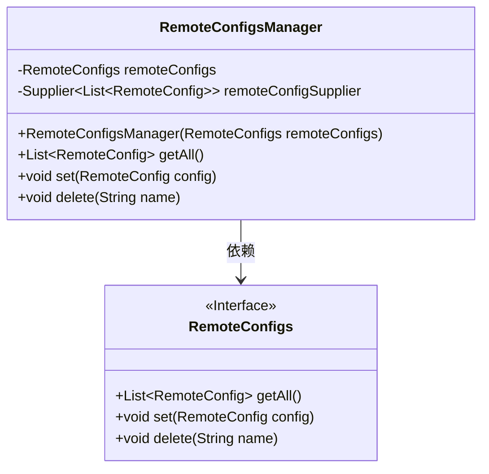
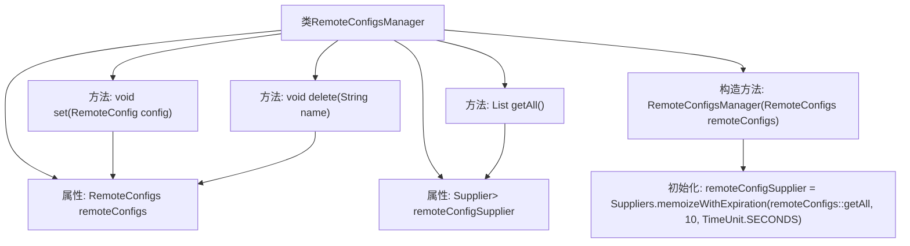

# 基础信息

|      |      |
|------|------|
| 名称 | RemoteConfigsManager |
| 编码语言 | .java |
| 代码路径 | Signal-Server/service/src/main/java/org/whispersystems/textsecuregcm/storage/RemoteConfigsManager.java |
| 包名 | org.whispersystems.textsecuregcm.storage |
| 依赖项 | ['com.google.common.base.Suppliers', 'java.util.List', 'java.util.concurrent.TimeUnit', 'java.util.function.Supplier'] |
| 概述说明 | RemoteConfigsManager类管理远程配置，支持获取、设置、删除，配置缓存10秒。 |

# 说明

RemoteConfigsManager类负责管理远程配置，提供获取、设置和删除配置的功能，所有配置操作均支持缓存，缓存时间为10秒。

# 类列表 Class Summary

| 名称   | 类型  | 说明 |
|-------|------|-------------|
| RemoteConfigsManager | class | RemoteConfigsManager类管理远程配置，支持获取、设置和删除操作，配置缓存10秒。 |

## 类 RemoteConfigsManager

|      |      |
|------|------|
| 访问范围 | public |
| 类型 | class |
| 名称 | RemoteConfigsManager |
| 说明 | RemoteConfigsManager类管理远程配置，支持获取、设置和删除操作，配置缓存10秒。 |

### UML类图

这段代码定义了一个`RemoteConfigsManager`类，用于管理远程配置。它依赖于`RemoteConfigs`接口，通过构造函数注入`RemoteConfigs`实例，并使用`Suppliers.memoizeWithExpiration`方法缓存配置数据，每10秒刷新一次。`RemoteConfigsManager`提供了获取所有配置、设置配置和删除配置的方法，这些方法最终都委托给`RemoteConfigs`接口实现。

### 内部方法调用关系图

这段代码定义了一个`RemoteConfigsManager`类，用于管理远程配置。类中包含两个主要属性：`remoteConfigs`和`remoteConfigSupplier`。`remoteConfigSupplier`通过`Suppliers.memoizeWithExpiration`方法进行初始化，缓存`remoteConfigs.getAll()`的结果，并设置10秒的过期时间。类提供了三个方法：`getAll()`用于获取所有远程配置，`set()`用于设置单个配置，`delete()`用于删除指定名称的配置。这些方法分别调用了`remoteConfigs`对象的相应方法来实现功能。

### 字段列表 Field List

| 名称  | 类型  | 说明 |
|-------|-------|------|
| remoteConfigs | RemoteConfigs | 声明了一个私有且不可变的远程配置对象。 |
| remoteConfigSupplier | Supplier<List<RemoteConfig>> | 私有字段，类型为提供远程配置列表的供应商。 |

### 方法列表 Method List

| 名称  | 类型  | 说明 |
|-------|-------|------|
| getAll | List<RemoteConfig> | 该方法返回远程配置列表，通过远程配置提供者获取。 |
| delete | void | 删除指定名称的远程配置。 |
| set | void | 设置远程配置并存储在remoteConfigs中。 |

