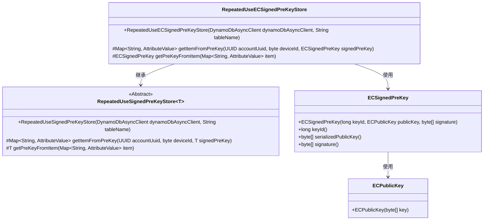
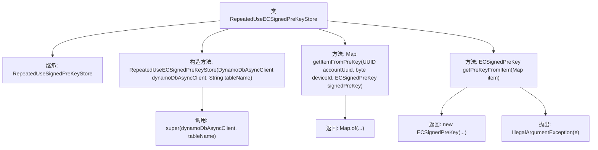

# 基础信息

|      |      |
|------|------|
| 名称 | RepeatedUseECSignedPreKeyStore |
| 编码语言 | .java |
| 代码路径 | Signal-Server/service/src/main/java/org/whispersystems/textsecuregcm/storage/RepeatedUseECSignedPreKeyStore.java |
| 包名 | org.whispersystems.textsecuregcm.storage |
| 依赖项 | ['java.util.Map', 'java.util.UUID', 'org.signal.libsignal.protocol.InvalidKeyException', 'org.signal.libsignal.protocol.ecc.ECPublicKey', 'org.whispersystems.textsecuregcm.entities.ECSignedPreKey', 'org.whispersystems.textsecuregcm.util.AttributeValues', 'software.amazon.awssdk.services.dynamodb.DynamoDbAsyncClient', 'software.amazon.awssdk.services.dynamodb.model.AttributeValue'] |
| 概述说明 | RepeatedUseECSignedPreKeyStore类存储EC签名预密钥，支持DynamoDB异步操作。 |

# 说明

RepeatedUseECSignedPreKeyStore类专门用于存储EC签名预密钥，并支持与DynamoDB异步客户端的交互操作。该类的主要功能是管理预密钥的存储和检索，确保在需要时能够高效地获取和使用这些密钥。通过支持异步操作，RepeatedUseECSignedPreKeyStore类能够在不阻塞主线程的情况下完成数据库操作，从而提高系统的整体性能和响应速度。

# 类列表 Class Summary

| 名称   | 类型  | 说明 |
|-------|------|-------------|
| RepeatedUseECSignedPreKeyStore | class | RepeatedUseECSignedPreKeyStore类用于存储EC签名预密钥，支持DynamoDB异步客户端操作。 |

## 类 RepeatedUseECSignedPreKeyStore

|      |      |
|------|------|
| 访问范围 | public |
| 类型 | class |
| 名称 | RepeatedUseECSignedPreKeyStore |
| 说明 | RepeatedUseECSignedPreKeyStore类用于存储EC签名预密钥，支持DynamoDB异步客户端操作。 |

### UML类图

这段代码定义了一个名为 `RepeatedUseECSignedPreKeyStore` 的类，该类继承自泛型类 `RepeatedUseSignedPreKeyStore`，并专门处理 `ECSignedPreKey` 类型的对象。`RepeatedUseECSignedPreKeyStore` 类通过 `getItemFromPreKey` 方法将 `ECSignedPreKey` 对象转换为 `Map<String, AttributeValue>`，并通过 `getPreKeyFromItem` 方法将 `Map<String, AttributeValue>` 转换回 `ECSignedPreKey` 对象。`ECSignedPreKey` 类包含一个 `ECPublicKey` 对象，用于存储公钥信息。整个设计用于在 DynamoDB 中存储和检索椭圆曲线签名预密钥。

### 内部方法调用关系图

这段代码定义了一个名为 `RepeatedUseECSignedPreKeyStore` 的类，该类继承自 `RepeatedUseSignedPreKeyStore<ECSignedPreKey>`。类中包含一个构造方法和两个重写的方法。构造方法调用了父类的构造方法。`getItemFromPreKey` 方法返回一个包含特定键值对的 `Map`，而 `getPreKeyFromItem` 方法则从 `Map` 中提取数据并返回一个新的 `ECSignedPreKey` 对象。如果提取过程中发生 `InvalidKeyException` 异常，则会抛出 `IllegalArgumentException`。

### 字段列表 Field List

| 名称  | 类型  | 说明 |
|-------|-------|------|

### 方法列表 Method List

| 名称  | 类型  | 说明 |
|-------|-------|------|
| getItemFromPreKey | Map<String, AttributeValue> | 根据账户UUID和设备ID获取签名的预密钥项。 |
| getPreKeyFromItem | ECSignedPreKey | 从Map中提取ECSignedPreKey对象，包含ID、公钥和签名。 |

