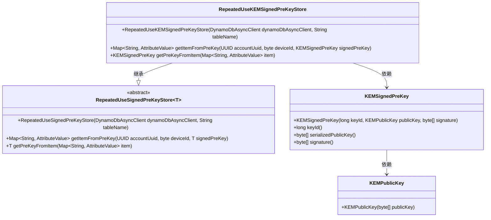
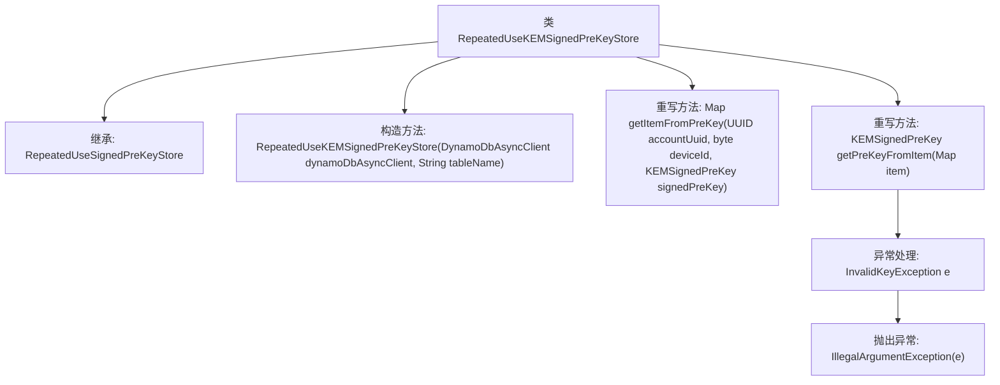

# 基础信息

|      |      |
|------|------|
| 名称 | RepeatedUseKEMSignedPreKeyStore |
| 编码语言 | .java |
| 代码路径 | Signal-Server/service/src/main/java/org/whispersystems/textsecuregcm/storage/RepeatedUseKEMSignedPreKeyStore.java |
| 包名 | org.whispersystems.textsecuregcm.storage |
| 依赖项 | ['org.signal.libsignal.protocol.InvalidKeyException', 'org.signal.libsignal.protocol.kem.KEMPublicKey', 'org.whispersystems.textsecuregcm.entities.KEMSignedPreKey', 'org.whispersystems.textsecuregcm.util.AttributeValues', 'software.amazon.awssdk.services.dynamodb.DynamoDbAsyncClient', 'software.amazon.awssdk.services.dynamodb.model.AttributeValue', 'java.util.Map', 'java.util.UUID'] |
| 概述说明 | RepeatedUseKEMSignedPreKeyStore继承RepeatedUseSignedPreKeyStore，存储KEMSignedPreKey，支持DynamoDb操作。 |

# 说明

RepeatedUseKEMSignedPreKeyStore类继承自RepeatedUseSignedPreKeyStore，专门用于存储KEMSignedPreKey，并支持与DynamoDb数据库的交互操作。

# 类列表 Class Summary

| 名称   | 类型  | 说明 |
|-------|------|-------------|
| RepeatedUseKEMSignedPreKeyStore | class | RepeatedUseKEMSignedPreKeyStore类继承RepeatedUseSignedPreKeyStore，用于存储KEMSignedPreKey，支持DynamoDb操作。 |

## 类 RepeatedUseKEMSignedPreKeyStore

|      |      |
|------|------|
| 访问范围 | public |
| 类型 | class |
| 名称 | RepeatedUseKEMSignedPreKeyStore |
| 说明 | RepeatedUseKEMSignedPreKeyStore类继承RepeatedUseSignedPreKeyStore，用于存储KEMSignedPreKey，支持DynamoDb操作。 |

### UML类图

这段代码定义了一个 `RepeatedUseKEMSignedPreKeyStore` 类，它继承自泛型类 `RepeatedUseSignedPreKeyStore<KEMSignedPreKey>`。该类主要用于存储和检索 `KEMSignedPreKey` 对象，该类包含公钥和签名信息。`RepeatedUseKEMSignedPreKeyStore` 类通过 `DynamoDbAsyncClient` 与 DynamoDB 数据库进行交互，实现了从 `KEMSignedPreKey` 对象到数据库项的转换，以及从数据库项到 `KEMSignedPreKey` 对象的反序列化。代码通过抽象类和泛型实现了灵活性和可扩展性。

### 内部方法调用关系图

这段代码定义了一个名为`RepeatedUseKEMSignedPreKeyStore`的类，继承自`RepeatedUseSignedPreKeyStore<KEMSignedPreKey>`。该类包含一个构造方法和两个重写方法。`getItemFromPreKey`方法将`KEMSignedPreKey`对象转换为`Map<String, AttributeValue>`，而`getPreKeyFromItem`方法则从`Map<String, AttributeValue>`中提取并构建`KEMSignedPreKey`对象。如果提取过程中遇到`InvalidKeyException`，会抛出`IllegalArgumentException`异常。

### 字段列表 Field List

| 名称  | 类型  | 说明 |
|-------|-------|------|

### 方法列表 Method List

| 名称  | 类型  | 说明 |
|-------|-------|------|
| getItemFromPreKey | Map<String, AttributeValue> | 根据账户UUID和设备ID获取签名预密钥的属性映射。 |
| getPreKeyFromItem | KEMSignedPreKey | 从Map中提取并构建KEMSignedPreKey对象，处理无效密钥异常。 |

