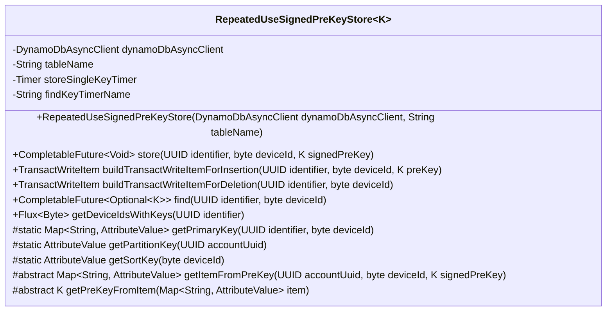

# 基础信息

|      |      |
|------|------|
| 名称 | RepeatedUseSignedPreKeyStore |
| 编码语言 | .java |
| 代码路径 | Signal-Server/service/src/main/java/org/whispersystems/textsecuregcm/storage/RepeatedUseSignedPreKeyStore.java |
| 包名 | org.whispersystems.textsecuregcm.storage |
| 依赖项 | ['io.micrometer.core.instrument.Metrics', 'io.micrometer.core.instrument.Timer', 'java.util.Map', 'java.util.Optional', 'java.util.UUID', 'java.util.concurrent.CompletableFuture', 'org.whispersystems.textsecuregcm.entities.SignedPreKey', 'org.whispersystems.textsecuregcm.metrics.MetricsUtil', 'org.whispersystems.textsecuregcm.util.AttributeValues', 'reactor.core.publisher.Flux', 'software.amazon.awssdk.services.dynamodb.DynamoDbAsyncClient', 'software.amazon.awssdk.services.dynamodb.model.AttributeValue', 'software.amazon.awssdk.services.dynamodb.model.Delete', 'software.amazon.awssdk.services.dynamodb.model.GetItemRequest', 'software.amazon.awssdk.services.dynamodb.model.Put', 'software.amazon.awssdk.services.dynamodb.model.PutItemRequest', 'software.amazon.awssdk.services.dynamodb.model.QueryRequest', 'software.amazon.awssdk.services.dynamodb.model.TransactWriteItem'] |
| 概述说明 | 类RepeatedUseSignedPreKeyStore用于存储和查找设备重复使用的预签名密钥，使用DynamoDB异步客户端。 |

# 说明

类RepeatedUseSignedPreKeyStore主要用于存储和查找设备重复使用的预签名密钥。该类通过DynamoDB异步客户端进行操作，确保高效的数据存储和检索。其核心功能是管理这些密钥，以便在需要时能够快速访问和使用，从而提升系统的性能和安全性。

# 类列表 Class Summary

| 名称   | 类型  | 说明 |
|-------|------|-------------|
| RepeatedUseSignedPreKeyStore | class | 类RepeatedUseSignedPreKeyStore用于存储和查找设备重复使用的预签名密钥，使用DynamoDB异步客户端操作。 |

## 类 RepeatedUseSignedPreKeyStore

|      |      |
|------|------|
| 访问范围 | public abstract |
| 类型 | class |
| 名称 | RepeatedUseSignedPreKeyStore |
| 说明 | 类RepeatedUseSignedPreKeyStore用于存储和查找设备重复使用的预签名密钥，使用DynamoDB异步客户端操作。 |

### UML类图

### 描述
`RepeatedUseSignedPreKeyStore` 是一个抽象类，用于管理重复使用的签名预密钥。它依赖于 `DynamoDbAsyncClient` 与 DynamoDB 进行异步交互，支持存储、查找和删除特定设备的预密钥。类中定义了多个抽象方法，需要子类实现具体的密钥转换逻辑。此外，类中使用了计时器来监控操作性能。

### 内部方法调用关系图

```mermaid
graph TD
    A["类RepeatedUseSignedPreKeyStore"]
    B["属性: DynamoDbAsyncClient dynamoDbAsyncClient"]
    C["属性: String tableName"]
    D["静态常量: KEY_ACCOUNT_UUID, KEY_DEVICE_ID, ATTR_KEY_ID, ATTR_PUBLIC_KEY, ATTR_SIGNATURE"]
    E["属性: Timer storeSingleKeyTimer"]
    F["属性: String findKeyTimerName"]
    G["构造方法: RepeatedUseSignedPreKeyStore(DynamoDbAsyncClient dynamoDbAsyncClient, String tableName)"]
    H["方法: CompletableFuture<Void> store(UUID identifier, byte deviceId, K signedPreKey)"]
    I["方法: TransactWriteItem buildTransactWriteItemForInsertion(UUID identifier, byte deviceId, K preKey)"]
    J["方法: TransactWriteItem buildTransactWriteItemForDeletion(UUID identifier, byte deviceId)"]
    K["方法: CompletableFuture<Optional<K>> find(UUID identifier, byte deviceId)"]
    L["方法: Flux<Byte> getDeviceIdsWithKeys(UUID identifier)"]
    M["方法: protected static Map<String, AttributeValue> getPrimaryKey(UUID identifier, byte deviceId)"]
    N["方法: protected static AttributeValue getPartitionKey(UUID accountUuid)"]
    O["方法: protected static AttributeValue getSortKey(byte deviceId)"]
    P["抽象方法: protected abstract Map<String, AttributeValue> getItemFromPreKey(UUID accountUuid, byte deviceId, K signedPreKey)"]
    Q["抽象方法: protected abstract K getPreKeyFromItem(Map<String, AttributeValue> item)"]

    A --> B
    A --> C
    A --> D
    A --> E
    A --> F
    A --> G
    A --> H
    A --> I
    A --> J
    A --> K
    A --> L
    A --> M
    A --> N
    A --> O
    A --> P
    A --> Q
```

这段代码定义了一个抽象类 `RepeatedUseSignedPreKeyStore`，用于管理与特定设备关联的重复使用预签名密钥的存储和检索。类中包含多个方法，用于存储、查找、删除密钥，以及获取设备ID列表。类还定义了一些抽象方法，用于将密钥转换为数据库项或从数据库项中提取密钥。代码通过 `DynamoDbAsyncClient` 与 DynamoDB 进行异步交互，并使用了计时器来监控操作性能。

### 字段列表 Field List

| 名称  | 类型  | 说明 |
|-------|-------|------|
| dynamoDbAsyncClient | DynamoDbAsyncClient | 私有异步DynamoDB客户端实例。 |
| tableName | String | 定义了一个私有不可变的字符串变量tableName。 |
| KEY_DEVICE_ID = "D" | String | 定义静态常量KEY_DEVICE_ID，值为"D"。 |
| ATTR_KEY_ID = "I" | String | 定义静态常量ATTR_KEY_ID，值为"I"。 |
| ATTR_SIGNATURE = "S" | String | 定义静态常量ATTR_SIGNATURE，值为"S"。 |
| ATTR_PUBLIC_KEY = "P" | String | 定义静态常量ATTR_PUBLIC_KEY，值为"P"。 |
| KEY_ACCOUNT_UUID = "U" | String | 定义常量KEY_ACCOUNT_UUID，值为"U"。 |
| findKeyTimerName = MetricsUtil.name(getClass(), "findKey") | String | 定义私有常量findKeyTimerName，用于存储查找键的计时器名称。 |
| storeSingleKeyTimer = Metrics.timer(MetricsUtil.name(getClass(), "storeSingleKey")) | Timer | 定义私有计时器用于记录存储单键操作的时间。 |

### 方法列表 Method List

| 名称  | 类型  | 说明 |
|-------|-------|------|
| getSortKey | AttributeValue | 该方法根据设备ID生成排序键，返回类型为AttributeValue。 |
| getPrimaryKey | Map<String, AttributeValue> | 静态方法生成主键映射，包含账户UUID和设备ID。 |
| getDeviceIdsWithKeys | Flux<Byte> | 该方法通过DynamoDB查询设备ID，并返回字节流。 |
| buildTransactWriteItemForInsertion | TransactWriteItem | 方法生成插入数据的TransactWriteItem对象。 |
| getPreKeyFromItem | K | 从映射项中提取预键值的方法。 |
| getPartitionKey | AttributeValue | 静态方法生成UUID分区键。 |
| getItemFromPreKey | Map<String, AttributeValue> | 从预密钥获取账户设备项的方法。 |
| find | CompletableFuture<Optional<K>> | 异步查找UUID和deviceId对应的键值，记录性能指标并返回结果。 |
| store | CompletableFuture<Void> | 异步存储UUID、设备ID和签名预密钥到DynamoDB表，并计时。 |
| buildTransactWriteItemForDeletion | TransactWriteItem | 构建删除操作的TransactWriteItem，使用标识符和设备ID作为主键。 |

